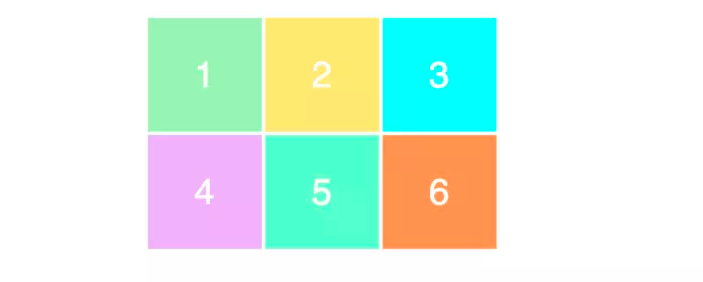
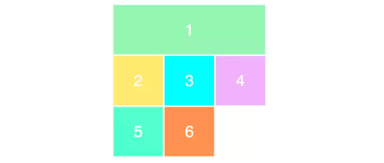
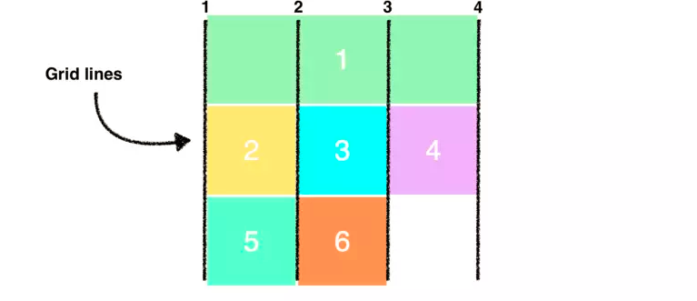
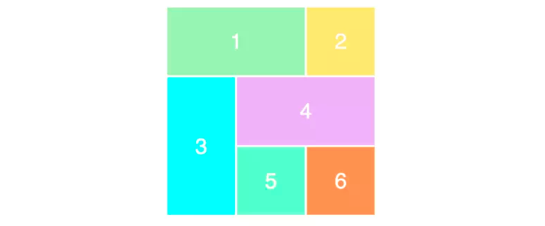

Grid 布局是网站设计的基础，CSS Grid 是创建网格布局最强大和最简单的工具。

CSS Grid 今年也获得了主流浏览器（Safari，Chrome，Firefox，Edge）的原生支持。

#### 第一个 Grid 布局

CSS Grid 布局由两个核心组成部分是 wrapper（父元素）和 items（子元素）。 wrapper 是实际的 grid(网格)，items 是 grid(网格) 内的内容。

下面是一个 wrapper 元素，内部包含6个 items ：

```html
<div class="wrapper">
    <div>1</div>
    <div>2</div>
    <div>3</div>
    <div>4</div>
    <div>5</div>
    <div>6</div>
</div>
```

要把 wrapper 元素变成一个 grid(网格)，只要简单地把其 display 属性设置为 grid 即可：

```css
.wrapper {
    display: grid;
}
```

但是，这还没有做任何事情，因为我们没有定义我们希望的 grid(网格) 是怎样的。它会简单地将6个 div 堆叠在一起。


#### Columns(列) 和 rows(行)

为了使其成为二维的网格容器，我们需要定义列和行。让我们创建3列和2行。我们将使用**grid-template-row**和**grid-template-column**属性。

```css
.wrapper {
    display: grid;
    grid-template-columns: 100px 100px 100px;
    grid-template-rows: 50px 50px;
}
```

正如你所看到的，我们为 grid-template-columns 写入了 3 个值，这样我们就会得到 3 列。 我们想要得到 2 行，因此我们为 grid-template-rows 指定了2个值。

这些值决定了我们希望我们的列有多宽（ 100px ），以及我们希望行数是多高（ 50px ）。 结果如下：


#### 放置 items(子元素)

接下来你需要学习的是如何在 grid(网格) 上放置 items(子元素) 。特别注意，这里才是体现 Grid 布局超能力的地方，因为它使得创建布局变得非常简单。

```html
<div class="wrapper">
    <div class="item1">1</div>
    <div class="item2">2</div>
    <div class="item3">3</div>
    <div class="item4">4</div>
    <div class="item5">5</div>
    <div class="item6">6</div>
</div>
```

现在，我们来创建一个 3×3 的 grid(网格)：

```css
.wrapper {
    display: grid;
    grid-template-columns: 100px 100px 100px;
    grid-template-rows: 100px 100px 100px;
}
```

将得到以下布局：



不知道你发现没有，我们只在页面上看到 3×2 的 grid(网格)，而我们定义的是 3×3 的 grid(网格)。这是因为我们只有 6 个 items(子元素) 来填满这个网格。如果我们再加3个 items(子元素)，那么最后一行也会被填满。

要定位和调整 items(子元素) 大小，我们将使用 **grid-column** 和 **grid-row** 属性来设置：

```css
.item1 {
    grid-column-start: 1;
    grid-column-end: 4;
}
也可以简写成
.item1 {
    grid-column: 1 / 4;
}
```

我们在这里要做的是，我们希望 item1 占据从第一条网格线开始，到第四条网格线结束。换句话说，它将独立占据整行。 以下是在屏幕上显示的内容：


如果你不明白我们设置的只有 3 列，为什么有4条网格线呢？看看下面这个图像，我画了黑色的列网格线：


请注意，我们现在正在使用网格中的所有行。当我们把第一个 items(子元素) 占据整个第一行时，它把剩下的 items(子元素) 都推到了下一行。

为了确保你已经正确理解了这个概念，我们重新排列其他的 items(子元素) 。

```css
.item1 {
    grid-column-start: 1;
    grid-column-end: 3;
}
.item3 {
    grid-row-start: 2;
    grid-row-end: 4;
}
.item4 {
    grid-column-start: 2;
    grid-column-end: 4;
}
```
以下是页面上的布局效果：


<br>
<br>
参考文章：[https://juejin.im/entry/5a23510f6fb9a0452a3c239f?utm_source=gold_browser_extension](https://juejin.im/entry/5a23510f6fb9a0452a3c239f?utm_source=gold_browser_extension)


