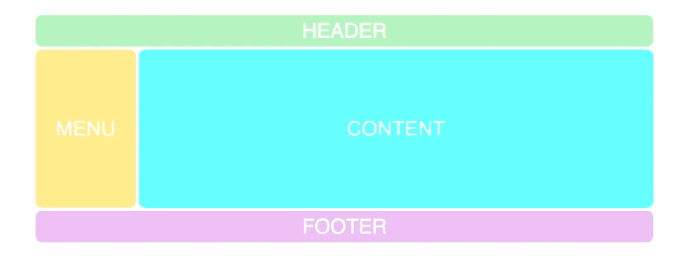
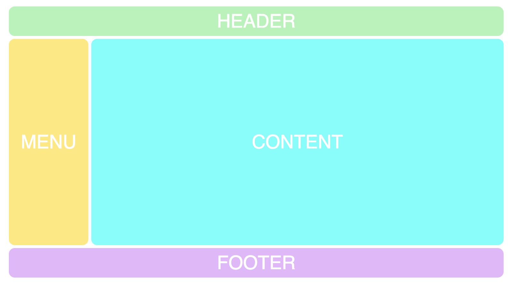
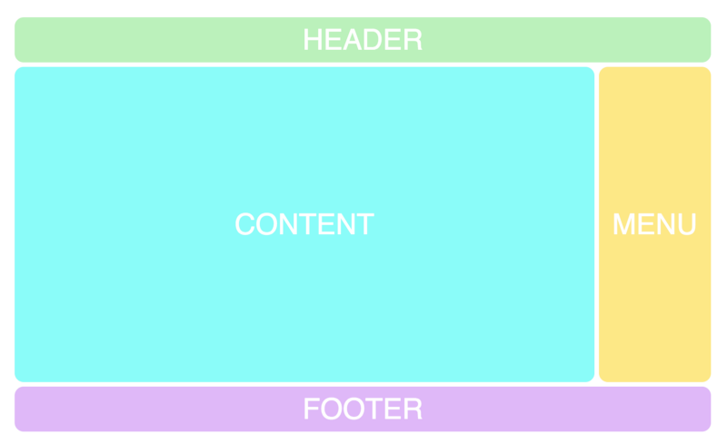
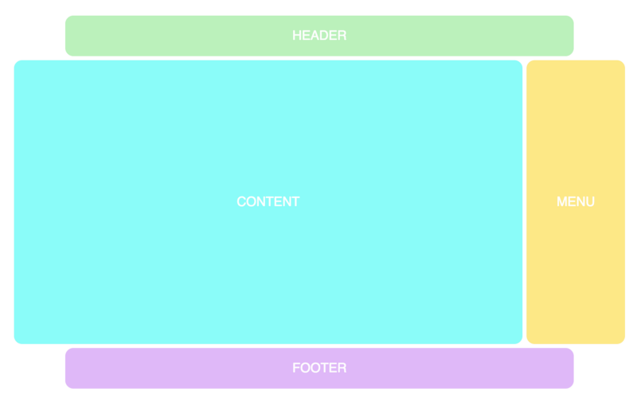

#### 例子1
我们将模仿一个经典网站布局，从非常基本的 Grid(网格) 开始：



**HTML**

```html
<div class="container">
    <div class="header">HEADER</div>
    <div class="menu">MENU</div>
    <div class="content">CONTENT</div>
    <div class="footer">FOOTER</div>
</div>
```

**CSS**

```css
.container {
    display: grid;
    grid-template-columns: repeat(12, 1fr);
    grid-template-rows: 50px 350px 50px;
    grid-gap: 5px;
}
```

以上代码的意思是：使用 grid-template-columns 属性创建一个 12 列的网格，每个列都是一个单位宽度（总宽度的 1/12 ）。（其中， repeat(12, 1fr) 意思是 12 个重复的 1fr 值。 fr 是网格容器剩余空间的等分单位。）
使用 grid-template-rows 属性创建 3 行，第一行高度是 50px ，第二行高度是 350px 和第三行高度是 50px。最后，使用 grid-gap 属性在网格中的网格项之间添加一个间隙。

**升级**

```css
.container {
    display: grid;
    grid-gap: 5px;
    grid-template-columns: repeat(12, 1fr);
    grid-template-rows: 50px 350px 50px;
    grid-template-areas:
    "h h h h h h h h h h h h"
    "m m c c c c c c c c c c"
    "f f f f f f f f f f f f";
}
```

grid-template-areas 属性背后的逻辑是你在代码中创建的网格可视化表示。正如你所看到的，它有 3 行 12 列，和我们在 grid-template-columns 和 grid-template-rows 中定义的正好呼应。

每行代表一行，用网格术语来说是 网格轨道(Grid Track) ，每个字符（ h，m，c，f）代表一个网格单元格。四个字母中的每一个现在都形成一个矩形 grid-area 。

你可能已经猜到，我选择了字符 h，m，c，f，是因为他们是 header, menu, content 和 footer 的首字母。

**给网格项设定网格区域名称**

```css
.header {
    grid-area: h;
}
.menu {
    grid-area: m;
}
.content {
    grid-area: c;
}
.footer {
    grid-area: f;
}
```



#### 尝试其他布局
只需修改 grid-template-areas 属性的字符即可。举个例子，把 menu 移到右边：

```css
grid-template-areas:
    “h h h h h h h h h h h h”
    "c c c c c c c c c c m m”
    “f f f f f f f f f f f f”;
```



我们可以使用点 . 来创建空白的网格单元格。

```css
grid-template-areas:
    “. h h h h h h h h h h .”
    "c c c c c c c c c c m m”
    “. f f f f f f f f f f .”;
```



#### 添加响应式布局
将 Grid(网格) 布局与响应式布局结合起来，简直就是一个杀手锏。因为在 Grid(网格) 布局之前，仅使用 HTML 和 CSS 实现的响应式布局不可能的做到简单而又完美。假设你想在移动设备上查看的是：标题旁边是菜单。那么你可以简单地这样做：


```css
@media screen and (max-width: 640px) {
.container {
    grid-template-areas:
        "m m m m m m h h h h h h"
        "c c c c c c c c c c c c"
        "f f f f f f f f f f f f";
    }
}
```
当屏幕宽度小于640px的时候······