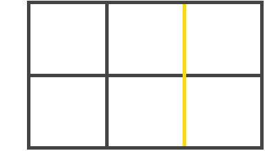
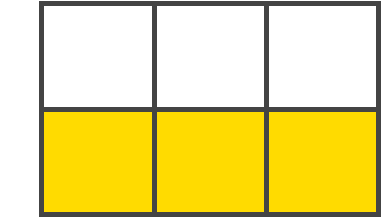
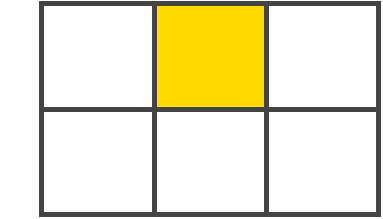
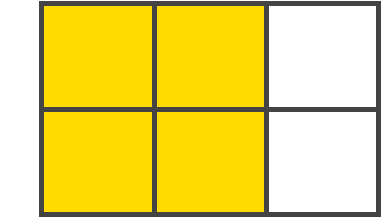

#### 网格容器(Grid Container)

应用 display: grid 的元素。这是所有网格项（Grid Items）的直接父级元素。

container 就是 网格容器(Grid Container)。

```html
<div class="container">
    <div class="item item-1"></div>
    <div class="item item-2"></div>
    <div class="item item-3"></div>
</div>
```

#### 网格项(Grid Item)

网格容器（Grid Container）的**子元素**（直接子元素）。

```html
<div class="container">
    <div class="item"></div>
    <div class="item">
        <span>这个不是</span>
    </div>
    <div class="item"></div>
</div>
```

#### 网格线(Grid Line)

构成网格结构的分界线。它们既可以是垂直的（“列网格线(column grid lines)”），也可以是水平的（“行网格线(row grid lines)”），并位于行或列的任一侧。



#### 网格轨道(Grid Track)

两条相邻网格线之间的空间。你可以把它们想象成网格的列或行。下图是第二条和第三条 行网格线 之间的 网格轨道(Grid Track)。



#### 网格单元格(Grid Cell)

两个相邻的行和两个相邻的列网格线之间的空间。这是 Grid(网格) 系统的一个“单元”。



#### 网格区域(Grid Area)

4条网格线包围的总空间。一个 网格区域(Grid Area) 可以由任意数量的 网格单元格(Grid Cell) 组成。



