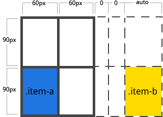

指定任何自动生成的网格轨道(grid tracks)（又名隐式网格轨道）的大小。在你明确定位的行或列（通过 grid-template-rows / grid-template-columns），超出定义的网格范围时，隐式网格轨道被创建了。

`<track-size>`：可以是长度值，百分比，或者等份网格容器中可用空间（使用 fr 单位）。

```css  
.container {
    grid-auto-columns: <track-size> ...;
    grid-auto-rows: <track-size> ...;
}
```

为了说明如何创建隐式网格轨道，请考虑一下以下的代码：

```css
.container {
    grid-template-columns: 60px 60px;
    grid-template-rows: 90px 90px
}
```


但现在想象一下，你使用 grid-column 和 grid-row 来定位你的网格项（grid items），像这样：

```css
.item-a {
    grid-column: 1 / 2;
    grid-row: 2 / 3;
}
.item-b {
    grid-column: 5 / 6;
    grid-row: 2 / 3;
}
```



我们告诉 .item-b 从第 5 条列网格线开始到第 6 条列网格线结束，但我们从来没有定义过 第5 或 第6 列网格线。

因为我们引用的网格线不存在，所以创建宽度为 0 的隐式网格轨道以填补空缺。我们可以使用 grid-auto-columns 和 grid-auto-rows 来指定这些隐式轨道的大小：

```css
.container {
    grid-auto-columns: 60px;
}
```


