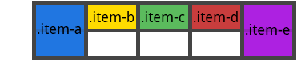

#### grid-auto-flow
如果你有一些没有明确放置在网格上的网格项(grid items)，自动放置算法 会自动放置这些网格项。该属性控制自动布局算法如何工作。
* row：告诉自动布局算法依次填充每行，根据需要添加新行
* column：告诉自动布局算法依次填入每列，根据需要添加新列
* dense：告诉自动布局算法在稍后出现较小的网格项时，尝试填充网格中较早的空缺

```css
.container {
    grid-auto-flow: row | column | row dense | column dense
}
```
请注意，dense 集可能导致你的网格项出现乱序。

示例：

```css
<section class="container">
    <div class="item-a">item-a</div>
    <div class="item-b">item-b</div>
    <div class="item-c">item-c</div>
    <div class="item-d">item-d</div>
    <div class="item-e">item-e</div>
</section>
```

你定义一个有 5 列和 2 行的网格，并将 grid-auto-flow 设置为 row（也就是默认值）：

```css
.container {
    display: grid;
    grid-template-columns: 60px 60px 60px 60px 60px;
    grid-template-rows: 30px 30px;
    grid-auto-flow: row;
}
```

将网格项放在网格上时，只能为其中的两个指定位置：

```css
.item-a {
    grid-column: 1;
    grid-row: 1 / 3;
}
.item-e {
    grid-column: 5;
    grid-row: 1 / 3;
}
```

因为我们把 grid-auto-flow 设成了 row ，所以我们的网格看起来会是这样。注意 我们没有进行定位的网格项（item-b，item-c，item-d）会这样排列在可用的行中：



相反地，如果我们把 grid-auto-flow 设成了 column ，item-b，item-c，item-d会沿着列向下排列

```css
.container {
    display: grid;
    grid-template-columns: 60px 60px 60px 60px 60px;
    grid-template-rows: 30px 30px;
    grid-auto-flow: column;
}
```

