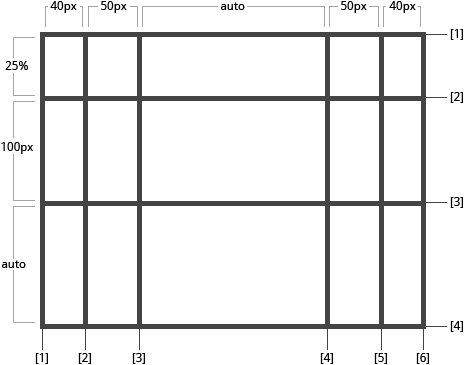

使用空格分隔的值列表，用来定义网格的列和行。这些值表示 网格轨道(Grid Track) 大小，它们之间的空格表示网格线。

* `<track-size>`： 可以是长度值，百分比，或者等份网格容器中可用空间（使用 fr 单位）
* `<line-name>`：你可以选择的任意名称

```css
.container {
	grid-template-columns: <track-size> ... | <line-name> <track-size> ...;
	grid-template-rows: <track-size> ... | <line-name> <track-size> ...;
}
```

网格轨道(Grid Track)可以设定auto

```css
//container容器也可以设置一个固定的width， height配合fr或者百分比使用
.container{
	grid-template-columns: 40px 50px auto 50px 40px;
	grid-template-rows: 25% 100px auto;
}
```



但是你可以明确的指定网格线(Grid Line)名称，即 <line-name> 值。请注意网格线名称的括号语法：

```css
.container {
	grid-template-columns: [first] 40px [line2] 50px [line3] auto [col4-start] 50px [five] 40px [end];
	grid-template-rows: [row1-start] 25% [row1-end] 100px [third-line] auto [last-line];
}

```


请注意，一条网格线(Grid Line)可以有多个名称。例如，这里的第二条 行网格线(row grid lines) 将有两个名字：row1-end 和row2-start ：

```css
.container{
	grid-template-rows: [row1-start] 25% [row1-end row2-start] 25% [row2-end];
}

```

**如果你的定义包含多个重复值，则可以使用 repeat() 表示法来简化定义：**

```css
.container {
	grid-template-columns: repeat(3, 20px [col-start]) 5%;
}
```

**fr 单元允许你用等分网格容器剩余可用空间来设置 网格轨道(Grid Track) 的大小 。例如，下面的代码会将每个网格项设置为网格容器宽度的三分之一：**

```css
.container {
	width: 300px;
	height: 300px;
	display: grid;
	grid-template-columns: 1fr 1fr 1fr;
	grid-template-rows: 1fr 1fr 1fr;
}
```

剩余可用空间是除去所有非灵活网格项之后计算得到的。在这个例子中，可用空间总量减去 50px 后，再给 fr 单元的值3等分：

```css
.container {
	grid-template-columns: 1fr 50px 1fr 1fr;
}
```