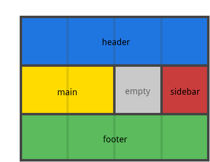

通过引用 grid-area 属性指定的 网格区域(Grid Area) 名称来定义网格模板。一个点号（.）代表一个空的网格单元。

* `<grid-area-name>`：由网格项的 grid-area 指定的网格区域名称
* .（点号） ：代表一个空的网格单元
* none：不定义网格区域

```css
.container {
    grid-template-areas:
    " | . | none | ..."
    "...";
}
```

```css
.item-a {
    grid-area: header;
}
.item-b {
    grid-area: main;
}
.item-c {
    grid-area: sidebar;
}
.item-d {
    grid-area: footer;
}
//列数一定要对应， 除非auto
.container {
    grid-template-columns: 50px 50px 50px 50px;
    grid-template-rows: auto;
    grid-template-areas:
    "header header header header"
    "main main . sidebar"
    "footer footer footer footer";
}
```



**你的声明中的每一行都需要有相同数量的单元格**。你可以使用任意数量的相邻的 点. 来声明单个空单元格。

注意你 不是 用这个语法来命名网格线，只是命名网格区域。当你使用这种语法时，区域两端的网格线实际上是自动命名的。如果你的网格区域的名字是 foo，该区域的起始 行网格线 和起始 列网格线 的名称将是 foo-start，而最后一行 行网格线 和最后一列 列网格线 的名字是 foo-end。这意味着一些网格线可能有多个名字，如上例中最左边的网格线，它将有三个名称：header-start，main-start 和 footer-start 。