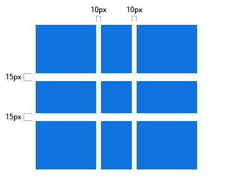

#### grid-column-gap / grid-row-gap
指定网格线(grid lines)的大小。你可以把它想象为设置列/行之间间距的宽度。

* `<line-size>` ：长度值

```css
.container {
    grid-column-gap: <line-size>;
    grid-row-gap: <line-size>;
}
```

```css
.container {
    grid-template-columns: 100px 50px 100px;
    grid-template-rows: 80px auto 80px;
    grid-column-gap: 10px;
    grid-row-gap: 15px;
}
```



只能在 列/行 之间创建间距，网格外部边缘不会有这个间距。

#### grid-gap
grid-column-gap 和 grid-row-gap 的缩写语法
* `<grid-row-gap> <grid-column-gap>`：长度值


```css
.container {
    grid-gap: <grid-row-gap> <grid-column-gap>;
}

```


```css
.container{
    grid-template-columns: 100px 50px 100px;
    grid-template-rows: 80px auto 80px;
    grid-gap: 10px 15px;
}
```

如果grid-row-gap没有定义，那么就会被设置为等同于 grid-column-gap 的值。例如下面的代码是等价的：

```css
.container{
    grid-column-gap: 10px;
    grid-column-gap: 10px;
    /* 等价于 */
    grid-gap: 10px 10px;
    /* 等价于 */
    grid-gap: 10px;
}
```