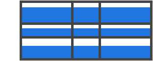

沿着 列轴线(column axis) 对齐 网格项(grid items) 内的内容（相反的属性是 justify-items 沿着行轴线对齐）。该值适用于容器内的所有网格项。
* start：将内容对齐到网格区域(grid area)的顶部
* end：将内容对齐到网格区域的底部
* center：将内容对齐到网格区域的中间（垂直居中）
* stretch：填满网格区域高度（默认值）

```css
.container {
    align-items: start | end | center | stretch;
}
```


```css
.container {
    align-items: start;
}
```


```css
.container {
    align-items: end;
}
```




```css
.container {
    align-items: center;
}
```


```css
.container {
    align-items: stretch;
}

```


这些行为也可以通过单独网格项(grid items) 的 align-self 属性设置。
