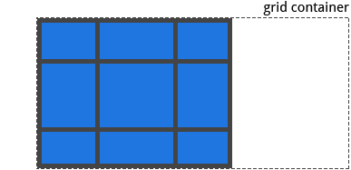

有时，你的网格合计大小可能小于其 网格容器(grid container) 大小。 如果你的所有 网格项(grid items) 都使用像 px 这样的非灵活单位设置大小，在这种情况下，您可以设置网格容器内的网格的对齐方式。 此属性沿着 行轴线(row axis) 对齐网格（相反的属性是 align-content ，沿着列轴线对齐网格）。

* start：将网格对齐到 网格容器(grid container) 的左边
* end：将网格对齐到 网格容器 的右边
* center：将网格对齐到 网格容器 的中间（水平居中）
* stretch：调整 网格项(grid items) 的宽度，允许该网格填充满整个 网格容器 的宽度
* space-around：在每个网格项之间放置一个均匀的空间，左右两端放置一半的空间
* space-between：在每个网格项之间放置一个均匀的空间，左右两端没有空间
* space-evenly：在每个栅格项目之间放置一个均匀的空间，左右两端放置一个均匀的空间


```css
.container {
    justify-content: start | end | center | stretch | space-around | space-between | space-evenly;
}
```

<br>

```css
.container {
    justify-content: start;
}
```



```css
.container {
    justify-content: end;
}
```


```css
.container {
    justify-content: center;
}
```


```css
.container {
    justify-content: stretch;
}
```


```css
.container {
    justify-content: space-around;
}
```


```css
.container {
    justify-content: space-between;
}
```


```css
.container {
    justify-content: space-evenly;
}
```

