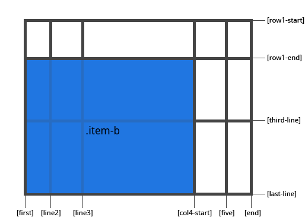

#### grid-column-start / grid-column-end / grid-row-start / grid-row-end
通过指定 网格线(grid lines) 来确定网格内 网格项(grid item) 的位置。grid-column-start / grid-row-start 是网格项目开始的网格线，grid-column-end / grid-row-end 是网格项结束的网格线。
* `<line> `：可以是一个数字引用一个编号的网格线，或者一个名字来引用一个命名的网格线
* span `<number>` ：该网格项将跨越所提供的网格轨道数量
* span `<name>` ：该网格项将跨越到它与提供的名称位置
* auto ：表示自动放置，自动跨度，默认会扩展一个网格轨道的宽度或者高度

```css
.item {
    grid-column-start: <number> | <name> | span <number> | span <name> | auto
    grid-column-end: <number> | <name> | span <number> | span <name> | auto
    grid-row-start: <number> | <name> | span <number> | span <name> | auto
    grid-row-end: <number> | <name> | span <number> | span <name> | auto
}
```

示例：

```css
.item-a {
    grid-column-start: 2;
    grid-column-end: five;
    grid-row-start: row1-start;
    grid-row-end: 3;
}
```


```css
.item-b {
    grid-column-start: 1;
    grid-column-end: span col4-start;
    grid-row-start: 2;
    grid-row-end: span 2;
}
```

```css
.item-b {
    grid-column-start: 1;
    grid-column-end: span col4-start;
    grid-row-start: 2;
    grid-row-end: span 2;
}
```



如果没有声明指定 grid-column-end / grid-row-end，默认情况下，该网格项将占据1个轨道。

项目可以相互重叠。您可以使用 z-index 来控制它们的重叠顺序。

<br>
#### grid-column / grid-row
分别为 grid-column-start + grid-column-end 和 grid-row-start + grid-row-end 的缩写形式。
* `<start-line> / <end-line>`：每个网格项都接受所有相同的值，作为普通书写的版本，包括跨度

```css
.item {
    grid-column: <start-line> / <end-line> | <start-line> / span <value>;
    grid-row: <start-line> / <end-line> | <start-line> / span <value>;
}
```

示例：

```css
.item-c {
    grid-column: 3 / span 2;
    grid-row: third-line / 4;
}
```


如果没有声明分隔线结束位置，则该网格项默认占据 1 个网格轨道。