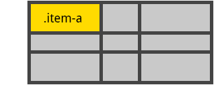

#### align-self
沿着 列轴线(column axis) 对齐 网格项 内的内容（ 相反的属性是 justify-self ，沿着 行轴线(row axis) 对齐）。此值适用于单个网格项内的内容。
* start：将内容对齐到网格区域的顶部
* end：将内容对齐到网格区域的底部
* center：将内容对齐到网格区域的中间（垂直居中）
* stretch：填充整个网格区域的高度（**这是默认值）**

```css
.item{
    align-self: start | end | center | stretch;
}
```

示例：

```css
.item-a {
    align-self: start;
}
```


```css
.item-a {
    align-self: end;
}
```


```css
.item-a {
    align-self: center;
}
```


```css
.item-a {
    align-self: stretch;
}
```



为网格中的所有网格项设置 列轴线(column axis) 上的对齐方式，也可以在 网格容器 上设置 align-items 属性。