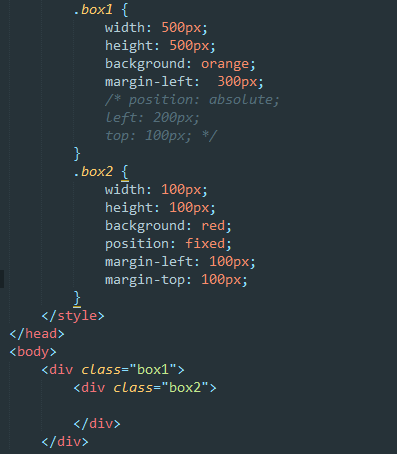
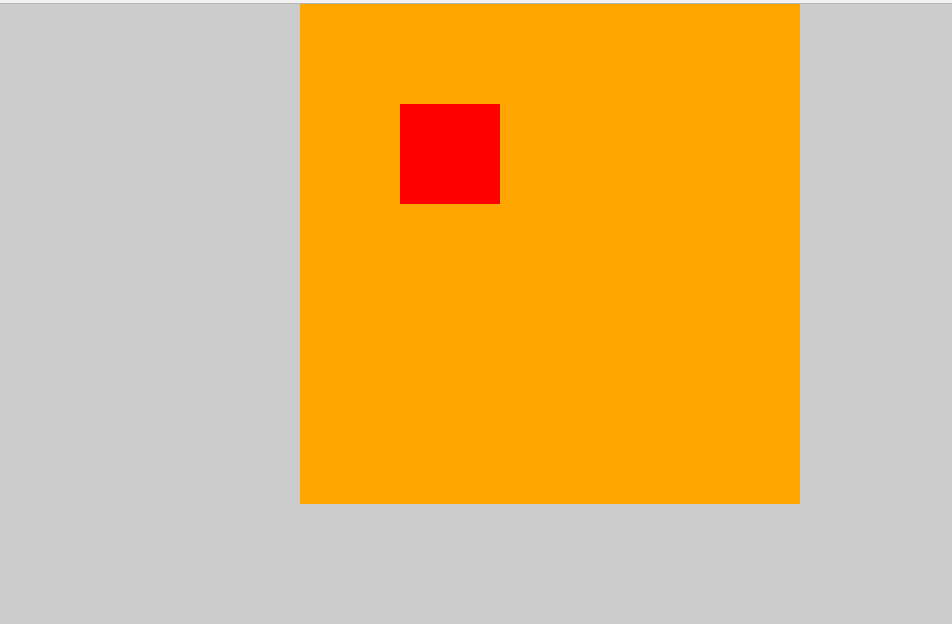

### fixed根据父级定位
在开发过程中遇到固定 定位的一个问题，一直以为`fixed`也是根据父级定位来确定的，其实并不是，`fixed`默认是根据窗口来定位的，如果想让`fixed`的元素能根据父级来定位的话，

```
fixed定位相对父级容器定位，不添加:top,bottom,left,right样式，通过margin定位,而且不用在乎父级是否有定位
```



参考[https://www.zhihu.com/question/24822927](https://www.zhihu.com/question/24822927)

<br>

### fixed的width和height的百分比是根据窗口的

直接满屏,  而`body`和`html`此时的高度还是0
```
<body>
	<div class="box"></div>
</body>

.box {
	background: orange;
    width: 100%;
    height: 100%;
    position: fixed;
    left: 0;
    top: 0;
}
```


