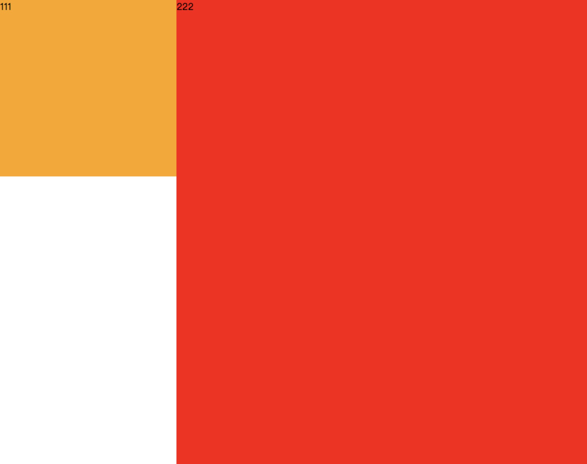
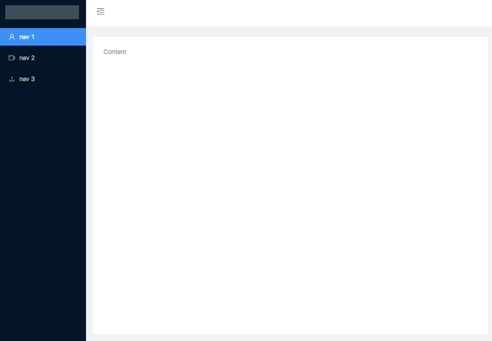

弹性布局中，子盒子的高度如果不设定的话，直接和父盒子一样

```html
<div class="parent">
    <div>111</div>
    <div>222</div>
</div>
```

```css
html, body {
    height: 100%;		//不用设置，因为下面直接使用了 min-height: 100vh;
}
.parent {
    min-height: 100vh;
    display: flex;
}
.one {
    height: 300px;
    background: orange;
}
.two {
    backgroubd: red;
}
```

111盒子的高度自己设置了，所以为`300px`， 222盒子的高度没设置，所以跟随父级高度。



所以我们可以很简单的布局出

