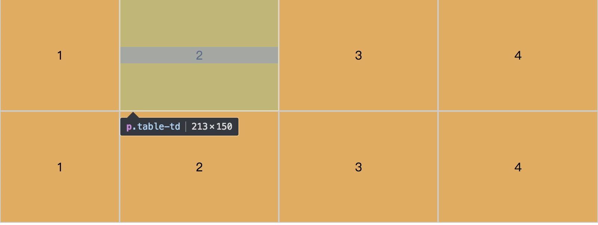

#### 基本值
- `display: none`
- `display: inline`
- `display: block`
- `display: list-item` 就像li标签一样，会在这个元素前面加上一个小黑点
- `display: inline-block`

#### 表格模型值
- `display: inline-table`: 它定义了一个行块级盒子
- `display: table`: 相当于`<table>`标签,它定义了一个块级盒子
- `display: table-caption`: 这个元素的作用的就像`<caption>` 一样。
- `display: table-cell`: 这个元素的作用就像`<td><th>` 一样。
- `display: table-row`: 这个元素的作用就像`<tr>` 一样.
- `display: table-column`: 这个元素的作用就像`<col>` 一样
- `display: table-column-group`: 这个元素的作用就像`<colgroup>`一样。
- `display: table-header-group`: 这个元素的作用就像`<thead>` 一样
- `display: table-row-group`: 这个元素的作用就像`<tbody>` 一样
- `display: table-footer-group`: 这个元素的作用就像`<tfoot>` 一样.

#### Flexbox模型值
- `display: flex`: 将对象作为弹性伸缩盒显示。
- `display: inline-flex`: 将对象作为内联块级弹性伸缩盒显示。

#### 栅格盒模型值
- `display: grid`
- `display: inline-grid`

#### 实验性的值
- `display: run-in`: 根据上下文决定对象是内联对象还是块级对象。
- `display: contents`

##### 例子1：
`display: table`来解决了一部分需要使用表格特性但又不需要表格语义的情况。

使用`display:table`最常见的例子了。对于动态高度的元素，有了它，就可以实现真正的垂直（居中）对齐。
```css
.table {
    background: orange;
    width: 800px;
    height: 300px;
    display: table;         /*相当于<table>标签*/
}
.table-tr {
    display: table-row;     /*相当于<tr>标签*/
}
.table-td {
    display: table-cell;    /*相当于<td>标签*/
    text-align: center;     
    vertical-align: middle;
}
```
```html
<div class="table">
    <div class="table-tr">
        <p class="table-td">1</p>
        <p class="table-td">2</p>
        <p class="table-td">3</p>
        <p class="table-td">4</p>
    </div>
    <div class="table-tr">
        <p class="table-td">1</p>
        <p class="table-td">2</p>
        <p class="table-td">3</p>
        <p class="table-td">4</p>
    </div>
</div>
```
想让一个`div`或`p`在父元素中垂直居中一直是很多人解决不了的问题（注意直接对块级元素使用`vertical-align`是不能解决这个问题的，`vertical-align`定义行内元素的基线相对于该元素所在行的基线的垂直对齐），同样可以使用`display：table`方便解决。 

1. `display`: `table`时`padding`会失效
2. `display`: `table-row`时`margin`、`padding`同时失效
3. `display`: `table-cell`时`margin`会失效

基于`display:table`的表格实现，没有`<table>`的`rowspan`和`colspan`单元格合并的实现，所以曲折实现，将表格每行单独嵌套一个独立的表格，这样在嵌套的独立表格内部，单元格合并就能通过控制嵌套表格的行数和列数以及单元格的宽高来实现。

所以对于`display:table-cell`其特殊之处就在于垂直居中，等高，水平级联，匿名创建等特性。