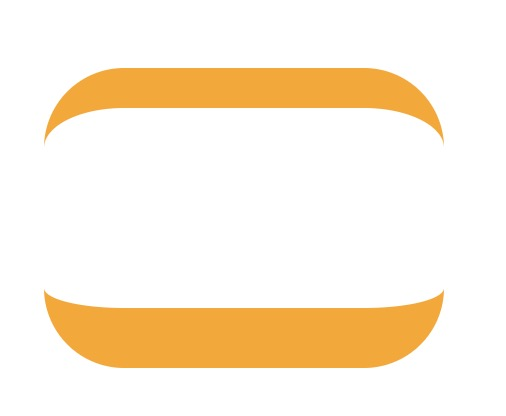

#### border-radius
```css
/*CSS3特性*/

border-radius: 1-4 length|% / 1-4 length|%;
```
```js
/*JavaScript 语法*/

object.style.borderRadius="5px"
```
每个半径的四个值的顺序是：左上角，右上角，右下角，左下角。想象成和`boder`的简略写法一样，如`border-radius: 5px 10px 8px 20px`等。

也可以`border-radius:50%;`或者`border-radius:2em;`

```css
/*表示border-radius:水平/垂直*/
border-radius:100px 50px 60px 40px/50px 100px 30px 20px ;
```

相关属性
- `border-top-left-radius: 水平 垂直`或`border-top-left-radius: 30px`
- `border-top-right-radius: 水平 垂直`
- `border-bottom-left-radius: 水平 垂直`
- `border-bottom-right-radius: 水平 垂直`


px: 角的水平x轴长度，垂直y轴长度。   

百分比: x轴/总width


##### 例子
```css
/*
`border-width`结合使用效果更好
*/
border-width:20px 0px 30px;
border-radius:40px;
```


写一个月亮
```css
border-left:20px solid #F60;
border-radius:50%;
```

单个圆角
```css
border-top-right-radius: 100%;
```

<br>

可参考: [css3教程 border-radius](http://www.mrszhao.com/post/57.html)