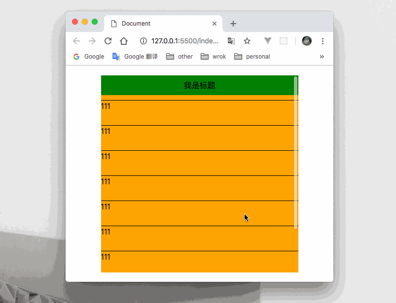

案例：实现一个绝对居中的弹框，弹框有一个title标题头部，将title定位在弹框的顶部，内容部分超出弹框，所以弹框存在滚动条。如果这个弹框有定位属性的话，当滚动时，title头部也会跟着滚动，并没有固定在头部？？？

```html
<div class="dialog">
	<p class="title">我是标题</p>
    <div class="content">我是一个高度很高的内容</div>
</div>
```

```css
.dialog {
    position: fixed;  /*不管是relative、absolute、fixed，只要是定位都会有这种情况*/
    left: 0;
    right: 0;
    top: 0;
    bottom: 0;
    margin: auto;
    width: 300px;
    height: 400px;
    overflow: auto;
}
.title {
    height: 40px;
    line-height: 40px;
    width: 100%;
    text-align: center;
    position: absolute;
    left: 0;
    top: 0;
}
.content {
    height: 800px;
}
```



#### 解决：

##### 方案一

父容器`dialog`不要加定位，就一个普通的盒子。

##### 方案二

对title标题头部加固定定位，根据固定定位`fixed`可以根据`margin`以父级来固定位置， 如果不用`margin`而使用`left`、`top`的话是根据`body`来定位。所以可以根据dialog盒子来定位。

```js
.title {
    position: fixed;
    margin-left: 0;
    margin-top: 0;
}
```

##### 方案三

在content内容盒子外在套一个固定高度的盒子，用于包裹内部的content盒子，形成滚动条。不影响title头部。

```html
<div class="dialog">
    <p class="title">我是标题</p>
    <div class="box">
        <div class="content">我是一个高度很高的内容</div>
    </div>
</div>
```

```css
/*将dialog的高度去掉，在这个盒子里设定*/
.dialog {
    position: fixed;
    left: 0;
    right: 0;
    top: 0;
    bottom: 0;
    margin: auto;
    width: 300px;
}
.title {
    height: 40px;
    line-height: 40px;
    text-align: center;
    position: absolute;
    left: 0;
    top: 0;
    background: greenyellow;
    width: 100%;
}
.box {
    height: 400px;
    overflow: auto;
    background: orange;
}
.content {
    height: 800px;
}
```

