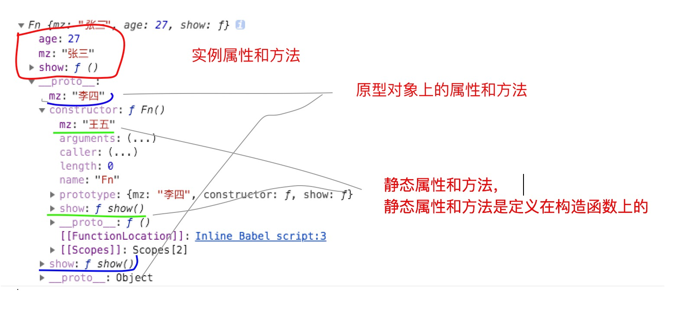

### ES5的构造函数和ES6的Class的比较

ES5

因为函数也是一个对象，所以我们可以在构造函数上定义静态属性和方法，静态属性和方法只能通过构造函数来获取。

```js
function Fn() {
    this.mz = '张三';			 		//实例属性
    this.age = 27;				  
    this.show = function() {	  		//实例方法
        console.log('实例方法');
    }
}

Fn.prototype.mz = "李四";					//原型对象上的属性
Fn.prototype.show = function() {			//原型对象上的方法
    console.log('构造函数原型对象的方法');
}

Fn.mz = '王五';						//静态属性
Fn.show = function() {				 //静态方法
    console.log('静态方法')
}
let f = new Fn();
console.log(f);
```


ES6

```js
class Fn {
    constructor() {								//实例属性和方法
        this.mz = '张三';			
        this.age = 27;
        this.show = function() {
            console.log('实例方法');
        }
    }
    //mz = '李四'  这样写原型属性，测试发现没有效果
    show() {									//原型对象的方法
        console.log('构造函数原型对象的方法');
    }
    static mz = '王五'							//构造函数的静态属性和方法
    static show() {
        console.log('静态方法')
    }
}
Fn.prototype.mz = '李四';							//原型对象的属性
let f = new Fn();
```




### 继承的对比

ES5

```js
function Parent() {
	this.a = 111;
	this.b = 222;
}
Parent.prototype.show = function() {
	console.log('aaa')
}

function Child() {
	Parent.call(this)			//调用Parent构造函数 添加属性
}
//这里调用new Parent()会执行Parent构造函数，Child中Parent.call(this)又执行了一次。导致重复， Child实例属性优先它的原型对象Parent中的属性，所以覆盖。
Child.prototype = new Parent();		
// Child.prototype = Parent.prototype;
Child.prototype.constructor = Child;	//如果不写constructor会指向Object
Child.prototype.run = function() {
	console.log('bbb')
}
let c = new Child();
console.log(c);
```

最佳的解决方式（这也是ES6中Class继承的原理，ES6Class只是一个语法糖）

```js
function Parent() {
    this.a = 111;
    this.b = 222;
}
Parent.prototype.show = function() {
    console.log('aaa')
}
function Child() {
    Parent.call(this)			//使用call的方法来得到父级的属性
}
/*
    function F() {};
    F.prototype = Parent.prototype;
    let test = new F();
    
    下面ES6中的Object.create()方法的原理就是对上面代码。
    test实例的__proto__原型对象是Parent.prototype, 
    即原来我们会new Parent()来做Child的原型对象，现在我们偷换成test实例，不过他们的__proto__都指向Parent.prototype。
*/
let test = Object.create(Parent.prototype);		//创建一个中转站的实例，该实例是Child的原型对象
Child.prototype = test;				//定义Child的原型对象
test.constructor = Child;			//定义创建的test实例的constructor指向Child
Child.prototype.run = function() {	
    console.log('bbb')
}
let c = new Child();
console.log(c);
```

ES6

```js
class Parent {
    constructor() {
        this.a = 111;
        this.b = 222;
    }
    show() {
        console.log('aaa')
    }
}
class Child extends Parent {
    constructor() {
        super();		//继承父级的属性
    }
    run() {
        console.log('bbb')
    }
}
let c = new Child();
console.log(c)
```


