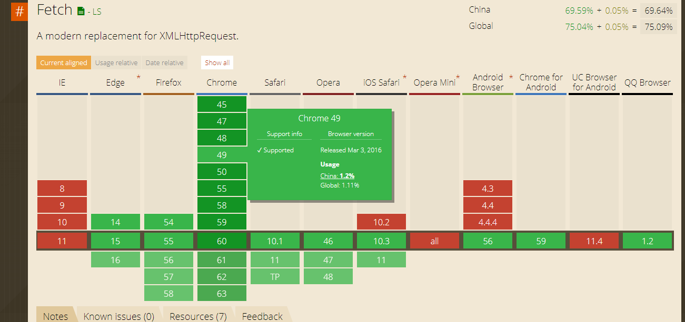

### Fetch
API  [https://developer.mozilla.org/zh-CN/docs/Web/API/Fetch_API](https://developer.mozilla.org/zh-CN/docs/Web/API/Fetch_API)

多年来，XMLHttpRequest一直是web开发者的亲密助手。无论是直接的，还是间接的， 当我们谈及Ajax技术的时候，通常意思就是基于XMLHttpRequest的Ajax，它是一种能够有效改进页面通信的技术。 Ajax的兴起是由于Google的Gmail所带动的，随后被广泛的应用到众多的Web产品（应用）中，可以认为， 开发者已经默认将XMLHttpRequest作为了当前Web应用与远程资源进行通信的基础。 而本文将要介绍的内容则是XMLHttpRequest的最新替代技术——[Fetch API](https://developer.mozilla.org/zh-CN/docs/Web/API/Fetch_API)， 它是W3C的正式标准。

<br/>

Fetch API提供了一个fetch()方法，它被定义在BOM的window对象中，你可以用它来发起对远程资源的请求。 该方法返回的是一个Promise对象，让你能够对请求的返回结果进行检索。



<br>

**fetch() 必须接受一个参数——资源的路径。无论请求成功与否，它都返回一个 promise 对象，resolve 对应请求的 Response。你也可以传一个可选的第二个参数—— init**

```js
//用fetch
var url = 'xxxxxx'
fetch(url).then(function(response) {
    return response.json()
}).then(function(json) {
    insertPhotos(json);
})

//用XMLHttpRequest
var xhr = new XMLHttpRequest();
xhr.onload = function() {
    insertPhotos(JSON.parse(xhr.responseText));
};
xhr.open('GET', URL);
xhr.send();
```

- <font size='2'>首先是构造请求的URL，然后将URL传递给全局的fetch()方法，它会立刻返回一个Promise， 当Promise被通过，它会返回一个Response对象，通过该对象的json()方法可以将结果作为JSON对象返回。 response.json()同样会返回一个Promise对象，因此在我们的例子中可以继续链接一个then()方法。</font>
- <font size='2'>可以发现，主要的不同点在于：传统上我们会使用事件处理器，而不是Promise对象。 并且请求的发起完全依赖于xhr对象所提供的方法。</font>

<br>

### 为什么需要替代XMLHttpRequest?

原因在于Fetch API不仅仅为你提供了一个fetch()方法。
如：你可以通过Request构造器函数创建一个新的请求对象，这也是建议标准的一部分。

**第一个参数是请求的URL或者request构造实例，第二个参数是一个选项对象，用于配置请求**。请求对象一旦创建了， 你便可以将所创建的对象传递给fetch()方法，用于替代默认的URL字符串。

**[Request()构造器所有的api点击这里](https://developer.mozilla.org/zh-CN/docs/Web/API/Request)**


```js
var req = new Request(URL, {method: 'GET', cache: 'reload'});
fetch(req).then(function(response) {
    return response.json();
}).then(function(json) {
    insertPhotos(json);
});
```

上面的代码中我们指明了请求使用的方法为GET，并且指定不缓存响应的结果。

有关Request对象的另一件更酷的事在于，你还可以基于原有的对象创建一个新的对象。 新的请求和旧的并没有什么不同，但你可以通过稍微调整配置对象，将其用于不同的场景。 例如，你可以基于原有的GET请求创建一个POST请求，它们具有相同的请求源。代码如下：

```js
// 基于req对象创建新的postReq对象
var postReq = new Request(req, {method: 'POST'});
```

<br>

每个Request对象都有一个header属性，在Fetch API中它对应了一个Headers对象。 通Headers对象，你能够修改请求头。不仅如此，对于返回的响应，你还能轻松的返回响应头中的各个属性。 但是需要注意的是，响应头是只读的。

```js
var headers = new Headers();
headers.append('Accept', 'application/json');
var request = new Request(URL, {headers: headers});
fetch(request).then(function(response) {
    console.log(response.headers);
});
```

在上面的代码中，你可以通过Headers构造器来获取这个对象，用于为新的Request对象配置请求头。

```js
var headers = new Headers({
    'Content-Type': 'application/json',
    'Cache-Control': 'max-age=3600'
});

var response = new Response(
    JSON.stringify({photos: {photo: []}}),
    {status: 200, headers: headers}
);
response.json().then(function(json) {
    insertPhotos(json);
});
```

Request和Response都完全遵循HTTP标准。

<br>

参考文章
[http://web.jobbole.com/84924/](http://web.jobbole.com/84924/)
[http://www.51xuediannao.com/javascript/fetchdyf_1142.html](http://www.51xuediannao.com/javascript/fetchdyf_1142.html)


