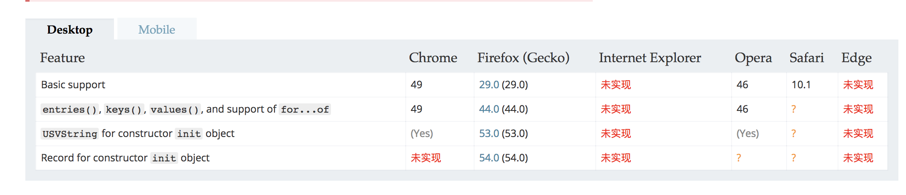

#### URLSearchParams
URLSearchParams 接口定义了一些实用的方法来处理 URL 的查询字符串。

一个实现了 URLSearchParams 的对象可以直接用在 for...of 结构中，不需要使用 entrie() ：for (var p of mySearchParams) 就等于for (var p of mySearchParams.entries())。

```js
var paramsString = "q=URLUtils.searchParams&topic=api"
var searchParams = new URLSearchParams(paramsString);
console.log(p);
searchParams.has("topic") === true; // true
searchParams.get("topic") === "api"; // true
searchParams.getAll("topic"); // ["api"]
searchParams.get("foo") === ""; // true
searchParams.append("topic", "webdev");
searchParams.toString(); // "q=URLUtils.searchParams&topic=api&topic=webdev"
searchParams.set("topic", "More webdev");
searchParams.toString(); // "q=URLUtils.searchParams&topic=More+webdev"
searchParams.delete("topic");
searchParams.toString(); // "q=URLUtils.searchParams"
```
<br/>

DOM 的 a 元素节点的 searchParams 属性，就是一个 URLSearchParams 实例。

```js
var a = document.createElement('a');
a.href = 'https://example.com?filter=api';
a.searchParams.get('filter') // "api"
```

