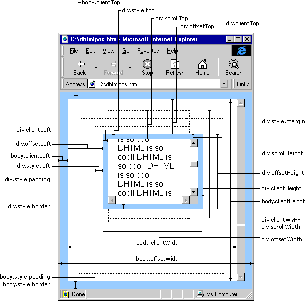

### DOM

- `div.clientLeft`
- `div.offsetLeft`         相对于父级
- `div.style.left`
- `div.style.padding`
- `div.style.margin`
- `div.style.border`

- `div.clientWidth`
- `div.scrollWidth`
- `div.offsetWidth`

- `body.clientLeft`
- `body.clientWidth`
- `body.offsetWidth`
- `body.style.padding`
- `body.style.border`

- `Element.getBoundingClientRect()` 方法返回元素的大小及其相对于视口的位置。既有元素的也有位置

### 鼠标

`event.clientX`、`event.clientY` 

鼠标**相对于浏览器窗口可视区域**的X，Y坐标（窗口坐标），不包括滚动条，可视区域不包括工具栏和滚动条。IE事件和标准事件都定义了这2个属性

`event.pageX`、`event.pageY`

类似于event.clientX、event.clientY，和上面的值好像一样，但它们使用的是文档坐标而非窗口坐标。这2个属性不是标准属性，但得到了广泛支持。IE事件中没有这2个属性。 

`event.offsetX`、`event.offsetY`

鼠标相对于事件源元素（srcElement）的X,Y坐标

`event.screenX`、`event.screenY`

鼠标相对于用户显示器屏幕左上角的X,Y坐标。

