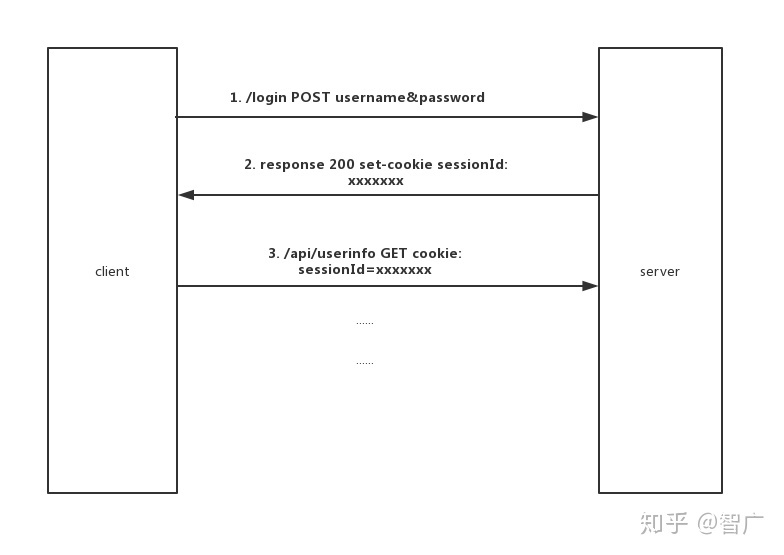
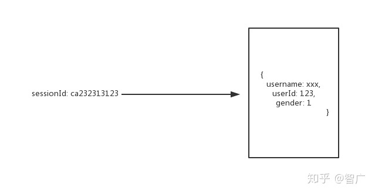
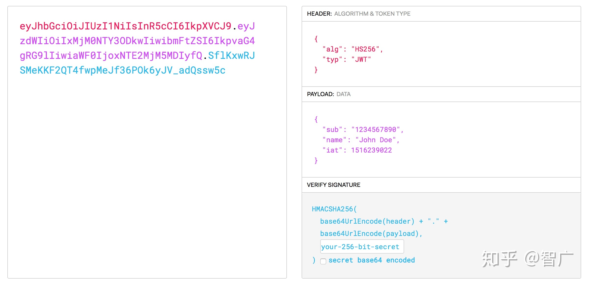

转载：[前端应该知道的web登录](https://zhuanlan.zhihu.com/p/62336927)

## 前端应该知道的web登录


### 为什么会有登录这回事

首先这是因为[HTTP](https://link.zhihu.com/?target=https%3A//developer.mozilla.org/zh-CN/docs/Web/HTTP)是无状态的协议，所谓无状态就是在两次请求之间服务器并不会保存任何的数据，相当于你和一个人说一句话之后他就把你忘掉了。所以，登录就是用某种方法让服务器在多次请求之间能够识别出你，而不是每次发请求都得带上用户名密码这样的识别身份的信息。从登录成功到登出的这个过程，服务器一直维护了一个可以识别出用户信息的数据结构，广义上来说，这个过程就叫做session，也就是保持了一个会话。


### 常见的两种登录

忽然想到一点，看了网上很多问题，我觉得大家应该区分两个概念：**广义的session**和**狭义的session**

**广义的session：**广义的session就是从登录成功到登出的过程，在这个过程中客户端和服务器端维持了保持登录的状态，至于具体怎么维持住这种登录的状态，没有要求。

**狭义的session：**狭义的session就是登录成功后，服务器端存储了一些必须的用户信息，这部分存在服务器端的用户信息就叫做session，也就是接下来要说的第一种登录的实现方式。


### 服务器session+客户端sessionId

先用图来看：



详细说的说一下，这里面主要是这么几个过程：

1. 客户端带着用户名和密码去访问 /login 接口，服务器端收到后校验用户名和密码，校验正确就会在服务器端存储一个sessionId和session的映射关系

   

2. 服务器端返回response，并且将sessionId以set-cookie的方式种在客户端，这样一来，sessionId就存在了客户端。这里要注意的是，将sessionId存在cookie并不是一种强制的方案，而是大家一般都这么做，而且发请求的时候符合domain和path的时候，会自动带上cookie，省去了手动塞的过程。

3. 客户端发起非登录请求时，服务端通过cookie中的sessionId找到对应的session来知道此次请求是谁发出的。


### token

前面说到sessionId的方式本质是把用户状态信息维护在server端，token的方式就是把用户的状态信息加密成一串token传给前端，然后每次发请求时把token带上，传回给服务器端；服务器端收到请求之后，解析token并且验证相关信息；

所以跟第一种登录方式最本质的区别是：通过解析token的计算时间换取了session的存储空间

业界通用的加密方式是jwt（[json web token](https://link.zhihu.com/?target=https%3A//jwt.io/)），jwt的具体格式如图：



简单的介绍一下jwt，它主要由3部分组成：

```
header 头部
{
  "alg": "HS256",
  "typ": "JWT"
}
payload 负载
{
  "sub": "1234567890",
  "name": "John Doe",
  "iat": 1516239022,
  "exp": 1555341649998
}
signature 签名
```

header里面描述加密算法和token的类型，类型一般都是JWT；

payload里面放的是用户的信息，也就是第一种登录方式中需要维护在服务器端session中的信息；

signature是对前两部分的签名，也可以理解为加密；实现需要一个密钥（secret），这个secret只有服务器才知道，然后使用header里面的算法按照如下方法来加密：

```
HMACSHA256(
  base64UrlEncode(header) + "." +
  base64UrlEncode(payload),
  secret)
```

总之，最后的 jwt = base64url(header) + "." + base64url(payload) + "." + signature

jwt可以放在response中返回，也可以放在cookie中返回，这都是具体的返回方式，并不重要。

客户端发起请求时，官方推荐放在HTTP header中：

```text
Authorization: Bearer <token>
```

这样子确实也可以解决cookie跨域的问题，不过具体放在哪儿还是根据业务场景来定，并没有一定之规。


### 两种登录方案存在的问题

#### session方式

1. session方式由于会在服务器端维护session信息，单机还好说，如果是多机的话，服务器之间需要同步session信息，服务横向扩展不方便。
2. session数量随着登录用户的增多而增多，存储会增加很多。
3. session+cookie里面存sessionId的方式可能会有csrf攻击的问题，常见的方式是使用[csrf_token](https://link.zhihu.com/?target=https%3A//www.ibm.com/developerworks/cn/web/1102_niugang_csrf/index.html)来解决

#### jwt方式

1. jwt的过期时间需要结合业务做设置，而且jwt一旦派发出去，后端无法强行使其作废