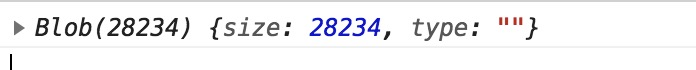
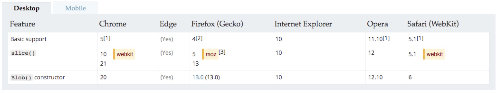

### Blob   (Binary large Object)

`Blob` 对象表示一个不可变、原始数据的类文件对象。[Blob](https://developer.mozilla.org/zh-CN/docs/Web/API/Blob) 表示的不一定是JavaScript原生格式的数据。[`File`](https://developer.mozilla.org/zh-CN/docs/Web/API/File) 接口基于`Blob`，继承了 `blob` 的功能并将其扩展使其支持用户系统上的文件。

`Blob`对象,就是二进制数据,比如通过`new Blob()`创建的对象就是`Blob`对象.又比如,在`XMLHttpRequest`里,如果指定`responseType`为`blob`,那么得到的返回值也是一个`blob`对象.

要获取用户文件系统上的文件对应的`Blob`对象，请参阅 [`File`](https://developer.mozilla.org/zh-CN/docs/Web/API/File)文档。

接受`Blob`对象的API也被列在 [`File`](https://developer.mozilla.org/zh-CN/docs/Web/API/File) 文档中。

> **注意：**`slice()`方法原本接受`length`作为第二个参数，以表示复制到新`Blob`对象的字节数。如果设置的参数使`start + length`超出了源`Blob`对象的大小，那返回的则是从start到结尾的数据。(存在兼容问题)

会返回

 

#### 构造函数

[`Blob(blobParts[, options])`](https://developer.mozilla.org/zh-CN/docs/Web/API/Blob/Blob):**返回一个新创建的 `Blob` 对象**，其内容由参数中给定的数组串联组成。

`var aBlob = new Blob(array, options);`

- `array`是一个由[`ArrayBuffer`](https://developer.mozilla.org/zh-CN/docs/Web/JavaScript/Reference/Global_Objects/ArrayBuffer), [`ArrayBufferView`](https://developer.mozilla.org/zh-CN/docs/Web/API/ArrayBufferView), [`Blob`](https://developer.mozilla.org/zh-CN/docs/Web/API/Blob), [`DOMString`](https://developer.mozilla.org/zh-CN/docs/Web/API/DOMString) 等对象构成的 [`Array`](https://developer.mozilla.org/zh-CN/docs/Web/JavaScript/Reference/Array) ，或者其他类似对象的混合体，它将会被放进 [`Blob`](https://developer.mozilla.org/zh-CN/docs/Web/API/Blob)。`DOMStrings`会被编码为`UTF-8`。
- `options` 是一个可选的`BlobPropertyBag`字典，它可能会指定如下两个属性：
  - `type`，默认值为 `""`，它代表了将会被放入到blob中的数组内容的MIME类型。
  - `endings`，默认值为`"transparent"`，用于指定包含行结束符`\n`的字符串如何被写入。 它是以下两个值中的一个： `"native"`，代表行结束符会被更改为适合宿主操作系统文件系统的换行符，或者 `"transparent"`，代表会保持blob中保存的结束符不变

##### 示例

```js
var aFileParts = ['<a id="a"><b id="b">hey!</b></a>']; // 一个包含DOMString的数组
var oMyBlob = new Blob(aFileParts, {type : 'text/html'}); // 得到 blob
//或
let blob = new Blob([arrayBuffer])		//ArrayBuffer
```


#### 属性

- [`Blob.size`](https://developer.mozilla.org/zh-CN/docs/Web/API/Blob/size) 只读，`Blob` 对象中所包含数据的大小（字节）。
- [`Blob.type`](https://developer.mozilla.org/zh-CN/docs/Web/API/Blob/type) 只读，一个字符串，表明该`Blob`对象所包含数据的MIME类型。如果类型未知，则该值为空字符串。

#### 方法

`Blob.slice([start,[ end ,[contentType]]])` :返回一个新的 `Blob`对象，包含了源 `Blob`对象中指定范围内的数据。

#### 示例

`Blob`构造函数用法举例，并创建一个指向类型化数组的`URL`

```js
var debug = {hello: "world"};
var blob = new Blob([JSON.stringify(debug, null, 2)], {type : 'application/json'});
var url = URL.createObjectURL(blob);
// 会产生一个类似blob:d3958f5c-0777-0845-9dcf-2cb28783acaf 这样的URL字符串
// 你可以像使用一个普通URL那样使用它，比如用在img.src上。
```

从 `Blob` 中提取数据, 从`Blob`中读取内容的唯一方法是使用 [`FileReader`](https://developer.mozilla.org/zh-CN/docs/Web/API/FileReader)。以下代码将 `Blob` 的内容作为类型数组读取：

```js
var reader = new FileReader();
reader.addEventListener("loadend", function() {
   // reader.result 包含转化为类型数组的blob
});
reader.readAsArrayBuffer(blob);
```

#### 兼容性



