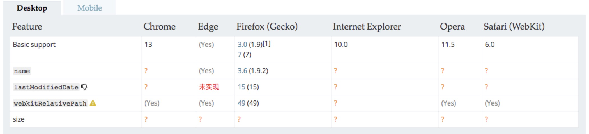

### File

文件`File` 接口提供有关文件的信息，并允许网页中的 JavaScript 访问其内容。

通常情况下， `File `对象是来自用户在一个`input`上选择文件后返回的 [`FileList`](https://developer.mozilla.org/zh-CN/docs/Web/API/FileList)对象,也可以是来自由拖放操作生成的 [`DataTransfer`](https://developer.mozilla.org/zh-CN/docs/Web/API/DataTransfer) 对象，或者来自 [`HTMLCanvasElement`](https://developer.mozilla.org/zh-CN/docs/Web/API/HTMLCanvasElement)上的 `mozGetAsFile`() API。

`File` 对象是特殊类型的 [`Blob`](https://developer.mozilla.org/zh-CN/docs/Web/API/Blob)，且可以用在任意的 Blob 类型的 context 中。比如说， [`FileReader`](https://developer.mozilla.org/zh-CN/docs/Web/API/FileReader), [`URL.createObjectURL()`](https://developer.mozilla.org/zh-CN/docs/Web/API/URL/createObjectURL), [`createImageBitmap()`](https://developer.mozilla.org/zh-CN/docs/Web/API/ImageBitmapFactories/createImageBitmap), 及 [`XMLHttpRequest.send()`](https://developer.mozilla.org/zh-CN/docs/Web/API/XMLHttpRequest#send()) 都能处理 `Blob`  和` File`。

```html
<input type="file" id="ff"/>
```

```js
let f = document.getElementById('ff');
let file = f.files[0];		//就有文件信息
```

#### 属性

`File` 接口也继承了  [`Blob`](https://developer.mozilla.org/zh-CN/docs/Web/API/Blob) 接口的属性：

- [`File.lastModified`](https://developer.mozilla.org/zh-CN/docs/Web/API/File/lastModified) 只读

  返回当前 `File `对象所引用文件最后修改时间， 自 1970年1月1日0:00 以来的毫秒数。

- [`File.lastModifiedDate`](https://developer.mozilla.org/zh-CN/docs/Web/API/File/lastModifiedDate) 只读 

  返回当前 `File `对象所引用文件最后修改时间的 `Date `对象。

- [`File.name`](https://developer.mozilla.org/zh-CN/docs/Web/API/File/name) 只读

  返回当前 `File `对象所引用文件的名字。

- [`File.size`](https://developer.mozilla.org/zh-CN/docs/Web/API/File/size) 只读

  返回文件的大小。

- [`File.webkitRelativePath`](https://developer.mozilla.org/zh-CN/docs/Web/API/File/webkitRelativePath) 只读 

  返回 [`File`](https://developer.mozilla.org/zh-CN/docs/Web/API/File) 相关的 path 或 URL。

- [`File.type`](https://developer.mozilla.org/zh-CN/docs/Web/API/File/type) 只读

  返回文件类型

#### 方法

`File` 接口没有定义任何方法，但是继承了 [`Blob`](https://developer.mozilla.org/zh-CN/docs/Web/API/Blob) 接口的方法。

#### 兼容性

