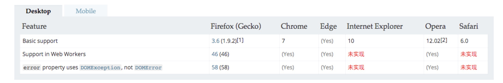
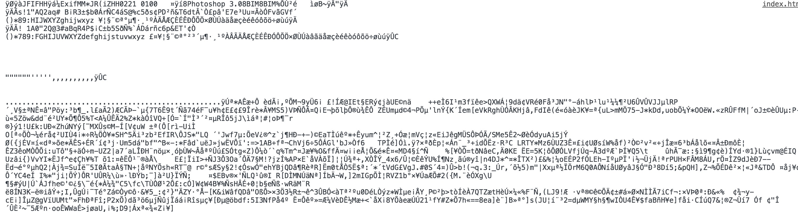
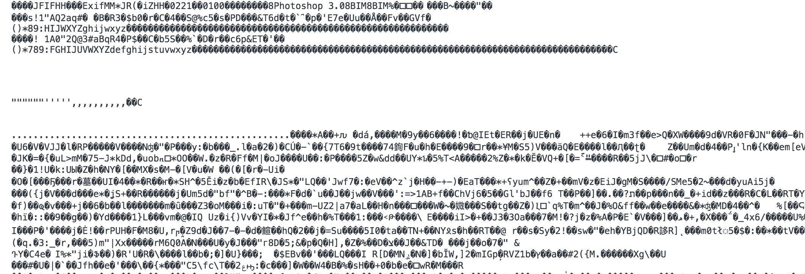
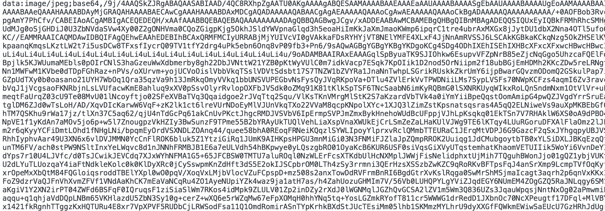
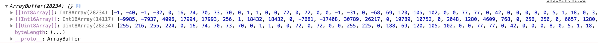

### FileReader

用来把文件读入内存，并且读取文件中的数据。[FileReader](https://developer.mozilla.org/zh-CN/docs/Web/API/FileReader)接口提供了一个异步API，使用该API可以在浏览器主线程中异步访问文件系统，读取文件中的数据。使用 [`File`](https://developer.mozilla.org/zh-CN/docs/Web/API/File) 或 [`Blob`](https://developer.mozilla.org/zh-CN/docs/Web/API/Blob) 对象指定要读取的文件或数据（`file`和`blob`做参数）。

兼容性：




#### 1、FileReader接口的方法

`FileReader`接口有4个方法，其中3个用来读取文件，另一个用来中断读取。无论读取成功或失败，方法并不会返回读取结果，这一结果存储在`result`属性中。

| 方法名                                                       | 参数                   | 描述                                                         |
| :----------------------------------------------------------- | ---------------------- | ------------------------------------------------------------ |
| [`readAsBinaryString`](https://developer.mozilla.org/zh-CN/docs/Web/API/FileReader/readAsBinaryString) | blob或file             | 开始读取指定的[`Blob`](https://developer.mozilla.org/zh-CN/docs/Web/API/Blob)中的内容。一旦完成，`result`属性中将包含所读取文件的原始二进制数据。 |
| [`readAsText`](https://developer.mozilla.org/zh-CN/docs/Web/API/FileReader/readAsText) | blob或file[, encoding] | 开始读取指定的[`Blob`](https://developer.mozilla.org/zh-CN/docs/Web/API/Blob)中的内容。一旦完成，`result`属性中将包含一个字符串以表示所读取的文件内容。 |
| [`readAsDataURL`](https://developer.mozilla.org/zh-CN/docs/Web/API/FileReader/readAsDataURL) | blob或file             | 开始读取指定的[`Blob`](https://developer.mozilla.org/zh-CN/docs/Web/API/Blob)中的内容。一旦完成，`result`属性中将包含一个`data:` URL格式的字符串以表示所读取文件的内容。(`img.src` 在`FileReader`方法中只能通过该方法得到图片) |
| [`readAsArrayBuffer`](https://developer.mozilla.org/zh-CN/docs/Web/API/FileReader/readAsArrayBuffer) | blob或file             | 开始读取指定的 [`Blob`](https://developer.mozilla.org/zh-CN/docs/Web/API/Blob)中的内容, 一旦完成, result 属性中保存的将是被读取文件的 [`ArrayBuffer`](https://developer.mozilla.org/zh-CN/docs/Web/API/ArrayBuffer) 数据对象. |
| [`abort`](https://developer.mozilla.org/zh-CN/docs/Web/API/FileReader/abort) | null                   | 中止读取操作。在返回时，`readyState`属性为`DONE`。           |

`File` 对象是特殊类型的 [`Blob`](https://developer.mozilla.org/zh-CN/docs/Web/API/Blob)，且可以用在任意的 Blob 类型的 context 中。

- `readAsBinaryString(file或blob)`

  

- `readAsText`

  

- `readAsDataURL` , 记住，在这几个方法中，只有该方法返回的值可以被用来做`src`的路径

  

- `readAsArrayBuffer`

  

#### 2、FileReader接口事件

`FileReader`接口包含了一套完整的事件模型，用于捕获读取文件时的状态。

| 事件        | 描述                                                         |
| ----------- | ------------------------------------------------------------ |
| onabort     | 处理`abort`事件。该事件在读取操作被中断时触发。              |
| onerror     | 处理`error`事件。该事件在读取操作发生错误时触发。            |
| onload      | 处理`load`事件。该事件在读取操作完成时触发。                 |
| onloadstart | 处理`loadstart`事件。该事件在读取操作开始时触发。            |
| onloadend   | 处理`loadend`事件。该事件在读取操作结束时（要么成功，要么失败）触发。 |
| onprogress  | 处理`progress`事件。该事件在读取[`Blob`](https://developer.mozilla.org/zh-CN/docs/Web/API/Blob)时触发。 |


#### 3、例子

```html
<label>请选择一个文件：</label>
<input type="file" id="file" />
<input type="button" value="读取图像" onclick="readAsDataURL()" />
<input type="button" value="读取二进制数据" onclick="readAsBinaryString()" />
<input type="button" value="读取文本文件" onclick="readAsText()" />
<div id="result" name="result"></div>
```

```js

var result=document.getElementById("result");
var file=document.getElementById("file");
 
//判断浏览器是否支持FileReader接口
if(typeof FileReader == 'undefined'){
    result.InnerHTML="<p>你的浏览器不支持FileReader接口！</p>";
    //使选择控件不可操作
    file.setAttribute("disabled","disabled");
}
 
function readAsDataURL(){
    //检验是否为图像文件
    var file = document.getElementById("file").files[0];
    if(!/image\/\w+/.test(file.type)){
        alert("看清楚，这个需要图片！");
        return false;
    }
    var reader = new FileReader();
    //将文件以Data URL形式读入页面
    reader.readAsDataURL(file);   //参数可以使File或者Blob
    reader.onload=function(e){
        var result=document.getElementById("result");
        //显示文件   -----   只用使用readAsDataURL方法得到的url可以被用来做显示图片的路径，其他几个不行
        result.innerHTML='';  
    }
}
 
function readAsBinaryString(){
    var file = document.getElementById("file").files[0];
    var reader = new FileReader();
    //将文件以二进制形式读入页面
    reader.readAsBinaryString(file);	//参数可以使File或者Blob
    reader.onload=function(f){
        var result=document.getElementById("result");
        //显示文件
        result.innerHTML=this.result;
    }
}
 
function readAsText(){
    var file = document.getElementById("file").files[0];
    var reader = new FileReader();
    //将文件以文本形式读入页面
    reader.readAsText(file);		//参数可以使File或者Blob
    reader.onload=function(f){
        var result=document.getElementById("result");
        //显示文件
        result.innerHTML=this.result;
    }
}
```

参考文章：

[https://blog.csdn.net/zk437092645/article/details/8745647](https://blog.csdn.net/zk437092645/article/details/8745647)

[MDN上的一篇如何使用文件](https://developer.mozilla.org/zh-CN/docs/Web/API/File/Using_files_from_web_applications)