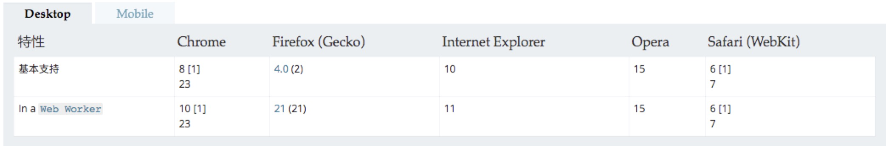

### URL.createObjectURL()



兼容性存在问题。

`URL.createObjectURL()` 静态方法会根据传入的参数创建一个指向该参数对象的URL。这个 URL 的生命周期和创建它的窗口中的 [`document`](https://developer.mozilla.org/zh-CN/docs/Web/API/Document) 绑定。这个新的URL 对象表示指定的 [`File`](https://developer.mozilla.org/zh-CN/docs/Web/API/File) 对象或 [`Blob`](https://developer.mozilla.org/zh-CN/docs/Web/API/Blob) 对象。

注意: 每次调用`createObjectURL`的时候,一个新的`URL`对象就被创建了。即使你已经为同一个文件创建过一个`URL`。 如果你不再需要这个对象,要释放它,需要使用`URL.revokeObjectURL()`方法。 当页面被关闭,浏览器会自动释放它,但是为了最佳性能和内存使用,当确保不再用得到它的时候,就应该释放它。

#### 语法

```js
objectURL = URL.createObjectURL(blob);	//参数是用来创建 URL 的 File 对象或者 Blob 对象
```


### URL.revokeObjectURL()

`URL.revokeObjectURL()`方法会释放一个通过`URL.createObjectURL()`创建的对象`URL`。

比如一张图片,我创建了一个对象`URL`,然后通过这个对象`URL`,我页面里加载了这张图.既然已经被加载,并且不需要再次加载这张图,那我就把这个对象`URL`释放,然后这个`URL`就不再指向这张图了。

```js
window.URL.revokeObjectURL(objectURL);
```


### 例子

1. Video

```js
var video = document.getElementById('video');
var obj_url = window.URL.createObjectURL(blob);
video.src = obj_url;
video.play()
window.URL.revokeObjectURL(obj_url);
```

2. pdf

```html
<iframe id="viewer">
```

```js
var obj_url = window.URL.createObjectURL(blob);
var iframe = document.getElementById('viewer');
iframe.setAttribute('src', obj_url);
window.URL.revokeObjectURl(obj_url);
```

3. Img

```html

```

```js
const xhr = new XMLHttpRequest();
xhr.open('GET', "http://xxx.xxx.xxx.xxx/aaa.jpg", true);
xhr.responseType = 'blob';		//重点
xhr.onload = function() {
    if(xhr.status === 200) {
        let blob = xhr.response;
        
        let img = document.querySelector('img');	//通过返回的图片二进制数据来创建一个对象URL
        img.src = URL.createObjectURL(blob);		//重点
    }
}
xhr.send();
```

返回的数据格式为blob二进制数据,使用`xhr.response`来获取响应的二进制数据,而不是`xhr.responseText`. 当定义了`xhr.responseType='blob'`以后,`xhr`就没有`responseText`属性了。

4. 综合

```js
document.getElementById('getPic').onclick = function(e){
    $.ajax({
        type:'GET',
        url:'img.png',
        resDataType:'blob',
        imgType:'png',
        success:function(resText,resXML){
            var img = document.createElement('img');
            var objectUrl = window.URL.createObjectURL(resText);
            img.src = objectUrl;
            img.onload = function(){
                window.URL.revokeObjectURL(objectUrl);	//当图片加载完成后释放对象URL
            };
            document.body.appendChild(img);
        },
        fail:function(err){
            console.log(err)
        }
    });
    e.preventDefault();
}
```

参考文章

[https://www.cnblogs.com/liulangmao/p/4262565.html](https://www.cnblogs.com/liulangmao/p/4262565.html)

[MDN](https://developer.mozilla.org/zh-CN/docs/Web/API/URL/revokeObjectURL)