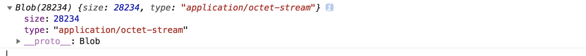

### xhr.responseType的类型

对于从服务端我们拿到的文件流是一个二进制流。我们可以通过`xhr.responseType`的设置来得到需要的类型。

[XMLHttpRequest.response](https://developer.mozilla.org/zh-CN/docs/Web/API/XMLHttpRequest/responseType) 属性返回响应的正文。 它可以是 [ArrayBuffer](https://developer.mozilla.org/en-US/docs/Web/JavaScript/Reference/Global_Objects/ArrayBuffer), [Blob](https://developer.mozilla.org/en-US/docs/Web/API/Blob), [Document](https://developer.mozilla.org/en-US/docs/Web/API/Document), JavaScript对象 或 一个 [DOMString](https://developer.mozilla.org/en-US/docs/Web/API/DOMString) 类型，具体取决于  [XMLHttpRequest.responseType](https://developer.mozilla.org/en-US/docs/Web/API/XMLHttpRequest/responseType)  属性的值。如果请求未完成或未成功，响应值为`null`。但是，如果`responseType`的值设置为`“text”`或空字符串，则响应可以包含部分文本响应，而请求仍处于加载状态。

##### 一般的xhr请求

```js
let xhr = new XMLHttpRequest();
xhr.open('Get', url, true);
xhr.onload = function() {
    if(xhr.status === 200) {
        let res = xhr.responseText;  //返回的是一个DOMString的类型
    }
}
```

##### responseType的类型

| 值          | 数据类型                                                     |
| ----------- | ------------------------------------------------------------ |
| ''          | DOMString(这个是默认类型)                                    |
| arraybuffer | ArrayBuffer对象                                              |
| blob        | Blob对象                                                     |
| document    | Document对象                                                 |
| json        | JavaScript object, parsed from a JSON string returned by the server |
| text        | DOMString                                                    |

- 默认或者`xhr.responseType = 'text'`, `DOMString`, 这里的值和我们`FileReader`中的`readAsText`后的值一样


- `xhr.responseType = 'arraybuffer'` , 这里的值和我们`FileReader`中的`readAsArrayBuffer`后的值一样

  

- `xhr.responseType = 'blob'`, 即对得到的值进行了`new Blob()`，使其变成了一个`blob` 

  


#### 正确的video流打开方式

还有一点`xhr.responseText`的类型为`DOMString`，只有当`responseType`为`DOMString`时才有正确数据，其他类型获取响应实体用`xhr.response`。

```js
let xhr = new XMLHttpRequest();
xhr.open('Get', url, true);
xhr.responseType = 'blob';
xhr.onload = function() {
    if(xhr.status === 200) {
        videoEle.src = URL.createObjectURL(xhr.response); //xhr.response 是一个blob对象
    }
}
```

参考文章

[https://blog.csdn.net/wkyseo/article/details/78232485](https://blog.csdn.net/wkyseo/article/details/78232485)

[MDN](https://developer.mozilla.org/zh-CN/docs/Web/API/XMLHttpRequest)