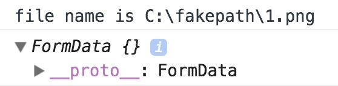
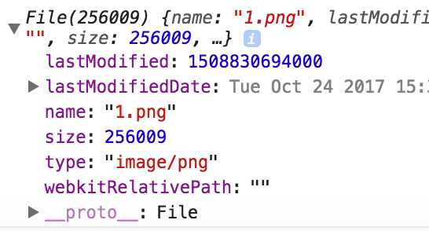

### 文件上传

操作文件的三种方式

1. 通过`<input type="file">`选择本地文件(`file API`、`FormData`、`FileReader`)
2. 通过拖拽的方式拖拽文件
3. 在编辑框里复制黏贴

#### File API、FormData、FileReader

```html
<form>
    <label for="a">button</label>
	<input type="file" name="ff" id="a" style="display: none">
</form>
```

直接使用`form`中的`submit`提交或者使用`formData`

```js
//1.直接使用form的submit提交

//2.FormData
let text= document.querySelector('input[type="file"]')	//text.value是文件的名字，不是文件内容
let formData = new FormData(form);
formData.append("fileName", text.value);
console.log(formData);
```

我们打印`FormData`的结果，在控制台中是看不到内容的，它对前端开发人员是透明的，无法查看、修改、删除里面的内容，只能`append`添加字段。



如果我们想要得到文件信息只能在`text.files[0]`中获取

```js
let text= document.querySelector('input[type="file"]');
console.log(text.files[0]);
```



使用`FileReader`可以将文件信息转为各种类型的形式显示，可以是文本、临时`url`、二进制字符形式、二进制数组等。

```js
let fileReader = new FileReader(),
fileType = text.files[0].type;
fileReader.onload = function() {
    if (/^image/.test(fileType)) {
        // 读取结果在fileReader.result里面
        $(``).appendTo("body");
    }
}
// 打印原始File对象
console.log(this.files[0]);
// base64方式读取
fileReader.readAsDataURL(this.files[0]);
```

`readAsDataURL`可以得到一个临时的`url`，可以直接赋值给`img.src`来显示图片

```js
// 按base64的方式读取，结果是base64，任何文件都可转成base64的形式
fileReader.readAsDataURL(this.files[0]);

// 以二进制字符串方式读取，结果是二进制内容的utf-8形式
fileReader.readAsBinaryString(this.files[0]);

// 以原始二进制方式读取，读取结果是一个二进制形成的数组
fileReader.readAsArrayBuffer(this.files[0]);
```

可以通过`ArrayBuffer.length`得到长度，还能转成整型数组，就能知道文件的原始二进制内容了：

```js
let buffer = this.result;
// 依次每字节8位读取，放到一个整数数组
let view = new Uint8Array(buffer);
console.log(view);
```

#### 第二种：拖拽的方式

```js
$(".img-container").on("dragover", function (event) {
    event.preventDefault();
})
.on("drop", function(event) {
    event.preventDefault();
    // 数据在event的dataTransfer对象里
    let file = event.originalEvent.dataTransfer.files[0];

    // 然后就可以使用FileReader进行操作
    fileReader.readAsDataURL(file);

    // 或者是添加到一个FormData
    let formData = new FormData();
    formData.append("fileContent", file);
})
```

数据在`drop`事件的`event.dataTransfer.files`里面，拿到这个`File`对象之后就可以使用`FileReader`读取，或者是新建一个空的`formData`，然后把它`append`到`formData`里面。

#### 第三种：粘贴的方式

通常是在一个编辑框里操作，如把`div`的`contenteditable`设置为`true`：

```html
<div contenteditable="true">
    hello, paste your image here
</div>
```

粘贴的数据是在`event.clipboardData.files`里面：

```js
$("#editor").on("paste", function(event) {
    let file = event.originalEvent.clipboardData.files[0];
});
```

但是Safari的粘贴不是通过`event`传递的，它是直接在输入框里面添加一张图片。

它新建了一个`img`标签，并把`img`的`src`指向一个`blob`的本地数据。

关于`src`使用的是`blob`链接的，除了上面提到的`img`之外，另外一个很常见的是`video`标签，如`youtobe`的视频就是使用的`blob`

#### 最后

- FormData格式

`FormData`格式这是一种区别于用&连接参数的方式，它的编码格式是`multipart/form-data`。

如果`xhr.send`的是`FormData`类型话，它会自动设置`MIME`类型，如果你用默认表单提交上传文件的话就得在`form`的`extype`上面设置这个属性，因为上传文件只能使用POST的这种编码。

常用的POST编码是`application/x-www-form-urlencoded`，它和`GET`一样，发送的数据里面，参数和参数之间使用`&`连接，如：`key1=value1&key2=value2`, `POST`是放在请求`body`里的，而`GET`是拼在`url`上面的

而上传文件用的这种`multipart/form-data`，参数和参数之间是且一个相同的字符串隔开的，上面的是使用
`------WebKitFormBoundary72yvM25iSPYZ4a3F`

请求的`contentType`被浏览器设置成：`Content-Type:multipart/form-data; boundary=----WebKitFormBoundary72yvM25iSPYZ4a3F`

- FileReader

如果读取结果是`ArrayBuffer`的话，也是可以直接用`xhr.send`发送出去的，但是一般我们不会直接把一个文件的内容发出去，而是用某个字段名等于文件内容的方式。如果你读取为`ArrayBuffer`的话再上传的话其实作用不是很大，还不如直接用`formData`添加一个`File`对象的内容，因为上面三种方式都可以拿到`File`对象。如果一开始就是一个`ArrayBuffer`了，那么可以转成`blob`然后再`append`到`FormData`里面。

使用比较多的应该是`base64`，因为前端经常要处理图片，读取为`base64`之后就可以把它画到一个`canvas`里面，然后就可以做一些处理，如压缩、裁剪、旋转等。最后再用`canvas`导出一个`base64`格式的图片，那怎么上传`base64`格式的呢？

1. 是拼一个表单上传的`multipart/form-data`的格式，再用`xhr.sendAsBinary`发出去。
2. 可以把`base64`转化成`blob`，然后再`append`到一个`formData`里面


参考文章

[前端本地文件操作与上传](https://zhuanlan.zhihu.com/p/31401799?utm_medium=social&utm_source=wechat_session)