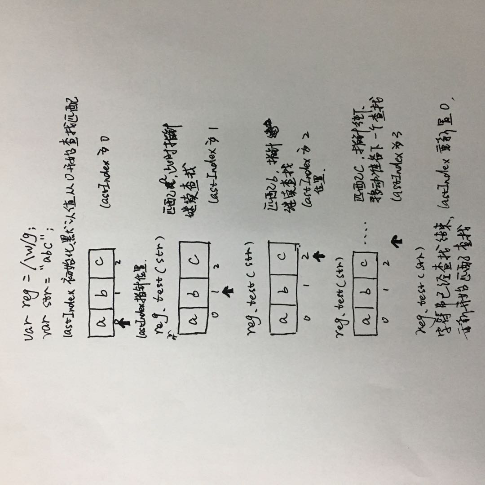

### REGEXP对象

JavaScript通过内置对象RegExp支持正则表达式。

有两种方式实例化RegExp对象

- 字面量

```js
var reg = /\bnn\b/g;			//\b表示单词边界 即   a nn c
```

- 构造函数

```js
//接收两个参数， 第一个参数为正则表达式的文本，第二个参数为修饰符
var reg = new RegExp('\\bnn\\b', 'g');  //js中\也是一个特殊字符，所以需要转义
```


### 修饰符

- g：全文搜索，不添加，搜索到第一个匹配停止
- i：忽略大小写，默认大小写敏感
- m：多行搜索

```js
var m = "
@123
@456
"
m.replace(/^@\d/g, 'X');		//结果只有一个@陪替换
//并不是说换行了就是可以从开头开始了，要想^有效果，从开头开始，加上m修饰符
m.replace(/^@\d/gm, 'X');
```


### 元字符

- 正则表达式由两种基本字符类型组成：
  - 原义文本字符：abc  就代表abc
  - 元字符：\d 代表数字  等
- 元字符是在正则表达式中有特殊含义的非字母字符

| 字符 | 含义       |
| ---- | ---------- |
| \t   | 水平制表符 |
| \v   | 垂直制表符 |
| \n   | 换行符     |
| \r   | 回车符     |
| \0   | 空字符     |
| \f   | 换页符     |
| \b   | 单词       |
| 等   |            |

- `*+？$^.|\ (){}[]`等特殊符号


### 字符类

一般情况下正则表达式一个字符对应字符串一个字符。

如：表达式ab\t的含义是'ab'➕tab

- 使用`[xx]`和`[^xx]`

我们可以使用元字符`[]`来构建一个简单的类，表达式[abc]把字符a或b或c归为一类，表达式可以匹配这类的字符。

使用元字符`[^xxx]`创建反向类，表达式`[^abc]`表示不是字符串a或b或c的内容。


### 范围类

- `[a-zA-Z]`、`[0-9]`，在a和z单词之间或数字之间的`-`横线表示范围之间，如果想要表示横线就不要在单词或数字之间写`-`，如：`[a-z-]`


### 预定义类

| 字符 | 等价类          | 含义                             |
| ---- | --------------- | -------------------------------- |
| .    | [^\r\n]         | 除了回车符和换行符之外的所有字符 |
| \d   | [0-9]           | 数字字符                         |
| \D   | [^0-9]          | 非数字字符                       |
| \s   | [\t\n\x0B\f\r]  | 空白符                           |
| \S   | [^\t\n\x0B\f\r] | 非空白符                         |
| \w   | [a-zA-Z_0-9]    | 单词字符(字母、数字)             |
| \W   | [^a-zA-Z_0-9]   | 非单词字符                       |


### 边界

| 字符 | 含义       |
| ---- | ---------- |
| ^    | 以xxx开始  |
| $    | 以xxx结束  |
| \b   | 单词边界   |
| \B   | 非单词边界 |


### 量词

| 字符   | 含义                           |
| ------ | ------------------------------ |
| ？     | 出现零次或一次（最多出现一次） |
| +      | 出现一次或多次（至少出现一次） |
| *      | 出现零次或多次（任意次）       |
| {n}    | 出现n次                        |
| {n, m} | 出现n到m次                     |
| {n,}   | 至少出现n次                    |


### 贪婪模式与非贪婪模式

1. 贪婪模式

```js
'12345678'.replace(/\d{3,6}/g, 'X')	//'X78'
```

正则表达式会尽可能的匹配多的值

2. 非贪婪模式

让正则表达式尽可能少的匹配，做法很简单，在**量词后加上？**即可

```js
'123456789'.match(/\d{3,5}?/g)	//['123', '456', '789']
'12345678'.replace(/\d{3,6}?/g, 'X')		//'XX78'
```


### 分组

使用`()`可以达到分组的功能，使量词作用于分组

```js
'a1b2c3d4'.replace(/[a-z]\d{3}/g, 'X');	//找不到 返回自身'a1b2c3d4'
'a1b2c3d4'.replace(/([a-z]\d){3}/g, 'X');	//'Xd4'
```


### 或

使用`|`可以达到或的效果

```js
//配合()一起使用
'ByronCasper'.replace(/Byron|Casper/g, 'X')		//'XX'
'ByronsperByrCasper'.replace(/Byr(on|Ca)sper/g, 'X')	//'XX'
```


### 反向引用

```js
2015-12-25   ->  12/25/2015

'2015-12-25'.replace(/(\d{4})-(\d{2})-(\d{2})/g, '$2/$3/$1')
```

使用`()`来进行分组，而通过`$1`、`$2`、`$3`等能够捕获分组


### 忽略分组

不希望捕获某些分组，只需要在分组内加上`?:`就可以了

```js
(?:Buron).(ok)  //相当于Buron这个分组被忽略了，而ok这个分组现在才是$1第一组
```


### 前瞻/后顾

正则表达式从文本头部向尾部开始解析，文本尾部方向，称为“前”。

前瞻就是在正则表达式匹配到规则的时候，向前检查是否符合断言，后顾方向相反。

JavaScript不支持后顾。

符合和不符合特定断言称为正向匹配和负向匹配

| 名称     | 正则           | 含义                                            |
| -------- | -------------- | ----------------------------------------------- |
| 正向前瞻 | exp(?=assert)  | 只匹配exp部分，括号中的部分为断言，当成一个判断 |
| 负向前瞻 | exp(?!assert)  |                                                 |
| 正向后顾 | exp(?<=assert) | JavaScript不支持                                |
| 负向后顾 | exp(?<!assert) | JavaScript不支持                                |

```js
//首先匹配一个单词，括号中是一个断言(即判断)，表示单词后面是一个数字，最后替换时不包括括号中的内容，因为只是一个断言而已
'a2*3'.replace(/\w(?=\d)/g, 'X')	//'X2*3'
'a2*34v8'.replace(/\w(?=\d)/g, 'X')	//'X2*X4X8'
//断言处表示不是数字
'a2*34vv'.replace(/\w(?!\d)/g, 'X')	//'aX*3XXX'
```


### 对象属性

- `global: boolean`：是否全文搜索，默认false
- `ignoreCase: boolean`：是否大小写敏感，默认是false
- `multiline: boolean`：多行搜索，默认值是false
- `lastIndex: number`：是当前表达式匹配内容的最后一个字符的下一个位置。没开始匹配之前都是从0开始，lastIndex为匹配字符的索引+1，持续匹配，直到匹配不到时，则将lastIndex重置为0，从头开始。（**即lastIndex这个指针是匹配后，此时正处于字符串中的相应索引位置，lastIndex中存储的索引值为多少，下次字符串匹配就从该索引位置开始匹配**），如果想让`lastIndex`从0开始：
  - 可以每次都实例化一个正则表达式匹配规则
  - 或者不使用`g`等修饰符，当匹配到一个就直接结束了，结束后`lastIndex`就会重新置0



- `source: string`：正则表达式的文本字符串

```js
var reg1 = /\w/;
var reg2 = /\w/gim;
console.log(reg1.global)	//false
console.log(reg2.global)	//true
reg1.global = true;		//没有效果，不能通过这样设置
console.log(reg1.source)	//'\w'
```


### 对象方法

#### RegExp.prototype.test(str)

用于测试字符串参数中是否存在匹配正则表达式模式的字符串，如果存在则返回`true`，否则返回`false`

```js
var reg2 = /\w/g;
console.log(reg2.lastIndex);	//默认一开始还没匹配之前lastIndex都是0
reg2.test('ab')					//第一次匹配a，a的索引为0，所以lastIndex为1
reg2.test('ab')					//第二次匹配b，b的索引为1，所以lastIndex为2
reg2.test('ab')					//第三次匹配结束了， 所以lastIndex为0，重置，重头开始
```

```js
//所以如果不了解lastIndex会让人非常费解
var reg2 = /\w/g;
reg2.test('a')	//true
reg2.test('a')	//false
reg2.test('a')	//true
reg2.test('a')	//false
...
```

所以我们建议对于调用`test`方法来匹配正则表达式时：

1. 每次都重新定义正则表达式匹配规则

```js
//每次重新实例化正则表达式匹配规则，那么lastIndex就每次都是从0开始，没有存储下来
let str = 'a';
console.log(/\w/g.test(str))	//true
console.log(/\w/g.test(str))	//true
console.log(/\w/g.test(str))	//true
```

2. 不要使用`g`修饰符，值匹配第一个就结束

```js
//匹配到第一个就结束，结束lastIndex就置0了
let str = 'abc';
let reg = /\w/;
reg.test(str);
console.log(reg.lastIndex)	//0
reg.test(str);
console.log(reg.lastIndex)	//0
```

#### RegExp.prototype.exec(str)

`exec()` 方法用于检索字符串中的正则表达式的匹配。

如果没有匹配的文本则返回`null`，否则返回一个结果数组(存在几个值)：

- [0]：匹配的全部字符串
- [1], ...[*n*]：括号中的分组捕获，'(a)(b)(c)(d)'同一级的捕获
- index：匹配到的字符位于原始字符串的基于0的索引值
- input：原始字符串

返回值的属性：

- `lastIndex: number`：下一次匹配开始的位置
- `ignoreCase: boolean`：是否使用了 "`i`" 标记使正则匹配忽略大小写    
- `global: boolean`：是否使用了 "`g`" 标记来进行全局的匹配.
- `multiline: boolean`：是否使用了 "`m`" 标记使正则工作在多行模式
- `source: string`：正则匹配的字符串

```js
let str = 'a1b2$c3';
let reg = /\w\d/g; 
console.log(reg.exec(str), reg.lastIndex)   //["a1", index: 0, input: "a1b2$c3", groups: undefined] 2
console.log(reg.exec(str), reg.lastIndex)   //["b2", index: 2, input: "a1b2$c3", groups: undefined] 4
console.log(reg.exec(str), reg.lastIndex)   //["c3", index: 5, input: "a1b2$c3", groups: undefined] 7
console.log(reg.exec(str), reg.lastIndex)   //null 0  lastIndex超过字符串长度，匹配置零，从头开始重新查询匹配
console.log(reg.exec(str), reg.lastIndex)   //["a1", index: 0, input: "a1b2$c3", groups: undefined] 2
console.log(reg.exec(str), reg.lastIndex)   //["b2", index: 2, input: "a1b2$c3", groups: undefined] 4
```

`lastIndex`如果超过字符串的长度，下次匹配会置零从头开始查询。

```js
var re = /quick\s(brown).+?(jumps)/ig;
var result = re.exec('The Quick Brown Fox Jumps Over The Lazy Dog');
//结果
[
    "Quick Brown Fox Jumps",
    "Brown",
    "Jumps", 
    index: 4, 
    input: "The Quick Brown Fox Jumps Over The Lazy Dog", 
    groups: undefined
]
```

```js
var myRe = /ab*/g;
var str = 'abbcdefabh';
var myArray;
while ((myArray = myRe.exec(str)) !== null) {
  var msg = 'Found ' + myArray[0] + '. ';
  msg += 'Next match starts at ' + myRe.lastIndex;
  console.log(msg);
}

//Found abb. Next match starts at 3
//Found ab. Next match starts at 9
```

##### 查找所有匹配

当正则表达式使用 "`g`" 标志时，可以多次执行 `exec` 方法来查找同一个字符串中的成功匹配。当你这样做时，查找将从正则表达式的`lastIndex` 属性指定的位置开始。`test()` 也会更新 `lastIndex` 属性）。


### 字符串对象方法

#### String.prototype.search(regexp|string)

如果是字符串的话会自动转为regexp。

`search()` 方法执行正则表达式和 String对象之间的一个搜索匹配。

`search()`方法不执行全局匹配，它将忽略标志`g`，并且总是从字符串的开始进行检索。**即它只会返回第一个匹配的索引**。

```js
str.search(regexp)
```

返回值：如果匹配成功，则 `search()` 返回正则表达式在字符串中首次匹配项的索引。否则，返回 -1。

#### String.prototype.match(regexp)

match()方法将检索字符串，以找到一个或多个与regexp匹配的文本，其中regexp是否具有标志g对结果影响很大。

```javascript
str.match(regexp);
```

如果你未提供任何参数，直接使用 match() ，那么你会得到一个包含空字符串的 `[]`。

##### 返回值

如果字符串匹配到了表达式，会返回一个数组，数组的第一项是进行匹配完整的字符串，之后的项是用圆括号捕获的结果。如果没有匹配到，返回null。对于没有修饰符`g`的正则匹配，数组中会存在以下值：

- [0]：匹配的全部字符串
- [1], ...[*n*]：括号中的分组捕获，括号中子括号的捕获，括号中子括号的子括号的捕获···，即(((···)))，嵌套一直捕获下去，和exec方法不同，exec方法捕获的是同一级的括号
- index：匹配到的字符位于原始字符串的基于0的索引值
- input：原始字符串

##### 描述

1. 非全局调用(即没有`g`修饰符)

如果正则表达式不包含 `g` 标志，则 `str.match()` 会返回和`RegExp.exec()` 相同的结果。只能在字符串中执行一次匹配。

如果没有找到任何匹配的文本，将返回`null`。

否则返回一个数组，其中存在 `input` 属性，该属性包含被解析的原始字符串。另外，还拥有一个 `index` 属性，该属性表示匹配结果在原字符串中的索引（以0开始）。

2. 全局调用(即有修饰符`g`)

如果regexp具有标志`g`则`match()`方法将执行全局检索，找到字符串中的所有匹配子字符串。

- 没有找到任何匹配的子串，则返回`null`。
- 如果找到一个或多个匹配子串，则返回一个数组。
- 数组元素中存放的是字符串中所有的匹配子串，**而且也没有index属性或input属性**。

例子：

```js
var str = 'For more information, see Chapter 3.4.5.1';
var re = /see (chapter \d+(\.\d)*)/i;
var found = str.match(re);

console.log(found);

// logs [ 'see Chapter 3.4.5.1',
//        'Chapter 3.4.5.1',
//        '.1',
//        index: 22,
//        input: 'For more information, see Chapter 3.4.5.1' ]

// 'see Chapter 3.4.5.1' 是整个匹配。
// 'Chapter 3.4.5.1' 被'(chapter \d+(\.\d)*)'捕获。
// '.1' 是被'(\.\d)'捕获的最后一个值。
// 'index' 属性(22) 是整个匹配从零开始的索引。
// 'input' 属性是被解析的原始字符串。
```

例子：`match` 使用全局（global）和忽略大小写（ignore case）标志

```js
var str = 'ABCDEFGHIJKLMNOPQRSTUVWXYZabcdefghijklmnopqrstuvwxyz';
var regexp = /[A-E]/gi;
var matches_array = str.match(regexp);

console.log(matches_array);
// ['A', 'B', 'C', 'D', 'E', 'a', 'b', 'c', 'd', 'e']
```

例子：使用`match()`，不传参数

```js
var str = "Nothing will come of nothing.";

str.match();   // returns [""]
```

例子：带`g`和不带`g`

带`g`全局匹配，不带`g`只匹配一次，并且带`g`返回的数组是没有index、input等额外的属性的，不带`g`却存在这些属性。

```js
let str = 'a1b2c3';
let reg1 = /\w\d/;		//不带g修饰符
console.log(str.match(reg1));	//["a1", index: 0, input: "a1b2c3", groups: undefined]

let reg2 = /\w\d/g;				//带上g修饰符
console.log(str.match(reg2));	//['a1', 'b2', 'c3']
```

#### String.prototype.split(regexp|string)

我们经常使用`split`方法把字符串分割为字符数组

```javascript
'a,b,c,d'.split(',');	//['a', 'b', 'c', 'd']
```

在一些复杂的分割情况下我们可以使用正则表达式解决

```js
'a1b2c3d'.split(/\d/);	//['a', 'b', 'c', 'd']
```

#### String.prototype.replace(regexp|substr, newSubStr|function)

`replace()` 方法返回一个由替换值替换一些或所有匹配的模式后的新字符串。模式可以是一个字符串或者一个正则表达式, 替换值可以是一个字符串或者一个每次匹配都要调用的函数。

```javascript
str.replace(regexp|substr, newSubStr|function)
```

##### 参数

- regexp：一个RegExp对象或者其字面量。

- substr：一个要被 `newSubStr` 替换的字符串。其被视为一整个字符串，而不是一个正则表达式。**仅仅是第一个匹配会被替换**。
- newSubStr：用于替换掉第一个参数在原字符串中的匹配部分的字符串。该字符串中可以内插一些特殊的变量名。
- function：一个用来创建新子字符串的函数，该函数的返回值将替换掉第一个参数匹配到的结果。

当第二个参数为函数的时候，如果第一个参数是正则表达式， 并且其为全局匹配模式， 那么这个方法将被多次调用， 每次匹配都会被调用。

下面是该函数的参数：

1. match：匹配的字符串。
2. p1,p2, ...：假如replace()方法的第一个参数是一个RegExp对象，则代表第n个括号匹配的字符串(即正则表达式分组内容，没有分组则没有该参数)。
3. offset：匹配到的子字符串在原字符串中的偏移量(匹配项在字符串中的index)。
4. string：被匹配的原字符串。

(精确的参数个数依赖于replace()的第一个参数是否是一个正则表达式对象， 以及这个正则表达式中指定了多少个括号子串。)

```js
function replacer(match, p1, p2, p3, offset, string) {
    console.log(match);     //abc12345#$*%
    console.log(p1);        //abc
    console.log(p2);        //12345
    console.log(p3);        //#$*%
    console.log(offset);    //0  因为从一开始就匹配
    console.log(string);    //abc12345#$*%
    return [p1, p2, p3].join(' - ');
}
var newString = 'abc12345#$*%'.replace(/([^\d]*)(\d*)([^\w]*)/, replacer);
console.log(newString);     // abc - 12345 - #$*%
```

##### 描述

该方法并不改变调用它的字符串本身，而只是返回一个新的替换后的字符串。在进行全局的搜索替换时，正则表达式需包含 `g` 标志。

##### 例子

1. 在 `replace()` 中使用正则表达式

```js
var str = 'Twas the night before Xmas...';
var newstr = str.replace(/xmas/i, 'Christmas');
console.log(newstr);  // Twas the night before Christmas...
```

2. 在 `replace()` 中使用 global 和 ignore 选项

```js
var re = /apples/gi;
var str = "Apples are round, and apples are juicy.";
var newstr = str.replace(re, "oranges");

// oranges are round, and oranges are juicy.
console.log(newstr);
```

3. 交换字符串中的两个单词

```js
var re = /(\w+)\s(\w+)/;
var str = "John Smith";
var newstr = str.replace(re, "$2, $1");
// Smith, John
console.log(newstr);
```

4. 使用行内函数来修改匹配到的字符

上面例子