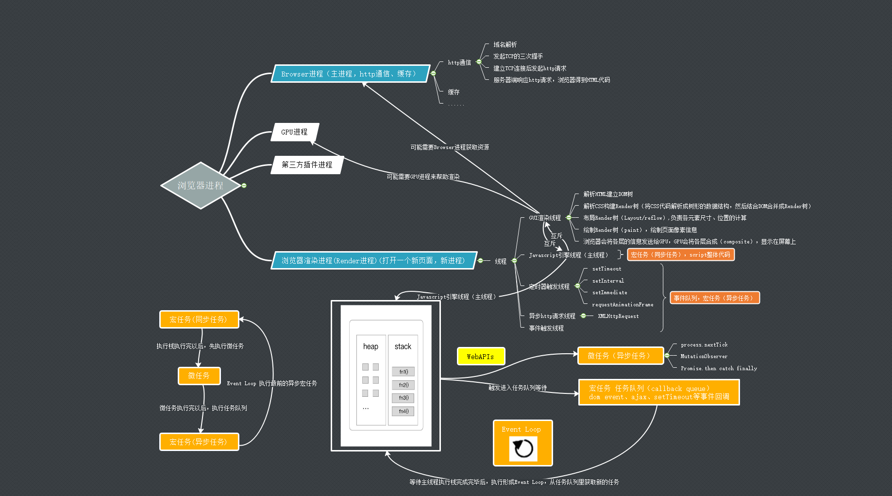

## 进程和线程

进程是CPU资源分配的最小单位（是能拥有资源和独立运行的最小单位，系统会给它分配内存）。

线程是CPU调试的最小单位（线程是建立在进程的基础上的一次程序运行单位，一个进程中可以有多个线程。同一进程的所有线程共享该进程的所有资源）。

进程是拥有资源的一个独立单位，线程不拥有系统资源，但可以访问隶属于进程的资源；一个进程可以有多个线程，线程之间可以相互通信。

线程在执行过程中，需要协作同步。不同进程的线程间要利用消息通信的办法实现同步。线程是指进程内的一个执行单元,也是进程内的可调度实体。


浏览器是多进程的，每打开一个页面，就相当于创建一个独立的浏览器进程。




## 主进程和渲染进程的通信过程

打开一个浏览器，可以看到：任务管理器出现了2个进程（一个主进程，一个是打开`Tab`页的渲染进程）；

- `Browser`主进程收到用户请求，首先需要获取页面内容（如通过网络下载资源）,随后将该任务通过`RendererHost`接口传递给`Render`渲染进程
- `Render`渲染进程的`Renderer`接口收到消息，简单解释后，交给渲染线程`GUI`，然后开始渲染
- `GUI`渲染线程接收请求，加载网页并渲染网页，这其中可能需要`Browser`主进程获取资源和需要`GPU`进程来帮助渲染
- 当然可能会有`JS`线程操作`DOM`（这可能会造成回流并重绘）
- 最后`Render`渲染进程将结果传递给`Browser`主进程
- `Browser`主进程接收到结果并将结果绘制出来

## 浏览器进程

浏览器一个页面就是新的一个进程,进程是CPU资源分配的最小单位（系统会给它分配内存）。

浏览器是多进程的。

- `Browser`进程(http通信等)：浏览器的主进程（负责协调，主控），只有一个，作用有：
  - 负责浏览器的界面显示，与用户交互，如前进、后退等
  - 负责各个页面的管理，创建和销毁其他进程
  - 将`Rendered`进程得到的内存中的`Bitmap`，绘制到用户界面上。
  - 网络资源的管理，通信、下载等
- 第三方插件进程：每个类型的插件对应一个进程，仅当使用该插件时才创建。
- `GPU`进程：最多一个，用于3D绘制、加速等。
- 浏览器渲染进程（浏览器内核）（`Render`进程，内部是多线程的）：默认每个页面一个进程，互不影响。主要作用为：**页面渲染、脚本执行、事件处理等**

浏览器多进程的优势：如果浏览器是单进程的，某个页面崩溃了，就影响了整个浏览器。同理如果插件崩溃了也会影响整个浏览器。

当然，内存等资源消耗也会更大，像**空间换时间**一样。

### 浏览器渲染进程（重点）

对于普通的前端操作来说，最重要的**渲染进程**：页面的渲染，`js`的执行，事件的循环等都在这个进程内执行;

**浏览器是多进程的，浏览器的渲染进程是多线程的；**

#### GUI渲染线程

- 负责渲染浏览器界面，解析`HTML`,`CSS`,构建`DOM`树和`RenderObject`树，布局和绘制等。
  -   解析HTML生成DOM树 - 渲染引擎首先解析HTML文档，生成DOM树
  - 构建Render树 - 接下来不管是内联式，外联式还是嵌入式引入的CSS样式会被解析生成CSSOM树，根据DOM树与CSSOM树生成另外一棵用于渲染的树-渲染树(Render tree)
  - 布局Render树 - 然后对渲染树的每个节点进行布局处理，确定其在屏幕上的显示位置
  - 绘制Render树 - 最后遍历渲染树并用UI后端层将每一个节点绘制出来

- 当界面需要重绘或由于某种操作引发回流时，该线程就会执行。
- 注意，**GUI渲染线程与JS引擎线程是互斥的**，当`JS`引擎执行时`GUI`线程会被挂起（相当于冻结了）,`GUI`更新会被保存在一个队列中等到`JS`引擎空闲时立即被执行。

如果JavaScript Runtime主线程被阻塞的话，同样会影响到UI渲染线程的执行，而一旦UI渲染线程被阻塞，用户就无法在页面上执行点击、滑动等操作了。这究竟是为什么呢？

原来，在浏览器的实现中，UI渲染操作（或者说是DOM更新操作）同样是以队列的形式处理的。类似于Message Queue(消息队列)，浏览器会维护一个Render Queue（简称RQ）来专门存放UI渲染消息，而且它跟MQ一样，必须等到Call Stack为空时才能被处理，不同的是，**它的处理优先级是要高于MQ的**。界面刷新的频次一般是每秒钟60次，也就是每16.67ms会执行一次，所以Event Loop每隔16.67ms就查看一下RQ队列是否有待处理的消息，如果有的话就检查Call Stack是否为空，为空就从RQ队列取出消息并处理，否则就继续等待直至Call Stack被清空，然后再处理RQ队列中的UI渲染消息。

##### css加载是否会阻塞dom树渲染

这里说的是头部引入`css`的情况，首先，我们都知道：`css`是由单独的下载线程异步下载的。

然后还有几个现象：

1. `css`加载不会阻塞`DOM`树解析（异步加载时`dom`照常构建）
2. 但会阻塞`render`树渲染（渲染时需要等`css`加载完毕，因为`render`树需要`css`信息）

这可能也是浏览器的一种优化机制因为你加载`css`的时候，可能会修改下面`DOM`节点的样式，如果`css`加载不塞`render`树渲染的话，那么当`css`加载完之后，`render`树可能又得重新重绘或者回流了，这就造成了一些没有必要的损耗所以干脆把`DOM`树的结构先解析完，把可以做的工作做完，然后等`css`加载完之后，在根据最终的样式来渲染`render`树，这种做法确实对性能好一点。

#### JavaScript引擎线程（主线程执行栈）

永远只有JS引擎（JS内核）线程在执行JS脚本程序，负责解析执行Javascript脚本程序的主线程（例如V8引擎）。一个Tab页（`render`进程）中无论什么时候都只有一个`JS`线程在运行`JS`程序。

- js引擎执行顺序
  - 宏任务(同步任务)直接执行,其他线程先进入任务队列等待执行。
  - 等执行栈清空以后，执行微任务。
  - 等微任务执行完以后，执行宏任务(异步任务)，执行栈会获取任务队列中最先的宏任务进行执行。这就是一个Event Loop，当遇到新的异步任务时，继续进入任务队列中等待执行，如此循环。

- 同样注意，`GUI`渲染线程与`JS`引擎线程是互斥的，所以如果`JS`执行的时间过长，这样就会造成页面的渲染不连贯，导致页面渲染加载阻塞。

> 注意：GUI渲染线程与JS引擎线程互斥。
>
> 由于JavaScript是可操纵DOM的，如果在修改这些元素属性同时渲染界面（即JS线程和UI线程同时运行），那么渲染线程前后获得的元素数据就可能不一致了。因此为了防止渲染出现不可预期的结果，浏览器设置GUI渲染线程与JS引擎为互斥的关系，当JS引擎执行时GUI线程会被挂起，GUI更新则会被保存在一个队列中等到JS引擎线程空闲时立即被执行。

#### 事件触发线程

- 归属于浏览器而不是`JS`引擎，用来控制事件循环（可以理解成`JS`引擎自己都忙不过来，需要浏览器另开线程协助）。
- 当`JS`引擎执行代码块如`setTimeout`时（也可来自浏览器内核的其它线程，如鼠标点击，`AJAX`异步请求等），当这些行为在响应的线程中执行好时，会将对应任务添加到事件线程中。
- 当对应的事件符合触发条件被触发时，该线程会把事件添加到待处理队列的队尾，等待`JS`引擎的处理。
- 注意，由于`JS`的单线程关系，所以这些待处理队列中的事件都得排队等待`JS`引擎处理（当`JS`引擎空闲时才会去执行）。**先进先出**

#### 定时器触发线程

- `setTimeout`、`setInterval`、`setImmediate`、所在的线程
- 浏览器定时计数器并不是由`JavaScript`引擎计数的，（因为`JavaScript`引擎是单线程的，如果处于阻塞线程状态就会影响计时的准确）
- 通过单独线程来计时并触发定时（计时完毕后，添加到事件队列中，等待`JS`引擎空闲后执行）
- 注意，`W3C`在`HTML`标准中规定，规定要求`setTimeout`中低于`4ms`的时间间隔算为`4ms`。

#### 异步HTTP请求线程

- `XMLHttpRequest`在连接后是通过浏览器新建一个线程请求。
- 当检测到状态变更时，如果设置有回调函数，异步线程就产生状态变更事件，将这个回调再放入事件队列中，再由`JavaScript`引擎执行。

## 总结浏览器渲染流程

总结下来，浏览器渲染进程如下：


> 浏览器输入`url`，浏览器主进程接管，开一个下载线程，然后进行`http`请求（略去`DNS`查询，`IP`寻址等等操作），然后等待响应，获取内容，随后将内容通过`RendererHost`接口转交给`Render`进程--浏览器渲染流程开始

浏览器内核拿到内容后，渲染大概可以划分为：

1. 解析`html`建立`dom`要
2. 解析`css`构建`render`树（将`css`代码解析成树形的数据结构，然后结合`dom`合并成`render`树）
3. 布局`render`树（`Layout/reflow`）,负责各元素尺寸，位置的计算
4. 绘制`render`树（`paint`），绘制页面像素信息
5. 浏览器会将各层的信息发送给`GPU`，`GPU`会将各层合成（`composite`）,显示在屏幕上

渲染完毕后就是`load`事件了，之后就是自己的`JS`逻辑处理了，略去了详细步骤。

**load事件与DOMContentLoaded事件的先后**

上面提到，渲染完毕后会触发`load`事件，那么你能分清楚`load`事件与`DOMContentLoaded`事件的先后么？

很简单，知道它们的定义就可以了：

当 `DOMContentLoaded` 事件触发时，仅当`DOM`加载完成，不包括样式表，图片。(譬如如果有`async`加载的脚本就不一定完成)

当 `onload` 事件触发时，页面上所有的`DOM`，样式表，脚本，图片都已经加载完成了。（渲染完毕了）

所以，顺序是：`DOMContentLoaded` -> `load`

## 单线程与多线程

- **单线程：** 从头执行到尾，一行一行执行，如果其中一行代码报错，那么剩下代码将不再执行。同时容易代码阻塞。
- **多线程：** 代码运行的环境不同，各线程独立，互不影响，避免阻塞。

JavaScript 的设计就是为了处理浏览器网页的交互（DOM操作的处理、UI动画等），决定了它是一门单线程语言。【处理任务是一件接着一件处理，从上往下顺序执行。如果有多个线程，它们同时在操作 DOM，那网页将会一团糟。

当遇到计时器、DOM事件监听或者是网络请求的任务时，JS引擎会将它们直接交给webapi，也就是浏览器提供的相应线程（如定时器线程为`setTimeout`计时、异步`http`请求线程处理网络请求）去处理，而JS引擎线程继续后面的其他任务，这样便实现了异步非阻塞。

为了利用多核CPU的计算能力，HTML5提出Web Worker标准，允许JavaScript脚本创建多个线程，但是子线程完全受主线程控制，且不得操作DOM。所以，这个新标准并没有改变JavaScript单线程的本质。

> 这里所谓的单线程指的是主线程是单线程的,所以在Node中主线程依旧是单线程的。

## 执行栈（stack）、任务队列（Task Queue）和事件循环（Event Loop）

JavaScript中的变量来说：

- 首先JavaScript中的变量分为基本类型和引用类型。
- 基本类型就是保存在栈内存中的简单数据段，而引用类型指的是那些保存在堆内存中的对象。

基本类型:

基本类型有Undefined、Null、Boolean、Number 和String。这些类型在内存中分别占有固定大小的空间，他们的值保存在栈空间，我们通过按值来访问的。

引用类型:

引用类型，值大小不固定，栈内存中存放地址指向堆内存中的对象。是按引用访问的。

栈内存中存放的只是该对象的访问地址，在堆内存中为这个值分配空间。由于这种值的大小不固定，因此不能把它们保存到栈内存中。但内存地址大小是固定的，因此可以将内存地址保存在栈内存中。 这样，当查询引用类型的变量时， 先从栈中读取内存地址， 然后再通过地址找到堆中的值。对于这种，我们把它叫做按引用访问。

#### 堆（heap）

对象被分配在一个堆中，即用以表示一个大部分非结构化的内存区域。

#### 执行栈（stack）

执行顺序：**后进先出**。

运行同步代码。执行栈中的代码（宏任务，同步任务），总是在读取"任务队列"（异步任务）之前执行。

#### 任务队列（callback queue）

执行顺序：**先进先出**。

任务队列是一个事件的队列（也可以理解成消息的队列），定时器线程、事件触发线程或异步HTTP请求线程完成一项任务，就在任务队列中添加一个事件，表示相关的异步任务可以进入执行栈了。主线程读取任务队列，就是读取里面有哪些事件。

任务队列是一个先进先出的数据结构，排在前面的事件，优先被主线程读取。主线程的读取过程基本上是自动的，只要执行栈一清空，任务队列上第一位的事件就自动进入主线程。

#### Event Loop

我们知道，在 `js` 代码执行过程中，会生成一个当前环境的执行上下文（ 执行环境 / 作用域），用于存放当前环境中的变量，这个上下文环境被生成以后，就会被推入`js`的执行栈。一旦执行完成，那么这个执行上下文就会被执行栈弹出，里面相关的变量会被销毁，在下一轮垃圾收集到来的时候，环境里的变量占据的内存就能得以释放。

这个执行栈，也可以理解为`JavaScript`的单一线程，所有代码都跑在这个里面，以同步的方式依次执行，或者阻塞，这就是同步场景。

那么异步场景呢？显然就需要一个独立于“执行栈”之外的容器，专门管理这些异步的状态，于是在“主线程”、“执行栈”之外，有了一个 `Task` 的队列结构，专门用于管理异步逻辑。所有异步操作的回调，都会暂时被塞入这个队列。`Event Loop` 处在两者之间，扮演一个大管家的角色，它会以一个固定的时间间隔不断轮询，当它发现主线程空闲，就会去到 `Task` 队列里拿一个异步回调，把它塞入执行栈中执行，一段时间后，主线程执行完成，弹出上下文环境，再次空闲，`Event Loop` 又会执行同样的操作。。。依次循环，于是构成了一套完整的事件循环运行机制。


上图中，主线程运行的时候，产生堆（heap）和栈（stack）。栈中的代码通过**先进后出，后进先出**，从上往下执行，当遇到异步事件时（`DOM Event，ajax，setTimeout...`），将他们的回调加入到**任务队列**中。只要栈中的代码执行完毕，主线程就会去读取任务队列，依次执行那些事件所对应的回调函数。

- 事件循环机制和消息队列的维护是由事件触发线程控制的。
- JS引擎线程遇到异步（DOM事件监听、网络请求、`setTimeout`计时器等...），会交给相应的线程单独去维护异步任务，等待某个时机（计时器结束、网络请求成功、用户点击DOM），然后由**事件触发线程**将异步对应的**回调函数**加入到消息队列中，消息队列中的回调函数等待被执行。
- 同时，JS引擎线程会维护一个**执行栈**，同步代码会依次加入执行栈然后执行，结束会退出执行栈。
- 如果执行栈里的任务执行完成，即执行栈为空的时候（即JS引擎线程空闲），事件触发线程才会从消息队列取出一个任务（即异步的回调函数）放入执行栈中执行。
- 执行完了后，执行栈再次为空，事件触发线程会重复上一步操作，再取出一个消息队列中的任务，这种机制就被称为事件循环（event loop）机制。

> 注意：栈和微任务队列存在内村溢出等情况，所以不要推入过多的事件，以防卡死

## 宏任务(macrotask)和微任务(microtask)

宏任务

| #                     | 浏览器 | Node |
| --------------------- | ------ | ---- |
| I/O                   | ✅      | ✅    |
| setTimeout            | ✅      | ✅    |
| setInterval           | ✅      | ✅    |
| setImmediate          | ❌      | ✅    |
| requestAnimationFrame | ✅      | ❌    |

微任务

| #                          | 浏览器 | Node |
| -------------------------- | ------ | ---- |
| process.nextTick           | ❌      | ✅    |
| MutationObserver           | ✅      | ❌    |
| Promise.then catch finally | ✅      | ✅    |

执行机制：

1. 首先，将执行栈最开始的所有同步代码(宏任务)执行完成；
2. 执行过程中如果遇到微任务，就将它添加到微任务的任务队列中，遇到异步宏任务，将执行权交给相应的线程，有结果后放入任务队列中，等待执行栈清空后被读取。
3. 执行栈清空后，立即执行当前微任务队列中的所有微任务（依次执行）
4. 当前宏任务（同步）、微任务执行完毕，开始检查渲染，然后GUI线程接管渲染
5. 渲染完毕后，JS引擎线程继续，开始下一个宏任务（从宏任务队列中获取）

这个过程是循环不断的，所以整个的这种运行机制又称为 **Event Loop（事件循环）**。

注意事项：

1. Promise 相对来说就比较特殊了，在 new Promise() 中传入的回调函数是会 立即执行 的，但是它的 `then() `方法是在 执行栈之后，任务队列之前 执行的，它属于微任务。

2. 在node环境下，`process.nextTick`的优先级高于`Promise`，也就是说：在宏任务结束后会先执行微任务队列中的`nextTickQueue`，然后才会执行微任务中的`Promise`。

3. `setImmediate` 是 Node.js 提供的另一个与"任务队列"有关的方法，它产生的任务追加到"任务队列"的尾部，它和 `setTimeout(fn, 0) `很像，但优先级都是 `setTimeout` 优先于 `setImmediate`。有时候，`setTimeout` 的执行顺序会在 `setImmediate` 的前面，有时候会在 `setImmediate` 的后面，这并不是 node.js 的 bug，这是因为虽然 `setTimeout` 第二个参数设置为0或者不设置，但是 `setTimeout` 源码中，会指定一个具体的毫秒数（node为1ms，浏览器为4ms），而由于当前代码执行时间受到执行环境的影响，执行时间有所起伏，如果当前执行的代码小于这个指定的值时，`setTimeout` 还没到推迟执行的时间，自然就先执行 `setImmediate` 了，如果当前执行的代码超过这个指定的值时，`setTimeout` 就会先于 `setImmediate` 执行。

   ```js
   setTimeout(_ => {
       console.log(11)
   });
   setImmediate(_ => {
       console.log(22)
   })
   //有时输出11 22 有时输出22 11，毫无规律，主要看setTimeout是否在setImmediate执行前准备好可以执行了
   
   /****** 解决办法 ******/
   
   //这样的话永远都是11 22了，因为同步任务执行完后，一定在4ms后，setTimeout必定已经可以执行
   setTimeout(_ => {
       console.log(11)
   });
   setImmediate(_ => {
       console.log(22)
   })
   let time = new Date();
   while(new Date() - time < 4) {}
   
   //或者使用这种写法，也必定永远是11 22，在node中因为I/O事件后是setImmediate先与setTimeout执行
   require('fs').readFile(__dirname, _ => {
     setTimeout(_ => console.log('timeout'))
     setImmediate(_ => console.log('immediate'))
   })
   ```


## Nodejs中的Event Loop

Node.js也是单线程的Event Loop，但是它的运行机制不同于浏览器环境。

Node中的Event Loop是基于`libuv`实现的，而`libuv`是 Node 的新跨平台抽象层，`libuv`使用异步，事件驱动的编程方式，核心是提供`i/o`的事件循环和异步回调。`libuv`的`API`包含有时间，非阻塞的网络，异步文件操作，子进程等等。

Event Loop就是在`libuv`中实现的。[libuv 官方文档](https://link.juejin.im/?target=http%3A%2F%2Fdocs.libuv.org%2Fen%2Fv1.x%2Fdesign.html)

Node 和浏览器的Event Loop是两个有明确区分的事物，不能混为一谈。nodejs的event是基于libuv，而浏览器的event loop则在html5的规范中明确定义。


根据上图，Node.js的运行机制如下。

- 我们写的js代码会交给v8引擎进行处理
- 代码中可能会调用nodeApi,node会交给libuv库处理
- libuv库负责Node API的执行。它将不同的任务分配给不同的线程，形成一个Event Loop（事件循环），以异步的方式将任务的执行结果返回给V8引擎。
- 通过事件驱动的方式,将结果放到事件队列中,最终交给我们的应用。

```
   ┌───────────────────────────┐
┌─>│           timers          │
│  └─────────────┬─────────────┘
│  ┌─────────────┴─────────────┐
│  │     pending callbacks     │
│  └─────────────┬─────────────┘
│  ┌─────────────┴─────────────┐
│  │       idle, prepare       │
│  └─────────────┬─────────────┘      ┌───────────────┐
│  ┌─────────────┴─────────────┐      │   incoming:   │
│  │           poll            │<─────┤  connections, │
│  └─────────────┬─────────────┘      │   data, etc.  │
│  ┌─────────────┴─────────────┐      └───────────────┘
│  │           check           │
│  └─────────────┬─────────────┘
│  ┌─────────────┴─────────────┐
└──┤      close callbacks      │
   └───────────────────────────┘
```

Node 的 Event Loop 分为 6 个阶段：

- timers：执行`setTimeout()` 和 `setInterval()`中到期的callback。
- pending callback: 上一轮循环中有少数的`I/O` callback会被延迟到这一轮的这一阶段执行
- idle, prepare：仅内部使用
- poll: 最为重要的阶段，执行`I/O` callback，在**适当的条件下**会阻塞在这个阶段
- check: 执行`setImmediate`的callback
- close callbacks: 执行`close`事件的callback，例如`socket.on('close'[,fn])`、`http.server.on('close, fn)`


## 思考

首先，根据以上的解释，`setTimeout( )`、`Promise.prototype.then( )` 、`http` 请求和各类浏览器事件，这些都被认为是异步的。以前我一直以为浏览器事件是异步的，当我执行了以下的代码后，对以前的认知进行了怀疑：

```js
var btn = document.getElementById('btn');

setTimeout(function () {
    console.log('timeout')
}, 0);

Promise.resolve().then(function () {
    console.log('promise');
});

btn.addEventListener('click', function () {
    console.log('click');
});

btn.click();

console.log('done');

//click done promise timeout
```

如果浏览器事件是异步的，不管后续会打印出什么，第一个打印的必然是 done ，而实际的打印结果为：`click done promise timeout` 。所以如果直接使用js调用事件，直接触发。

如果我们使用鼠标去手动点击的话，则是按照任务队列的顺序触发，在执行栈没有清空之前不会触发回调。

```js
var btn = document.getElementById('btn');

btn.addEventListener('click', function () {
    console.log('click');
});

let time = new Date();
while(new Date() - time < 3000) {
      //时间超过3s之后跳出循环，才能点击
}
```

在这个过程中，执行栈的代码一直在执行，所以你怎么手动点击都点击不了，因为js是单线程的，主线程还没有执行完，直到执行栈清空以后，才可以点击。


参考文章：

[浏览器渲染机制](https://segmentfault.com/a/1190000014018604)

[JavaScript的Event Loop详解](https://juejin.im/post/5d21c6d56fb9a07ea4209ffc#heading-4)

[JS进(线)程，微(宏)任务，同(异)步总结](https://www.cnblogs.com/sunidol/p/11301785.html)

[[基础] 浅谈 JS Event Loop](https://juejin.im/post/5c7e3fdbf265da2dca38856e)

[【THE LAST TIME】彻底吃透 JavaScript 执行机](https://juejin.im/post/5d901418518825539312f587#heading-29)

[js Event Loop 运行机制](https://juejin.im/post/5b67108e5188251aa30c8811)

