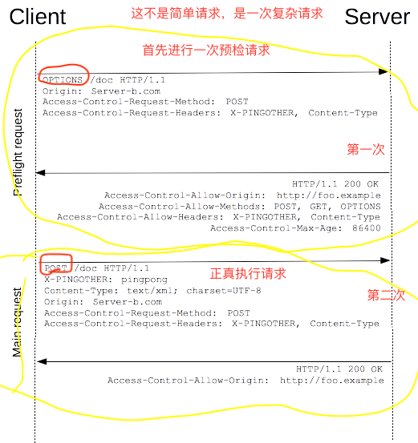

# CORS

当一个资源从与该资源本身所在的服务器不同的域或端口请求一个资源时，资源会发起一个**跨域 HTTP 请求**。

**出于安全原因，浏览器限制从脚本内发起的跨源HTTP请求。 例如，XMLHttpRequest和Fetch API遵循同源策略。 这意味着使用这些API的Web应用程序只能从加载应用程序的同一个域请求HTTP资源，除非使用CORS头文件。**

跨域并不一定是浏览器限制了发起跨站请求，也可能是跨站请求可以正常发起，但是返回结果被浏览器拦截了。

**跨域指的是浏览器的一种安全机制，服务器之间不存在跨域问题。如果两台服务器之间无法访问，请检查服务器的防火墙配置是否阻止了二者之间的通信**


## 概述

跨域资源共享标准新增了一组 HTTP 首部字段，允许服务器声明哪些源站有权限访问哪些资源。规范要求，对那些可能对服务器数据产生副作用的 HTTP 请求方法（特别是 [`GET`](https://developer.mozilla.org/zh-CN/docs/Web/HTTP/Methods/GET) 以外的 HTTP 请求，或者搭配某些 MIME 类型的 [`POST`](https://developer.mozilla.org/zh-CN/docs/Web/HTTP/Methods/POST) 请求），浏览器必须首先使用 [`OPTIONS`](https://developer.mozilla.org/zh-CN/docs/Web/HTTP/Methods/OPTIONS) 方法发起一个预检请求（preflight request），从而获知服务端是否允许该跨域请求。服务器确认允许之后，才发起实际的 HTTP 请求。在预检请求的返回中，服务器端也可以通知客户端，是否需要携带身份凭证（包括 [Cookies ](https://developer.mozilla.org/zh-CN/docs/Web/HTTP/Cookies)和 HTTP 认证相关数据）。

整个CORS通信过程，都是浏览器自动完成，不需要用户参与。对于开发者来说，CORS通信与同源的AJAX通信没有差别，代码完全一样。浏览器一旦发现AJAX请求跨源，就会自动添加一些附加的头信息，有时还会多出一次附加的请求，但用户不会有感觉。

因此，实现CORS通信的关键是服务器。只要服务器实现了CORS接口，就可以跨源通信。


## 若干访问场景

浏览器将CORS请求分成两类：简单请求、预检请求、附带身份凭证的请求。

对于简单请求，浏览器直接发出CORS请求。具体来说，就是在头信息之中，增加一个`Origin`字段。浏览器发现这次跨源AJAX请求是简单请求，就自动在头信息之中，添加一个`Origin`字段。

`Origin`字段用来说明，本次请求来自哪个源（协议 + 域名 + 端口）。服务器根据这个值，决定是否同意这次请求。

如果`Origin`指定的源，不在许可范围内，服务器会返回一个正常的HTTP回应。浏览器发现，这个回应的头信息没有包含`Access-Control-Allow-Origin`字段，就知道出错了，从而抛出一个错误，被`XMLHttpRequest`的`onerror`回调函数捕获。注意，这种错误无法通过状态码识别，因为HTTP回应的状态码有可能是200。

**所以，其实尽管跨域，客户端也是能将信息发送到服务端的。只要服务端如果没有返回相关响应头设置给客户端，那么对于客户端(浏览器等)来说他并不知道是否跨域了，所以浏览器进行了拦截。**

### 简单请求

只要满足以下所有条件，就属于简单请求。

- 使用下列请求方法之一：
  - [`GET`](https://developer.mozilla.org/zh-CN/docs/Web/HTTP/Methods/GET)
  - [`HEAD`](https://developer.mozilla.org/zh-CN/docs/Web/HTTP/Methods/HEAD)
  - [`POST`](https://developer.mozilla.org/zh-CN/docs/Web/HTTP/Methods/POST)

- Fetch 规范定义了[对 CORS 安全的首部字段集合](https://fetch.spec.whatwg.org/#cors-safelisted-request-header)，不得人为设置该集合之外的其他首部字段。该集合为：
  - [`Accept`](https://developer.mozilla.org/zh-CN/docs/Web/HTTP/Headers/Accept)
  - [`Accept-Language`](https://developer.mozilla.org/zh-CN/docs/Web/HTTP/Headers/Accept-Language)
  - [`Content-Language`](https://developer.mozilla.org/zh-CN/docs/Web/HTTP/Headers/Content-Language)
  - [`Content-Type`](https://developer.mozilla.org/zh-CN/docs/Web/HTTP/Headers/Content-Type) （需要注意额外的限制）
  - `DPR`
  - `Downlink`
  - `Save-Data`
  - `Viewport-Width`
  - `Width`
  - [`Content-Type`](https://developer.mozilla.org/zh-CN/docs/Web/HTTP/Headers/Content-Type) 的值仅限于下列三者之一：
    - `text/plain`
    - `multipart/form-data`
    - `application/x-www-form-urlencoded`

- 请求中没有使用 [`ReadableStream`](https://developer.mozilla.org/zh-CN/docs/Web/API/ReadableStream) 对象。

- 请求中的任意[`XMLHttpRequestUpload`](https://developer.mozilla.org/zh-CN/docs/Web/API/XMLHttpRequestUpload) 对象均没有注册任何事件监听器；[`XMLHttpRequestUpload`](https://developer.mozilla.org/zh-CN/docs/Web/API/XMLHttpRequestUpload) 对象可以使用 [`XMLHttpRequest.upload`](https://developer.mozilla.org/zh-CN/docs/Web/API/XMLHttpRequest/upload) 属性访问。


### 预检请求

非简单请求的CORS请求，会在正式通信之前，使用 [`OPTIONS`](https://developer.mozilla.org/zh-CN/docs/Web/HTTP/Methods/OPTIONS)   方法发起一个预检请求到服务器，称为"预检"请求（preflight）。浏览器先询问服务器，当前网页所在的域名是否在服务器的许可名单之中，以及可以使用哪些HTTP动词和头信息字段。只有得到肯定答复，浏览器才会发出正式的`XMLHttpRequest`请求，否则就报错。"预检请求“的使用，可以避免跨域请求对服务器的用户数据产生未预期的影响。

只要不满足上面的简单请求的条件，那么就执行预检请求。



预检请求

```
1.OPTIONS /resources/post-here/ HTTP/1.1
 2.Host: bar.other
 3.User-Agent: Mozilla/5.0 (Macintosh; U; Intel Mac OS X 10.5; en-US; rv:1.9.1b3pre) Gecko/20081130 Minefield/3.1b3pre
 4.Accept: text/html,application/xhtml+xml,application/xml;q=0.9,*/*;q=0.8
 5.Accept-Language: en-us,en;q=0.5
 6.Accept-Encoding: gzip,deflate
 7.Accept-Charset: ISO-8859-1,utf-8;q=0.7,*;q=0.7
 8.Connection: keep-alive
 9.Origin: http://foo.example
10.Access-Control-Request-Method: POST
11.Access-Control-Request-Headers: X-PINGOTHER, Content-Type
12.
13.
14.HTTP/1.1 200 OK
15.Date: Mon, 01 Dec 2008 01:15:39 GMT
16.Server: Apache/2.0.61 (Unix)
17.Access-Control-Allow-Origin: http://foo.example
18.Access-Control-Allow-Methods: POST, GET, OPTIONS
19.Access-Control-Allow-Headers: X-PINGOTHER, Content-Type
20.Access-Control-Max-Age: 86400
21.Vary: Accept-Encoding, Origin
22.Content-Encoding: gzip
23.Content-Length: 0
24.Keep-Alive: timeout=2, max=100
25.Connection: Keep-Alive
26.Content-Type: text/plain
```

预检请求完成之后，发送实际请求：

```
POST /resources/post-here/ HTTP/1.1
Host: bar.other
User-Agent: Mozilla/5.0 (Macintosh; U; Intel Mac OS X 10.5; en-US; rv:1.9.1b3pre) Gecko/20081130 Minefield/3.1b3pre
Accept: text/html,application/xhtml+xml,application/xml;q=0.9,*/*;q=0.8
Accept-Language: en-us,en;q=0.5
Accept-Encoding: gzip,deflate
Accept-Charset: ISO-8859-1,utf-8;q=0.7,*;q=0.7
Connection: keep-alive
X-PINGOTHER: pingpong
Content-Type: text/xml; charset=UTF-8
Referer: http://foo.example/examples/preflightInvocation.html
Content-Length: 55
Origin: http://foo.example
Pragma: no-cache
Cache-Control: no-cache

<?xml version="1.0"?><person><name>Arun</name></person>


HTTP/1.1 200 OK
Date: Mon, 01 Dec 2008 01:15:40 GMT
Server: Apache/2.0.61 (Unix)
Access-Control-Allow-Origin: http://foo.example
Vary: Accept-Encoding, Origin
Content-Encoding: gzip
Content-Length: 235
Keep-Alive: timeout=2, max=99
Connection: Keep-Alive
Content-Type: text/plain

[Some GZIP'd payload]
```

从上面的报文中，我们看到，第 1~12 行发送了一个使用 `OPTIONS` 方法的预检请求。` OPTIONS` 是 HTTP/1.1 协议中定义的方法，用以从服务器获取更多信息。该方法不会对服务器资源产生影响。 预检请求中同时携带了下面两个首部字段：

```
Access-Control-Request-Method: POST
Access-Control-Request-Headers: X-PINGOTHER, Content-Type
```

- 告知服务器，实际请求将使用 POST 方法。
- 告知服务器，实际请求将携带两个自定义请求首部字段：`X-PINGOTHER` 与 `Content-Type`。服务器据此决定，该实际请求是否被允许。

第14~26 行为预检请求的响应，表明服务器将接受后续的实际请求。重点看第 17~20 行：

```
Access-Control-Allow-Origin: http://foo.example
Access-Control-Allow-Methods: POST, GET, OPTIONS
Access-Control-Allow-Headers: X-PINGOTHER, Content-Type
Access-Control-Max-Age: 86400
```

- 首部字段` Access-Control-Allow-Methods `表明服务器允许客户端使用` POST,` `GET `和 `OPTIONS` 方法发起请求。
- 首部字段 `Access-Control-Allow-Headers `表明服务器允许请求中携带字段 `X-PINGOTHER `与` Content-Type`。与` Access-Control-Allow-Methods `一样，`Access-Control-Allow-Headers` 的值为逗号分割的列表。
- 最后，首部字段 `Access-Control-Max-Age` 表明该响应的有效时间为 86400 秒，也就是 24 小时。在有效时间内，浏览器无须为同一请求再次发起预检请求。请注意，浏览器自身维护了一个最大有效时间，如果该首部字段的值超过了最大有效时间，将不会生效。


### 附带身份凭证的请求

[Fetch](https://developer.mozilla.org/en-US/docs/Web/API/Fetch_API) 与 CORS 的一个有趣的特性是，可以基于  [HTTP cookies](https://developer.mozilla.org/en-US/docs/Web/HTTP/Cookies) 和 HTTP 认证信息发送身份凭证。一般而言，对于跨域 [XMLHttpRequest](https://developer.mozilla.org/zh-CN/docs/Web/API/XMLHttpRequest) 或 [Fetch](https://developer.mozilla.org/en-US/docs/Web/API/Fetch_API) 请求，浏览器**不会**发送身份凭证信息。如果要发送凭证信息，需要设置 `XMLHttpRequest `的某个特殊标志位。

```js
var xhr = new XMLHttpRequest();
xhr.open('GET', url, true);
xhr.withCredentials = true;		//标明浏览器的请求头中携带cookie
xhr.onload = function() {
    if(xhr.status === 200) {
        
    }    
}
xhr.send()
```

`xhr.withCredentials` 标志设置为 `true`，从而向服务器发送 `Cookies`。因为这是一个简单 GET 请求，所以浏览器不会对其发起“预检请求”。但是，如果服务器端的响应中未携带 `Access-Control-Allow-Credentials: true `，浏览器将不会把响应内容返回给请求的发送者。所以对于后台的返回，我们要设置响应头信息，并且此时`Access-Control-Allow-Origin`不能为`*`，必须是详细的地址。

```
'Access-Control-Allow-Credentials': 'true',
'Access-Control-Allow-Origin': 'http://127.0.0.1:5500',
```

如果缺失 `'Access-Control-Allow-Credentials': 'true'`，则响应内容不会返回给请求的发起者。


#### 附带身份凭证的请求与通配符(cookie)

HTTP Cookie（也叫Web Cookie或浏览器Cookie）是服务器发送到用户浏览器并保存在本地的一小块数据，它会在浏览器下次向同一服务器再发起请求时被携带并发送到服务器上。**通常，它用于告知服务端两个请求是否来自同一浏览器**，如保持用户的登录状态。Cookie使基于[无状态](https://developer.mozilla.org/en-US/docs/Web/HTTP/Overview#HTTP_is_stateless_but_not_sessionless)的HTTP协议记录稳定的状态信息成为了可能。

注意：

- 当客户端和服务端出于同域的时候，只要我们设置好`cookie`，客户端会直接通过请求头发送给服务端。但是如果是处于跨域，此时我们要得到`cookie`的话，客户端和服务端都要做相应的配置。(如下)

- 对于附带身份凭证的请求，服务器不得设置 `'Access-Control-Allow-Origin'：*`。

- 这是因为请求的首部中携带了`Cookie` 信息，如果 `Access-Control-Allow-Origin` 的值为`*`，请求将会失败。此时，我们必须写发送请求的主机端口。

- 另外，响应首部中也携带了 `Set-Cookie` 字段，尝试对` Cookie` 进行修改。如果操作失败，将会抛出异常。
- 其中在`Set-Cookie`中如果我们还设置了`HttpOnly`，那么在客户端我们不能取得服务端返回的`Cookie`
- 同时，Cookie依然遵循同源政策，只有用服务器域名设置的Cookie才会上传，其他域名的Cookie并不会上传，且（跨源）原网页代码中的`document.cookie`也无法读取服务器域名下的Cookie。(其实每打开一个新的浏览器窗口，**使用f12查看application可以得到同源下Cookies处都是独立的，同源下的每个新页面都有新的的缓存**，`sessionStorage`也是，但`localStorage`却不是，是共同的。注意是同源下的共同页面，一个百度和一个阿里可不是同一个网站)

例子:

```js
//客户端  http://127.0.0.1:5500
var xhr = new XMLHttpRequest();
xhr.open('GET', '/docros', true);
xhr.withCredentials = true;		//在跨域的情况下，标明浏览器的请求头中允许携带cookie
xhr.onload = function() {}
xhr.send()

//服务端
app.use('/docros', (req, res) => {
    let cookie = req.headers.cookie;
    console.log(cookie)
    res.set({
        'Access-Control-Allow-Credentials': 'true',	//在跨域的情况下，表明服务端允许客户端发送凭证
        'Access-Control-Allow-Origin': 'http://127.0.0.1:5500',
        'Set-Cookie': 100 * Math.random(),   //HttpOnly		
        // 'Access-Control-Expose-Headers': 'Set-Cookie',
    })
    res.send('aaa')
})
```

随机返回`cookie`，  下次请求头中的`cookie`就是这次返回的`cookie`，而下次再返回的`cookie`，又会作为下次再次请求时的`cookie`

> 注意： 当header信息 `Access-Control-Allow-Credentials:true`，那么`Access-Control-Allow-Origin`不可以为 `*`，因为`*`会和 `Access-Control-Allow-Credentials:true` 冲突，需配置指定的地址，不然会报错。


#### 扩展

其中对于[xhr.getResponseHeader(header)](https://developer.mozilla.org/zh-CN/docs/Web/API/XMLHttpRequest/getResponseHeader)或[xhr.getAllResponseHeaders()](https://developer.mozilla.org/zh-CN/docs/Web/API/XMLHttpRequest/getAllResponseHeaders)方法，我们是不能得到响应头中返回的`cookie`的，因为：

1. [W3C的 xhr 标准中做了限制](https://www.w3.org/TR/XMLHttpRequest/)，规定客户端无法获取 response 中的 `Set-Cookie`、`Set-Cookie2`这2个字段，无论是同域还是跨域请求；在上面两个方法中返回的字段中是没有`Set-Cookie`、`Set-Cookie2`字段的，响应头中直接帮我们在浏览器设置了新`cookie`，要获取`cookie`我们只能通过`document.cookie`。

2. [W3C 的 cors 标准对于跨域请求也做了限制](https://www.w3.org/TR/cors/#access-control-allow-credentials-response-header)，规定对于跨域请求，客户端允许获取的response header字段只限于[simple response header](https://developer.mozilla.org/en-US/docs/Glossary/Simple_response_header)和[Access-Control-Expose-Headers](https://developer.mozilla.org/zh-CN/docs/Web/HTTP/Headers/Access-Control-Expose-Headers) 。同源的请求，就能得到更多的响应头信息。

   1. simple response header包括的 header 字段有：`Cache-Control`、`Content-Language`、`Content-Type`、`Expires`、`Last-Modified`、`Pragma`， 如果要访问其他头，则需要服务器设置`Access-Control-Expose-Headers`;

   2. [Access-Control-Expose-Headers](https://developer.mozilla.org/zh-CN/docs/Web/HTTP/Headers/Access-Control-Expose-Headers)：首先得注意是`Access-Control-Expose-Headers`是**进行跨域请求时响应头部中的一个字段，对于同域请求，响应头部是没有这个字段的**。这个字段中列举的 `header` 字段就是服务器允许暴露给客户端访问的字段，让服务器把允许浏览器访问的头放入白名单。

      ```js
      //node
      res.set({
          aa: 111,		//我们在响应头中，随意写一个要暴露的字段
          'Access-Control-Expose-Headers': 'aa'
      })
      
      //js
      xhr.getResponseHeader('aa)		//就能得到除simple response header外的响应头字段信息
      ```

   3. `'Set-Cookie': 'name=lisi;HttpOnly;'`  如果设置上了`HttpOnly`，那么返回的`cookie`在客户端是不能被读取的。如果不设置，我们可以通过`document.cookie`读取到。


## HTTP 响应首部字段

#### Access-Control-Allow-Origin

响应首部中可以携带一个 [Access-Control-Allow-Origin](https://developer.mozilla.org/zh-CN/docs/Web/HTTP/Headers/Access-Control-Allow-Origin) 字段，该字段是必须的。其语法如下:

```http
Access-Control-Allow-Origin: <origin> | *
```

其中，origin 参数的值指定了允许访问该资源的外域 URI。对于不需要携带身份凭证的请求，服务器可以指定该字段的值为通配符，表示允许来自所有域的请求。


#### Access-Control-Expose-Headers

该字段可选，只有在跨域的情况下才有这个字段，同源情况下没有。在跨域访问时，`XMLHttpRequest`对象的`getResponseHeader()`方法只能拿到一些最基本的响应头，`Cache-Control`、`Content-Language`、`Content-Type`、`Expires`、`Last-Modified`、`Pragma`，如果要访问其他头，则需要服务器设置本响应头。

[Access-Control-Expose-Headers](https://developer.mozilla.org/zh-CN/docs/Web/HTTP/Headers/Access-Control-Expose-Headers) 头让服务器把允许浏览器访问的头放入白名单，例如： 

```http
Access-Control-Expose-Headers: X-My-Custom-Header, X-Another-Custom-Header
```

这样浏览器就能够通过`getResponseHeader`访问`X-My-Custom-Header`和 `X-Another-Custom-Header` 响应头了`。` 


#### Access-Control-Max-Age

[Access-Control-Max-Age](https://developer.mozilla.org/zh-CN/docs/Web/HTTP/Headers/Access-Control-Max-Age) 头指定了请求的结果能够被缓存多久。

```http
Access-Control-Max-Age: <delta-seconds>
```


#### Access-Control-Allow-Credentials

[Access-Control-Allow-Credentials](https://developer.mozilla.org/zh-CN/docs/Web/HTTP/Headers/Access-Control-Allow-Credentials) 头指定了当浏览器的`credentials`设置为`true`时, 是否允许浏览器读取response的凭着内容(如cookie)。

该字段可选。它的值是一个布尔值，表示是否允许客户端发送Cookie。默认情况下，Cookie不包括在CORS请求之中。只有这个字段为`true`，即表示服务器明确许可，然后客户端`xhr.withCredentials = true`，Cookie才可以包含在请求中，一起发给服务器。

在跨域的情况下，默认cookie是不发送到服务端的，在请求头我们也看不到cookie字段。只有以下设置的情况下，客户端的请求头中才会发送cookie：

```js
//客户端
xhr.withCredentials = true  //存在兼容问题：>=IE10

//服务端
res.set({
    Access-Control-Allow-Credentials: true
})
```

```http
Access-Control-Allow-Credentials: true
```


#### Access-Control-Allow-Methods	(预检请求的回应)

[Access-Control-Allow-Methods](https://developer.mozilla.org/zh-CN/docs/Web/HTTP/Headers/Access-Control-Allow-Methods) 首部字段用于预检请求的响应。其指明了实际请求所允许使用的 HTTP 方法。

```http
Access-Control-Allow-Methods: <method>[, <method>]*
```


#### Access-Control-Allow-Headers	(预检请求的回应)

[Access-Control-Allow-Headers](https://developer.mozilla.org/zh-CN/docs/Web/HTTP/Headers/Access-Control-Allow-Headers) 首部字段用于预检请求的响应。其指明了实际请求中允许携带的首部字段。 

```http
Access-Control-Allow-Headers: <field-name>[, <field-name>]*
```


## HTTP 请求首部字段

列出了可用于发起跨域请求的首部字段。**请注意，这些首部字段无须手动设置。 当开发者使用 XMLHttpRequest 对象发起跨域请求时，它们已经被设置就绪**。


#### Origin

[Origin](https://developer.mozilla.org/zh-CN/docs/Web/HTTP/Headers/Origin) 首部字段表明预检请求或实际请求的源站。

```http
Origin: <origin>
```

origin 参数的值为源站 URI。它不包含任何路径信息，只是服务器名称。


#### Access-Control-Request-Method	(预检请求)

[Access-Control-Request-Method](https://developer.mozilla.org/zh-CN/docs/Web/HTTP/Headers/Access-Control-Request-Method) 首部字段用于预检请求。其作用是，将实际请求所使用的 HTTP 方法告诉服务器。 

```http
Access-Control-Request-Method: <method>
```


#### Access-Control-Request-Headers	(预检请求)

[Access-Control-Request-Headers](https://developer.mozilla.org/zh-CN/docs/Web/HTTP/Headers/Access-Control-Request-Headers) 首部字段用于预检请求。其作用是，将实际请求所携带的首部字段告诉服务器。 

```http
Access-Control-Request-Headers: <field-name>[, <field-name>]*
```


参考文章:

[HTTP访问控制（CORS）](https://developer.mozilla.org/zh-CN/docs/Web/HTTP/Access_control_CORS#Preflighted_requests)

[Server-Side Access Control](https://developer.mozilla.org/zh-CN/docs/Web/HTTP/Server-Side_Access_Control)

[跨域资源共享 CORS 详解](http://www.ruanyifeng.com/blog/2016/04/cors.html)

[ 你真的会使用XMLHttpRequest吗](https://segmentfault.com/a/1190000004322487)