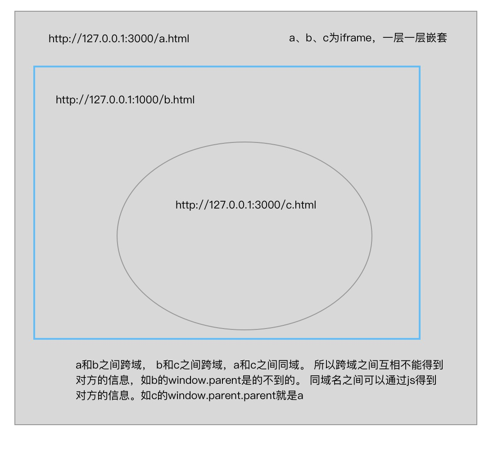

#  前端常见跨域

### 什么是跨域？

跨域是指一个域下的文档或脚本试图去请求另一个域下的资源，这里跨域是广义的。

#### 广义的跨域：

- 资源跳转： a链接、重定向、表单提交

- 资源嵌入：`<link>`、`<script>`、``、`<frame>`等dom标签，还有样式中`background:url()`、`@font-face()`等文件外链

- 脚本请求：`js`发起的`ajax`请求、`dom`和`js`对象的跨域操作等

其实我们通常所说的跨域是狭义的，是由浏览器同源策略限制的一类请求场景。

#### 什么是同源策略?

同源策略/SOP（Same origin policy）是一种约定，由Netscape公司1995年引入浏览器，它是浏览器最核心也最基本的安全功能，如果缺少了同源策略，浏览器很容易受到XSS、CSFR等攻击。**所谓同源是指"协议+域名+端口"三者相同，即便两个不同的域名指向同一个ip地址，也非同源**。

同源策略限制以下几种行为：

1. `Cookie`、`LocalStorage` 和 `IndexDB` 无法读取
2. `DOM` 和 `Js`对象无法获得
3. `AJAX` 请求不能发送

### 常见跨域场景

```
URL                                      说明                    是否允许通信
http://www.domain.com/a.js
http://www.domain.com/b.js         同一域名，不同文件或路径           允许
http://www.domain.com/lab/c.js

http://www.domain.com:8000/a.js
http://www.domain.com/b.js         同一域名，不同端口                不允许
 
http://www.domain.com/a.js
https://www.domain.com/b.js        同一域名，不同协议                不允许
 
http://www.domain.com/a.js
http://192.168.4.12/b.js           域名和域名对应相同ip              不允许
 
http://www.domain.com/a.js
http://x.domain.com/b.js           主域相同，子域不同                不允许
http://domain.com/c.js
 
http://www.domain1.com/a.js
http://www.domain2.com/b.js        不同域名                         不允许
```

主域名：由两个或两个以上的字母构成，中间由点号隔开，整个域名只有1个点号。

子域名：是在主域名之下的域名，域名内容会有多个点号。

例：baidu.com是主域名，www.baidu.com, wap.baidu.com,new.baidu.com是子域名，不带前缀为主，带了就是子。


### 跨域解决方案

1. 像`a`标签、表单、`<link>`、`<script>`、``、`<frame>`等dom标签，还有样式中`background:url()`、`@font-face()`等文件外链

1. 通过`jsonp`跨域 
2. `document.domain` + `iframe`跨域
3. `location.hash` +`iframe`
4. `window.name` + `iframe`跨域
5. `postMessage`跨域
6. 跨域资源共享（`CORS`）
7. `nginx`代理跨域
8. `nodejs`中间件代理跨域
9. `WebSocket`协议跨域


#### 一、通过jsonp跨域

通常为了减轻web服务器的负载，我们把`js`、`css`，`img`等静态资源分离到另一台独立域名的服务器上，在`html`页面中再通过相应的标签从不同域名下加载静态资源，而被浏览器允许，基于此原理，我们可以通过动态创建`script`，再请求一个带参网址实现跨域通信。

**jsonp缺点：只能实现get一种请求。**

##### 1. 原生实现

```js
//客户端
<script>
    var script = document.createElement('script');
    script.type = 'text/javascript';

    // 传参并指定回调执行函数为show名
    script.src = 'http://www.domain2.com:8080/login?user=admin&callback=show';
    document.head.appendChild(script);

    // 回调执行函数
    function show(res) {
        alert(res);
    }
 </script>
```

```js
//服务端
app.use('/jsonp', (req, res) => {
    let back = req.query.callback;  //这是一个字符串函数名
    let data = {
        a: 22
    }

    back = back + '(' + JSON.stringify(data) + ')';
    //res.set('Content-Type', 'text/javascript;charset=utf-8')
    res.send(back);		//返回一个字符串的函数形式, 
})
```

其实只要你服务端返回一个执行的函数名，然后客户端存在这个函数，那么就可以在客户端触发。

##### 2. jquery ajax

```js
$.ajax({
    url: 'http://www.domain2.com:8080/login',
    type: 'get',
    dataType: 'jsonp',  // 请求方式为jsonp
    jsonpCallback: "onBack",    // 自定义回调函数名
    data: {}
});
```


#### 二、document.domain + iframe跨域

此方案仅限主域相同，子域不同的跨域应用场景。

```
parent.domain.com和child.domain.com就是主域domain.com相同, 子域加上child和parent，不同
```

实现原理：两个页面都通过js强制设置`document.domain`为基础主域，就实现了同域。

> 记住如果两个iframe不是同域的话，那么除了可以使用location.htef跳转，其他iframe想获取双方的信息是不允许的。因为跨域了

```html
//父窗口
<iframe id="iframe" src="http://child.domain.com/b.html"></iframe>
<script>
    document.domain = 'domain.com';
    var user = 'admin';
</script>
```

```html
//子窗口
<script>
    document.domain = 'domain.com';
    // 获取父窗口中变量
    alert('get js data from parent ---> ' + window.parent.user);
</script>
```


#### 三、location.hash + iframe跨域

指的是URL的#后面的部分，比如`http:127.0.0.1:3000/index.html#hello的#hello`，**只改变hash是不会刷新页面。**同样该方法也只适用于不同窗体之间跨域请求。

父窗体可以把信息写在子窗体的`href`的`hash`上，子窗口通过监听`hashchange`事件获取信息。 

实现原理： a欲与b跨域相互通信，通过中间页c来实现。 三个页面，不同域之间利用`iframe`的`location.hash`传值，相同域之间直接js访问来通信。

具体实现：A域：a.html -> B域：b.html -> A域：c.html，a与b不同域只能通过`hash`值单向通信，b与c也不同域也只能单向通信，但c与a同域，所以c可通过`parent.parent`访问a页面所有对象。而c的`window.parent`是跨域的，不能获取到父级信息。

> 注意： iframe之间不是同域的话，那么不能互相得到对方的信息

1. a.html	`http://www.domain1.com/a.html`

```html
<iframe id="iframe" src="http://www.domain2.com/b.html" style="display:none;"></iframe>
<script>
    var iframe = document.getElementById('iframe');

    // 向b.html传hash值
    setTimeout(function() {
        iframe.src = iframe.src + '#user=admin';
    }, 1000);
    
    // 开放给同域c.html的回调方法
    function onCallback(res) {
        alert('data from c.html ---> ' + res);
    }
</script>
```

2. b.html	`http://www.domain2.com/b.html`

```html
<iframe id="iframe" src="http://www.domain1.com/c.html" style="display:none;"></iframe>
<script>
    var iframe = document.getElementById('iframe');

    // 监听a.html传来的hash值，再传给c.html
    window.onhashchange = function () {
        iframe.src = iframe.src + location.hash;
    };
</script>
```

c.html	`http://www.domain1.com/c.html`

```html
<script>
    // 监听b.html传来的hash值
    window.onhashchange = function () {
        // 再通过操作同域a.html的js回调，将结果传回
        window.parent.parent.onCallback('hello: ' + location.hash.replace('#user=', ''));
    };
</script>
```


#### 四、window.name + iframe跨域

`window.name`属性的独特之处：`name`值在不同的页面（甚至不同域名）加载后依旧存在，并且可以支持非常长的 `name` 值（2MB）。

1. a.html：`http://www.domain1.com/a.html`

```js
var proxy = function(url, callback) {
    var state = 0;
    var iframe = document.createElement('iframe');

    // 加载跨域页面
    iframe.src = url;

    // onload事件会触发2次，第1次加载跨域页，并留存数据于window.name
    iframe.onload = function() {	//这个框架里的地址改变就重新加载一次
        if (state === 1) {
            // 第2次onload(同域proxy页)成功后，读取同域window.name中数据
            callback(iframe.contentWindow.name);
            destoryFrame();

        } else if (state === 0) {
            // 第1次onload(跨域页)成功后，切换到同域代理页面
            iframe.contentWindow.location = 'http://www.domain1.com/proxy.html';	//地址改变， 所以iframe.onload会重新加载
            state = 1;
        }
    };

    document.body.appendChild(iframe);

    // 获取数据以后销毁这个iframe，释放内存；这也保证了安全（不被其他域frame js访问）
    function destoryFrame() {
        iframe.contentWindow.document.write('');
        iframe.contentWindow.close();
        document.body.removeChild(iframe);
    }
};

// 请求跨域b页面数据
proxy('http://www.domain2.com/b.html', function(data){
    alert(data);
});
```

2. proxy.html：`http://www.domain1.com/proxy`

中间代理页，与a.html同域，内容为空即可。

3. b.html：`http://www.domain2.com/b.html`

```js
<script>
    window.name = 'This is domain2 data!';
</script>
```

总结：通过`iframe`的`src`属性由外域转向本地域，跨域数据即由`iframe`的`window.name`从外域传递到本地域。这个就巧妙地绕过了浏览器的跨域访问限制，但同时它又是安全操作。


#### 五、postMessage跨域

`postMessage`是`HTML5 XMLHttpRequest Level 2`中的API，且是为数不多可以跨域操作的`window`属性之一，它可用于解决以下方面的问题：

1. 页面和其打开的新窗口的数据传递
2. 多窗口之间消息传递
3. 页面与嵌套的`iframe`消息传递
4. 上面三个场景的跨域数据传递

用法：`postMessage(data,origin)`方法接受两个参数

`data`： html5规范支持任意基本类型或可复制的对象，但部分浏览器只支持字符串，所以传参时最好用`JSON.stringify()`序列化。

`origin`： 协议+主机+端口号，也可以设置为"*"，表示可以传递给任意窗口，如果要指定和当前窗口同源的话设置为`"/"`。

先获取`iframe`里面的`window`对象，再通过这个对象，获取到里面的`DOM`元素`iframe.contentWindow`

```html
//a.html：(http://www.domain1.com/a.html)

<iframe id="iframe" src="http://www.domain2.com/b.html" style="display:none;"></iframe>
<script>       
    var iframe = document.getElementById('iframe');
    iframe.onload = function() {
        var data = {
            name: 'aym'
        };
        // 向domain2传送跨域数据
        iframe.contentWindow.postMessage(JSON.stringify(data), 'http://www.domain2.com');
        
       	console.log(iframe.contentWindow.document.body)
    };

    // 接受domain2返回数据
    window.addEventListener('message', function(e) {
        alert('data from domain2 ---> ' + e.data);
    }, false);
</script>
```

```html
//b.html：(http://www.domain2.com/b.html)

<script>
    // 接收domain1的数据
    window.addEventListener('message', function(e) {
        alert('data from domain1 ---> ' + e.data);
		
        var data = JSON.parse(e.data);
        if (data) {			//因为当前文件加载好，初始化onmessage会执行一次，而此时e.data为空字符串
            data.number = 16;

            // 处理后再发回domain1
            //这里的window.parent本来跨域是不被允许的，但是因为postMessage前面是一个otherWindow对象，所以这里可以写上父级window，但是直接获取window.parent是会报跨域的错，不被允许得到父级信息
            window.parent.postMessage(JSON.stringify(data), 'http://www.domain1.com');
        }
    }, false);
</script>

```

##### 对于iframe是否跨域



`iframe`之间同域可以访问。


#### 六、跨域资源共享（CORS）

普通跨域请求：只服务端设置`Access-Control-Allow-Origin`即可，前端无须设置，若要带`cookie`请求：前后端都需要设置。

需注意的是：由于同源策略的限制，所读取的`cookie`为跨域请求接口所在域的`cookie`，而非当前页。如果想实现当前页`cookie`的写入(**就是指反向代理，其实是客户端-->反向代理服务端—>服务端，其中客户端到反向代理服务器之间还是存在跨域问题，只是服务器和服务器之间不存在跨域**，可参考下文：七、`nginx`反向代理中设置proxy_cookie_domain 和 八、NodeJs中间件代理中cookieDomainRewrite参数的设置。

**只要是有浏览器，那么就存在同源策略的问题。如果协议、域名、端口不同，就存在跨域问题。**

**跨域 XHR 对象也有一些限制，但为了安全这些限制是必需的(即跨域的时候需要注意)**：

- 客户端不能使用`setRequestHeader()`设置自定义头部。
- 客户端不能发送和接收`cookie`
- 调用 `getAllResponseHeaders()`方法，w3c规定只会返回[simple response header](https://developer.mozilla.org/en-US/docs/Glossary/Simple_response_header)和[Access-Control-Expose-Headers](https://developer.mozilla.org/zh-CN/docs/Web/HTTP/Headers/Access-Control-Expose-Headers) 的头部信息。

如果想要在服务端获取`cookie`，或者在客户端获取服务端返回的`cookie`，那么前后端一定要设置如下：

```js
// 前端设置是否带cookie  原生js
xhr.withCredentials = true;

//后台
res.set({
    'Access-Control-Allow-Credentials': 'true',		//后台设置cookie, 如果写上这句，那么下面不能写*，必须明确的地址
    'Access-Control-Allow-Origin': 'http://127.0.0.1:5500',		//*
    'Set-Cookie': 'name=lisi;HttpOnly;',   //HttpOnly如果写上这个，那么在客户端不能通过document.cookie获取到重新设定，返回的cookie
})
```


> 注意： 当header信息 `Access-Control-Allow-Credentials:true`，那么`Access-Control-Allow-Origin`不可以为 `*`，因为`*`会和 `Access-Control-Allow-Credentials:true` 冲突，需配置指定的地址，不然会报错。

1. 前端设置

```js
var xhr = new XMLHttpRequest(); // IE8/9需用window.XDomainRequest兼容

// 前端设置是否带cookie
xhr.withCredentials = true;

xhr.open('post', 'http://www.domain2.com:8080/login', true);
xhr.setRequestHeader('Content-Type', 'application/x-www-form-urlencoded');
xhr.send('user=admin');

xhr.onreadystatechange = function() {
    if (xhr.readyState == 4 && xhr.status == 200) {
        alert(xhr.responseText);
        console.log(document.cookie)	//只能通过该方法得到cookie， getResponseHeader方法不行
    }
};
```

2. 服务端设置

若后端设置成功，前端浏览器控制台则不会出现跨域报错信息，反之，说明没设成功。

```js
var http = require('http');
var server = http.createServer();
var qs = require('querystring');

server.on('request', function(req, res) {
    var postData = '';

    // 数据块接收中
    req.on('data', function(chunk) {
        postData += chunk;
    });

    // 数据接收完毕
    req.on('end', function() {
        postData = qs.parse(postData);

        // 跨域后台设置
        res.writeHead(200, {
            'Access-Control-Allow-Credentials': 'true',     // 后端允许发送Cookie
            'Access-Control-Allow-Origin': 'http://www.domain1.com',    // 允许访问的域（协议+域名+端口）
            /* 
             * 此处设置的cookie还是domain2的而非domain1，因为后端也不能跨域写cookie(nginx反向代理可以实现)，
             * 但只要domain2中写入一次cookie认证，后面的跨域接口都能从domain2中获取cookie，从而实现所有的接口都能跨域访问
             */
            'Set-Cookie': 'l=a123456;Path=/;Domain=www.domain2.com;HttpOnly'  // HttpOnly的作用是让js无法读取cookie
        });

        res.write(JSON.stringify(postData));
        res.end();
    });
});

server.listen('8080');
console.log('Server is running at port 8080...');
```

3. 拓展

执行上面之后，我们想在客户端获取响应的`cookie`。该怎么做？首先，我们只要按照上面对前后端都设定好对于`cookie`的设置。在服务端`req.headers.cookie`中能得到客户端传给服务端的`cookie`，在客户端`document.cookie`中能得到服务端传给客户端的`cookie`。

其中对于[xhr.getResponseHeader(header)](https://developer.mozilla.org/zh-CN/docs/Web/API/XMLHttpRequest/getResponseHeader)或[xhr.getAllResponseHeaders()](https://developer.mozilla.org/zh-CN/docs/Web/API/XMLHttpRequest/getAllResponseHeaders)方法，我们是不能得到响应头中返回的`cookie`的，因为：

1. [W3C的 xhr 标准中做了限制](https://www.w3.org/TR/XMLHttpRequest/)，规定客户端无法获取 response 中的 `Set-Cookie`、`Set-Cookie2`这2个字段，无论是同域还是跨域请求；

2. [W3C 的 cors 标准对于跨域请求也做了限制](https://www.w3.org/TR/cors/#access-control-allow-credentials-response-header)，规定对于跨域请求，客户端允许获取的response header字段只限于[simple response header](https://developer.mozilla.org/en-US/docs/Glossary/Simple_response_header)和[Access-Control-Expose-Headers](https://developer.mozilla.org/zh-CN/docs/Web/HTTP/Headers/Access-Control-Expose-Headers) 。

   1. `simple response header`包括的 header 字段有：`Cache-Control`,`Content-Language`,`Content-Type`,`Expires`,`Last-Modified`,`Pragma`;

   2. `Access-Control-Expose-Headers`：首先得注意是`Access-Control-Expose-Headers`是进行跨域请求时响应头部中的一个字段，对于同域请求，响应头部是没有这个字段的。这个字段中列举的 header 字段就是服务器允许暴露给客户端访问的字段。

      ```js
      //node
      res.set({
          aa: 111,		//我们在响应头中，随意写一个要暴露的字段
          'Access-Control-Expose-Headers': 'aa'
      })
      
      //js
      xhr.getResponseHeader('aa)		//就能得到除simple response header外的响应头字段信息
      ```

   3. `'Set-Cookie': 'name=lisi;HttpOnly;'`  如果设置上了`HttpOnly`，那么返回的`cookie`在客户端是不能被读取的。如果不设置，我们可以读取到

   4. **跨域指的是浏览器的一种安全机制，服务器之间不存在跨域问题。如果两台服务器之间无法访问，请检查服务器的防火墙配置是否阻止了二者之间的通信**


#### xhr.withCredentials与 CORS 什么关系

我们都知道，在发同域请求时，浏览器会将`cookie`自动加在`request header`中。但大家是否遇到过这样的场景：在发送跨域请求时，`cookie`并没有自动加在`request header`中。

造成这个问题的原因是：在`CORS`(跨域时)标准中做了规定，默认情况下，浏览器在发送跨域请求时，不能发送任何认证信息（`credentials`）如`cookies`和`HTTP authentication schemes`。除非`xhr.withCredentials`为`true`（`xhr`对象有一个属性叫`withCredentials`，默认值为`false`）。

所以根本原因是`cookies`也是一种认证信息，在跨域请求中，客户端必须手动设置`xhr.withCredentials=true`，且服务端也必须允许`request`能携带认证信息（即`response header`中包含`Access-Control-Allow-Credentials:true`），这样浏览器才会自动将`cookie`加在`request header`中。

另外，要特别注意一点，一旦跨域`request`能够携带认证信息，`server`端一定不能将`Access-Control-Allow-Origin`设置为`*`，而必须设置为请求页面的域名。

```js
//前端
var xhr = new XMLHttpRequest();
xhr.open('GET', 'http://example.com/', true); 
xhr.withCredentials = true;   //写上这个，即使跨域，也可以发送cookie了
xhr.send(null);


//后台设置响应头   允许credentials:
res.set({
    //不写这个 虽然浏览器上能看到响应结果，但我们不能得到响应的数据
    'Access-Control-Allow-Credentials': true,   //或'true'也可以， 设置了这个字段，那么下面的Access-Control-Allow-Origin不能使用*，一定要写正确的地址。
    'Access-Control-Allow-Origin': 'http://127.0.0.1:5500',  
})
```

支持 `withCredentials` 属性的浏览器有 Firefox 3.5+、Safari 4+和 Chrome。IE 10 及更早版本都不 9
支持。


#### 七、nginx代理跨域

##### 1、nginx配置解决iconfont跨域

浏览器跨域访问js、css、img等常规静态资源被同源策略许可，但`iconfont`字体文件(eot|otf|ttf|woff|svg)例外，此时可在nginx的静态资源服务器中加入以下配置。

```
location / {
  add_header Access-Control-Allow-Origin *;
}
```

##### 2、nginx反向代理接口跨域

跨域原理： 同源策略是浏览器的安全策略，不是`HTTP`协议的一部分。服务器端调用`HTTP`接口只是使用`HTTP`协议，不会执行JS脚本，所以服务器端与服务器端之间不需要同源策略，也就不存在跨越问题。而客户端和服务端之间存在同源策略，如果协议、域名、端口不一样的话，存在跨域问题。

实现思路：通过`nginx`配置一个代理服务器（域名与domain1相同，端口不同）做跳板机，反向代理访问domain2接口，并且可以顺便修改`cookie`中domain信息，方便当前域`cookie`写入，实现跨域登录。

1. nginx具体配置:

```
#proxy服务器
server {
    listen       81;
    server_name  www.domain1.com;

    location / {
        proxy_pass   http://www.domain2.com:8080;  #反向代理
        proxy_cookie_domain www.domain2.com www.domain1.com; #修改cookie里域名
        index  index.html index.htm;

        # 当用webpack-dev-server等中间件代理接口访问nignx时，此时无浏览器参与，故没有同源限制，下面的跨域配置可不启用
        add_header Access-Control-Allow-Origin http://www.domain1.com;  #当前端只跨域不带cookie时，可为*
        add_header Access-Control-Allow-Credentials true;
    }
}
```

2. 前端代码示例：

```js
var xhr = new XMLHttpRequest();

// 前端开关：浏览器是否读写cookie
xhr.withCredentials = true;

// 访问nginx中的代理服务器
xhr.open('get', 'http://www.domain1.com:81/?user=admin', true);
xhr.send();
```

3. Nodejs后台示例:

```js
var http = require('http');
var server = http.createServer();
var qs = require('querystring');

server.on('request', function(req, res) {
    var params = qs.parse(req.url.substring(2));

    // 向前台写cookie
    res.writeHead(200, {
        'Set-Cookie': 'l=a123456;Path=/;Domain=www.domain2.com;HttpOnly'   // HttpOnly:脚本无法读取
    });

    res.write(JSON.stringify(params));
    res.end();
});

server.listen('8080');
console.log('Server is running at port 8080...');
```

**总的来说是，客户端和代理服务器之间存在一个同源策略，存在跨域。通过配置允许客户端将数据发送给代理服务器。然后，相同局域网下(防火线没开)的情况下，服务器与服务器之间只是使用`http`协议，不存在浏览器的同源策略，所以不存在跨域问题。**

**而同域的情况下，我们可以直接将客户端中的`cookie`传给服务端，不用做设置。**


#### 八、Nodejs中间件代理跨域

`node`中间件实现跨域代理，原理大致与`nginx`相同，都是通过启一个代理服务器，实现数据的转发，也可以通过设置`cookieDomainRewrite`参数修改响应头中`cookie`中域名，实现当前域的`cookie`写入，方便接口登录认证。

##### 1、 非vue框架的跨域

利用`node + express + http-proxy-middleware`搭建一个`proxy`服务器。

1. 前端代码示例：

```js
var xhr = new XMLHttpRequest();

// 前端开关：浏览器是否读写cookie
xhr.withCredentials = true;

// 访问http-proxy-middleware代理服务器
xhr.open('get', 'http://www.domain1.com:3000/login?user=admin', true);
xhr.send();
```

2. 中间件服务器：

```js
var express = require('express');
var proxy = require('http-proxy-middleware');
var app = express();

app.use('/', proxy({
    // 代理跨域目标接口
    target: 'http://www.domain2.com:8080',
    changeOrigin: true,

    // 修改响应头信息，实现跨域并允许带cookie
    onProxyRes: function(proxyRes, req, res) {
        res.header('Access-Control-Allow-Origin', 'http://www.domain1.com');
        res.header('Access-Control-Allow-Credentials', 'true');
    },

    // 修改响应信息中的cookie域名
    cookieDomainRewrite: 'www.domain1.com'  // 可以为false，表示不修改
}));

app.listen(3000);
console.log('Proxy server is listen at port 3000...');
```

3. `Nodejs`后台同上面的`nginx`部分

#####  2、vue框架的跨域

利用`node + webpack + webpack-dev-server`代理接口跨域。在开发环境下，由于`vue`渲染服务和接口代理服务都是`webpack-dev-server`同一个，所以页面与代理接口之间不再跨域，无须设置`headers`跨域信息了。

`webpack.config.js`部分配置：

```js
module.exports = {
    entry: {},
    module: {},
    ...
    devServer: {
        historyApiFallback: true,
        proxy: [{
            context: '/login',
            target: 'http://www.domain2.com:8080',  // 代理跨域目标接口
            changeOrigin: true,
            secure: false,  // 当代理某些https服务报错时用
            cookieDomainRewrite: 'www.domain1.com'  // 可以为false，表示不修改
        }],
        noInfo: true
    }
}
```


#### 九、 WebSocket协议跨域

WebSocket protocol是HTML5一种新的协议。它实现了浏览器与服务器全双工通信，同时允许跨域通讯，是server push技术的一种很好的实现。 

原生`WebSocket API`使用起来不太方便，我们使用`Socket.io`，它很好地封装了`webSocket`接口，提供了更简单、灵活的接口，也对不支持`webSocket`的浏览器提供了向下兼容。

1. 前端代码：

```html
<div>user input：<input type="text"></div>
<script src="./socket.io.js"></script>
<script>
var socket = io('http://www.domain2.com:8080');

// 连接成功处理
socket.on('connect', function() {
    // 监听服务端消息
    socket.on('message', function(msg) {
        console.log('data from server: ---> ' + msg); 
    });

    // 监听服务端关闭
    socket.on('disconnect', function() { 
        console.log('Server socket has closed.'); 
    });
});

document.getElementsByTagName('input')[0].onblur = function() {
    socket.send(this.value);
};
</script>
```

2. Nodejs socket后台：

```js
var http = require('http');
var socket = require('socket.io');

// 启http服务
var server = http.createServer(function(req, res) {
    res.writeHead(200, {
        'Content-type': 'text/html'
    });
    res.end();
});

server.listen('8080');
console.log('Server is running at port 8080...');

// 监听socket连接
socket.listen(server).on('connection', function(client) {
    // 接收信息
    client.on('message', function(msg) {
        client.send('hello：' + msg);
        console.log('data from client: ---> ' + msg);
    });

    // 断开处理
    client.on('disconnect', function() {
        console.log('Client socket has closed.'); 
    });
});
```


参考文章：

[从XMLHttpRequest请求响应里getResponseHeader(header)报错](https://blog.csdn.net/iuoon/article/details/53691984)

[前端常见跨域解决方案（全）](https://segmentfault.com/a/1190000011145364)

[浏览器的同源策略](https://developer.mozilla.org/zh-CN/docs/Web/Security/Same-origin_policy)

[HTTP访问控制（CORS）](https://developer.mozilla.org/zh-CN/docs/Web/HTTP/Access_control_CORS#%E8%8B%A5%E5%B9%B2%E8%AE%BF%E9%97%AE%E6%8E%A7%E5%88%B6%E5%9C%BA%E6%99%AF)

[跨域资源共享 CORS 详解](http://www.ruanyifeng.com/blog/2016/04/cors.html)