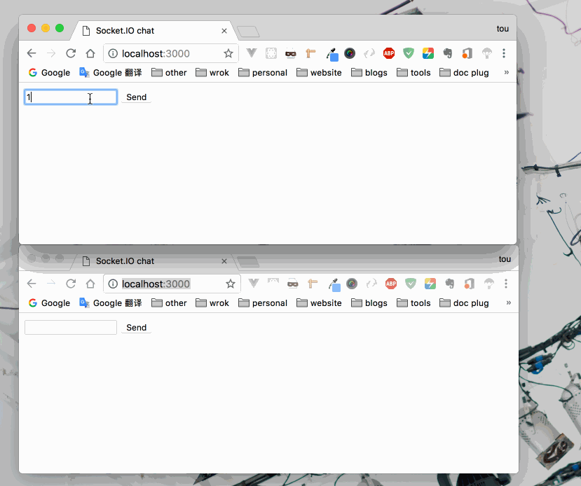
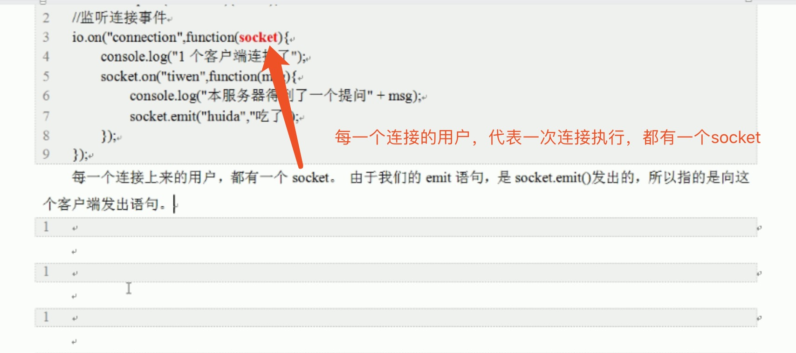

### WebSocket

- 长轮询：客户端每隔很短的时间，都会对服务器发送请求，查看是否有新的消息，只要轮询速度足够快，例如1秒，就能给人造成交互是实时进行的印象。这种做法是无奈之举，实际上对服务端、客户端双方都造成了大量的性能浪费。
- 长连接：客户端只请求一次，但是服务器会将连接保持，不会返回结果(想象一下我们没有写`res.send()`时，浏览器一直转小菊花)。服务器有了新数据，就将数据发回来，又有了新数据，就将数据发回来，而一直保持挂起状态。这种做法也造成了大量的性能浪费。
- `WebSocket`协议能够让浏览器和服务器全双工实时通信，互相的，服务器也能主动通知客户端
  - `WebSocket`的原理非常简单：利用`HTTP`请求产生握手，`HTTP`头部中含有`WebSocket`协议的请求，所以握手之后，二者转用`TCP`协议进行交流(QQ的协议)。现在的浏览器和服务器之间，就是QQ和QQ服务器的关系了。
  - 所以`WebSocket`协议，需要浏览器支持，更需要服务器支持。


### socket.io

`Socket.IO` 由两部分组成:

- 一个服务端用于集成 (或挂载) 到 Node.JS HTTP 服务器： `socket.io`

- 一个加载到浏览器中的客户端： `socket.io-client`

  客户端的`socket.io-client` 暴露了一个 `io` 全局变量，然后连接服务器。

  `<script src="/socket.io/socket.io.js"></script>`

```
npm install --save socket.io
```

##### 广播

```html
<!doctype html>
<html>
  <head>
    <title>Socket.IO chat</title>
    <style>
      * { margin: 0; padding: 0; box-sizing: border-box; }
      body { font: 13px Helvetica, Arial; }
      form { background: #000; padding: 3px; position: fixed; bottom: 0; width: 100%; }
      form input { border: 0; padding: 10px; width: 90%; margin-right: .5%; }
      form button { width: 9%; background: rgb(130, 224, 255); border: none; padding: 10px; }
      #messages { list-style-type: none; margin: 0; padding: 0; }
      #messages li { padding: 5px 10px; }
      #messages li:nth-child(odd) { background: #eee; }
    </style>
  </head>
  <body>
    <ul id="messages"></ul>
    <form action="">
      <input id="m" autocomplete="off" /><button>Send</button>
    </form>
  </body>
  <script src="/socket.io/socket.io.js"></script>
  <script src="https://code.jquery.com/jquery-1.11.1.js"></script>
  <script>
      $(function () {
        var socket = io();		//不带参数会开启自动发现
        $('form').submit(function(){
          socket.emit('chat message', $('#m').val());
          $('#m').val('');
          return false;
        });
        socket.on('chat message', function(msg){	//直接监听自定义事件
          $('#messages').append($('<li>').text(msg));
        });
      });

  </script>
</html>
```

```js
var app = require('express')();
var http = require('http').Server(app);
var io = require('socket.io')(http);

app.get('/', function(req, res){
  res.sendFile(__dirname + '/index.html');
});

io.on('connection', function(socket){
  socket.on('chat message', function(msg){
    io.emit('chat message', msg);	//全部广播，包括自己
    /*
    如果是socket.emit('chat message', msg);那么没有广播的效果，只有自己客户端发送的有效。
    如果是socket.broadcast.emit('hi');那么除了自己，其他都有效能广播。
    io.emit('chat message', msg);是所有人包括自己，全都广播。
    */
  });
});

http.listen(3000, function(){
  console.log('listening on *:3000');
});
```




其中




##### 指定命名空间 

如果你可以控制应用中的所有消息和事件，使用默认的 / 命名空间就够了。但如果你使用了第三方代码，或是要将代码分享给其他人使用， `socket.io` 还可以为` socket` 提供命名空间。

服务端

```
var app = require('express')();
var http = require('http').Server(app);
var io = require('socket.io')(http);

app.get('/', function (req, res) {
    res.sendFile(__dirname + '/index.html');
});
var chat = io
    .of('/chat')
    .on('connection', function (socket) {		//这里的socket可以对应客户端的chat的通信对象
        socket.emit('a message', {
            that: 'only',
            '/chat': 'will get'
        });
        socket.on('hi!', (msg) => {
            console.log(msg)
        })
    });

var news = io
    .of('/news')
    .on('connection', function (socket) {	//socket对应客户端的news的通信对象
        socket.emit('news', {
            news: 'item'
        });
    });

http.listen(3000, () => {
    console.log('listening on *:3000');
});
```

客户端

```js
<script>
    var chat = io.connect('http://localhost:3000/chat'),		//暴露一个io
        news = io.connect('http://localhost:3000/news');

    chat.on('connect', function () {		//你也可以直接监听具体事件，而不用监听 `connect` 事件！
        console.log('客户端 chat');
        
        chat.emit('hi!', 1111);
        chat.on('a message', (msg) => {
            console.log(msg);
        })
    });

    news.on('news', function (msg) {		//news直接绑定一个news事件
        console.log(msg)
    });
</script>
```

##### 发送并获取数据(回执)

有时，你需要在客户端确认消息已接收后执行一个回调。要做到这一点，只需要为 `.send` 或 `.emit` 方法的最后一个参数传入一个函数即可。 更重要的是，当你使用 `.emit` 方法时，确认是由您完成的，这意味着您也可以传递数据：

服务端

```js
// 1.客户端触发了 'ferret' 事件，发送数据 'tobi' 给服务器，
//   并注册了一个回调 function(data){...} 以等待服务端的回执（acknowledgement）
// 2.服务端响应 'ferret' 事件，并在适当的时候调用 cb() ,为客户端返回回执，
//   这里的 'woot' 可有可无，如果没有，那么客户端回调中的 data 就是 undefined
// 3.客户端收到回执 ，执行预先注册的回调 function(data){...} 
var io = require('socket.io')(80);

io.on('connection', function (socket) {
  socket.on('ferret', function (name, cb) {
    console.log(name); // name 将会是 'tobi'
    // 这里的回调 cb() 在服务器接收到消息后可以调用，以通知客户端服务器已接收消息；
    // 调用时还可以返回数据给客户端（这里是 'woot'）
    cb('woot');
  });
});
```

客户端

```js
<script>
    var socket = io(); // TIP: io() 不带参数会开启自动发现
	socket.on('connect', function () { // TIP: 你也可以直接监听具体事件，而不用监听 `connect` 事件！
    socket.emit('ferret', 'tobi', function (data) {
        // 回调将在服务器端调用 cb() 后执行
        console.log(data); // data 将会是 'woot'
    });
});
</script>
```


##### 用作跨浏览器的 WebSocket

如果要使用 WebSocket 的语法，只需要调用 `send` 方法并监听 `message` 事件即可：

服务端

```js
var io = require('socket.io')(80);

io.on('connection', function (socket) {
  socket.on('message', function (msg) { 	//监听， 有数据发送过来就触发
  	console.log(msg)		//hi
    socket.send(222)
  });
  socket.on('disconnect', function () { });
});
```

客户端

```js
<script>
  var socket = io('http://localhost/');
  socket.on('connect', function () {
    socket.send('hi');		//发送hi信息
	
    socket.on('message', function (msg) {
      // my msg
        console.log(msg);	//222
    });
  });
</script>
```

