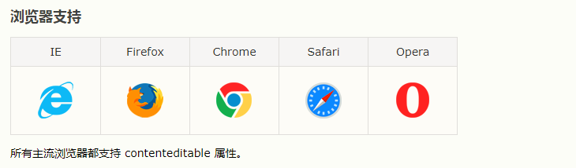

### HTML contenteditable 属性

```html
<p contenteditable="true">这是一个可编辑的段落。</p>
```



contenteditable 是一个枚举属性（enumerated attribute），表示元素是否可被用户编辑。

* true 或空字符串，表示元素是可编辑的；
* false 表示元素不是可编辑的。

如果没有设置该属性，其默认值继承自父元素。

该属性是一个枚举属性（enumerated one），而非布尔属性（Boolean one）。这意味着必须显式设置其值为 true、false 或空字符串中的一个，并且不允许简写