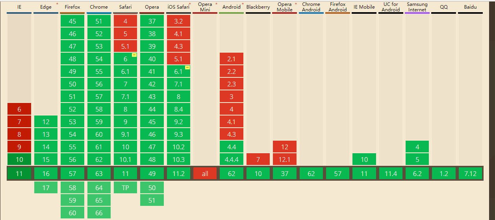

`window.requestAnimationFrame()`方法告诉浏览器您希望执行动画并请求浏览器调用指定的函数在下一次重绘之前更新动画。该方法使用一个回调函数作为参数，这个回调函数会在浏览器重绘之前调用。

当你准备好更新屏幕画面时你就应用此方法。这会要求你的动画函数在浏览器下次重绘前执行。回调的次数常是每秒60次，但大多数浏览器通常匹配 W3C 所建议的刷新率。

回调函数只会被传入一个参数，DOMHighResTimeStamp，指示当前被 requestAnimationFrame 序列化的函数队列被触发的时间。即使经过了许多对之前回调的计算工作时间，单个帧中的多个回调也都将被传入相同的时间戳。
**之前的setInterval，时间频率设置20ms会相对平滑一些， 如果设置过少会丢失卡针， 过长也不平滑等。**

**而requestAnimationFrame就是为了这个而出现的。我所做的事情很简单，跟着浏览器的绘制走，如果浏览设备绘制间隔是16.7ms，那我就这个间隔绘制；如果浏览设备绘制间隔是10ms, 我就10ms绘制。这样就不会存在过度绘制的问题，动画不会掉帧，自然流畅**

并且可以当前动画结束，继续回调下一步的动画， 按步骤来**形成一个队列**

```js
window.requestAnimationFrame(callback);
```


```js
let i = 0
function step() {
    i++
    if(i<100) {
        console.log(i)
        window.requestAnimationFrame(step);
    }
}
step()
```




