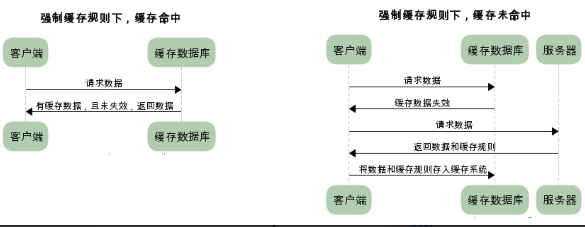
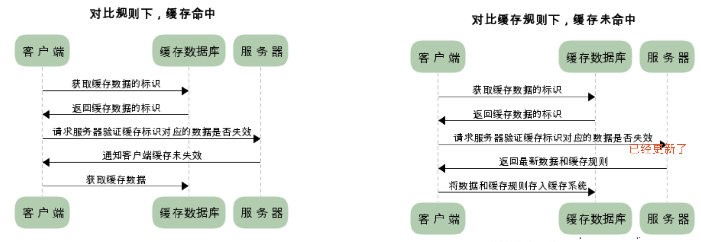
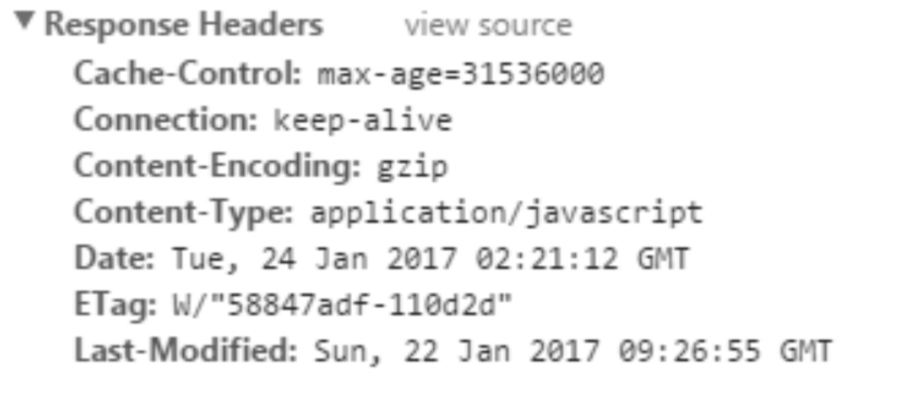
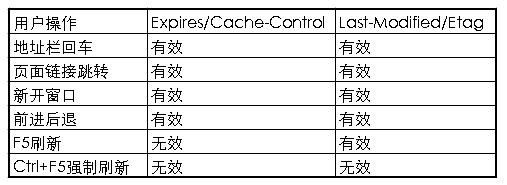
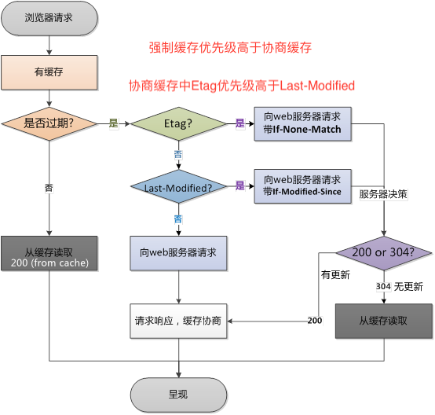

## 前言

缓存机制无处不在，有客户端缓存，服务端缓存，代理服务器缓存等。在HTTP中具有缓存功能的是浏览器缓存。

**HTTP缓存** : 当web请求抵达缓存时，如果本地已经有缓存并且缓存还没有过期，就直接使用缓存中的资源，而无需再向服务器发送请求。  

**HTTP缓存一般是在GET请求，POST请求永远不会缓存**。

HTTP缓存作为web性能优化的重要手段，对于从事web开发的朋友有重要的意义。本文将围绕以下几个方面来整理HTTP缓存：
* 缓存的规则
* 缓存的方案
* 缓存的优点
* 不同刷新的请求执行过程


## 缓存的规则

**我们知道HTTP的缓存属于客户端缓存**, 后面会提到为什么属于客户端缓存。所以我们认为浏览器存在一个缓存数据库，用于储存一些不经常变化的静态文件（图片、css、js等）。我们将缓存分为强制缓存和协商缓存。下面我将分别详细的介绍这两种缓存的缓存规则。

### 强制缓存

当缓存数据库中已有所请求的数据时。客户端直接从缓存数据库中获取数据。当缓存数据库中没有所请求的数据时，客户端的才会从服务端获取数据。


### 协商缓存

又称对比缓存，客户端会先从缓存数据库中获取到一个缓存数据的标识，得到标识后请求服务端验证是否失效（新鲜），如果没有失效服务端会返回304，此时客户端直接从缓存中获取所请求的数据，如果标识失效，服务端会返回更新后的数据。
~~~~

小贴士：
两类缓存机制可以同时存在，强制缓存的优先级高于协商缓存，当执行强制缓存时，如若缓存命中，则直接使用缓存数据库数据，不在进行缓存协商。


## 缓存的方案

上面的内容让我们大概了解了缓存机制是怎样运行的，但是，服务器是如何判断缓存是否失效呢？**我们知道浏览器和服务器进行交互的时候会发送一些请求数据和响应数据，我们称之为HTTP报文**。**报文中包含首部header和主体部分body**。与缓存相关的规则信息就包含在header中。**boby中的内容是HTTP请求真正要传输的部分**。举个HTTP报文header部分的例子如下：
如下：

接下来我们将对HTTP报文中出现的与缓存规则相关的信息做出详细解释。（我们依旧分为强制缓存和协商缓存两个方面来介绍）

强制缓存中主要属性为`Expires`和`Cache-Control`，协商缓存主要属性为`Last-Modified`和`Etag`。其中两者一起使用时，**`Cache-Control/Expires`的优先级要高于`Last-Modified/ETag`**。 **即强制缓存的优先级高于协商缓存**。

即当本地副本根据`Cache-Control/Expires`发现还在有效期内时，则不会再次发送请求去服务器询问修改时间`Last-Modified`或实体标识`Etag`了。  

一般情况下，需要`Cache-Control/Expires`配合`Last-Modified/ETag`一起使用，因为即使服务器设置缓存时间, 当用户点击“刷新”按钮时（第二种刷新的方式，根据服务器返回的状态码），浏览器会忽略缓存继续向服务器发送请求，这时`Last-Modified/ETag`将能够很好利用304，从而减少响应开销（这里只是避免了服务器响应数据，也就是说如果响应304。服务不再返回数据，浏览器直接使用缓存文件，但是浏览器端依旧会发送请求）。 

### 强制缓存

对于强制缓存，服务器响应的header中会用两个字段来表明——`Expires`和`Cache-Control`。

从缓存中取时状态码为 `200（from cache）`。在google浏览器中，对于从缓存中取，我们又可以看到`from memory cache`和`from disk cache`两种情况。

#### Expires

`Exprires`的值为服务端返回的数据到期时间。当再次请求时的请求时间小于返回的此时间，则直接使用缓存数据。但由于服务端时间和客户端时间可能有误差，这也将导致缓存命中的误差（**Expires有一个缺点：**它的过期时间是服务器的时间，假如我的客户端时间和服务器时间相差很大，那误差就很大），另一方面，**Expires是HTTP1.0的产物，故现在大多数使用Cache-Control替代**。

`Cache-Control`优先级高于`Expires `

#### Cache-Control

`Cache-Control`有很多属性，不同的属性代表的意义也不同;

- `no-cache`：不使用本地缓存。需要使用缓存协商，先与服务器确认返回的响应是否被更改，如果之前的响应中存在`ETag`，那么请求的时候会与服务端验证，如果资源未被更改，则可以避免重新下载。

- `no-store`：直接禁止游览器缓存数据，每次用户请求该资源，都会向服务器发送一个请求，每次都会下载完整的资源。
- `public`：可以被所有的用户缓存，包括终端用户和CDN等中间代理服务器。
- `private`：只能被终端用户的浏览器缓存，不允许CDN等中继缓存服务器对其缓存。

- `max-age=t`：缓存内容将在t秒后失效no-cache：需要使用协商缓存来验证缓存数据;（单位是s）

### 协商缓存

协商缓存需要进行对比判断是否可以使用缓存。浏览器第一次请求数据时，服务器会将缓存标识与数据一起响应给客户端，客户端将它们备份至缓存中。再次请求时，客户端会将缓存中的标识发送给服务器，服务器根据此标识判断。若未失效，返回304状态码，浏览器拿到此状态码就可以直接使用缓存数据了。对于协商缓存来说，缓存标识我们需要着重理解一下，下面我们将着重介绍它的两种缓存方案。

**这两组搭档都是成对出现的，即第一次请求的响应头带上某个字段（Last-Modified或者Etag），则后续请求则会带上对应的请求字段（If-Modified-Since或者If-None-Match），若响应头没有Last-Modified或者Etag字段，则请求头也不会有对应的字段**

>  注意： Etag(优先级高于Last-Modified)

#### Last-Modified

`Last-Modified`：服务器在响应请求时，会告诉浏览器资源的最后修改时间。

`if-Modified-Since`: 浏览器再次请求服务器的时候，请求头会包含此字段，后面跟着在缓存中获得的最后修改时间。服务端收到此请求头发现有`if-Modified-Since`，则与被请求资源的最后修改时间进行对比，如果一致则返回304和响应报文头，浏览器只需要从缓存中获取信息即可。从字面上看，就是说：从某个时间节点算起，是否文件被修改了
* 如果真的被修改：那么开始传输响应一个整体，服务器返回：`200 OK`
* 如果没有被修改：那么只需传输响应header，服务器返回：`304 Not Modified`

`if-Unmodified-Since`:从字面上看, 就是说: 从某个时间点算起, 是否文件没有被修改。
* 如果没有被修改:则开始继续'传送文件: 服务器返回: `200 OK`
* 如果文件被修改:则不传输,服务器返回: `412 Precondition failed`(预处理错误)

这两个的区别是一个是修改了才下载一个是没修改才下载。`Last-Modified` 说好却也不是特别好，因为如果在服务器上，一个资源被修改了，但其实际内容根本没发生改变，会因为`Last-Modified`时间匹配不上而返回了整个实体给客户端（即使客户端缓存里有个一模一样的资源）。为了解决这个问题，HTTP1.1推出了`Etag`。

`Last-Modified/If-Modified-Since`就是缓存过期后，检查服务端文件是否更新的一种方式，**要配合`Cache-Control`使用** 。

**核心思想**：当缓存资源过期后（也就是 `Cache-Control:max-age=0`），假设该资源具有`Last-Modified`声明，则再次向服务器请求时带上头 `If-Modified-Since`表示请求时间。服务器收到请求后发现有头`If-Modified-Since`，则与被请求资源的最后修改时间进行比对。若`Last-Modified`的时间较新，说明最后修改时间较新，说明资源又被改动过，则响应整的资源重新从服务器读取，而不是读取缓存，返回`HTTP200`；若`If-Modified-Since`的时间比`Last-Modified`新或者两者相等，说明服务器的内容没有更新，直接读取缓存即可，返回`HTTP304`，告知浏览器继续使用所保存的缓存资源，同时更新响应头`last-Modified`的值（以备下次对比）。  

**缺点：** 

 - 有些文档可能会被周期性地重写，但实际包含的数据常常是一样的。尽管内容没有变化，但是修改日期会发生变化。 
 - 有些文档可能被修改了，但所做修改并不重要，不需要让世界范围内的缓存都重装数据(比如对拼音或注释的修改)。 
 - 有些服务器无法准确地判定其页面的最后修改日期。 
 - 有些服务器提供的文档会在亚秒间隙发生变化，对这些服务器来说，以秒为粒度的修改日期就不够用了。 

这个问题就需要下面说到的ETag来解决了 。

#### Etag

`ETag/If-None-Match`是第二种检测服务端文件是否更新的方式，也要配合`Cache-Control`使用。 

`Etag`：服务器响应请求时，通过此字段告诉浏览器当前资源在服务器生成的唯一标识（生成规则由服务器决定）。我们只需要清楚：**每个文件都有一个唯一的标识，只要这个文件发生了改变，这个标识就会发生变化。**  

`If-None-Match`： 再次请求服务器时，浏览器的请求报文头部会包含此字段，后面的值为在缓存中获取的标识。服务器接收到次报文后发现`If-None-Match`则与被请求资源的唯一标识进行对比。

**过程**：当缓存资源过期之后，如果浏览器发现服务器端返回的头部信息具有`Etage`声明，就在请求中发送`If-None-Match`选项，值即为上次请求后响应头的`ETag`值，该值在服务端和服务端代表该文件唯一的字符串对比（如果服务端该文件改变了，该值就会变），如果相同，则响应`HTTP304`，客户端直接读取缓存，如果不相同，则响应`HTTP200`，返回最新的数据资源，更新`ETag`值。  

* 不同，说明资源被改动过，则响应整个资源内容，返回状态码200。
* 相同，说明资源无心修改，则响应header，浏览器直接从缓存中获取数据信息。返回状态码304.

但是实际应用中由于`Etag`的计算是使用算法来得出的，而算法会占用服务端计算的资源，所有服务端的资源都是宝贵的，所以就很少使用`Etag`了。

**如果`If-Modified-Since` 和`If-None-Match`同时存在，那么`If-None-Match`优先**，忽略`If-Modified-Since` ，或许你会问为什么它优先？两者功能相似甚至相同，为什么要同时存在？

HTTP1.1中ETag的出现主要是为了解决几个`Last-Modified`比较难解决的问题： 

- Last-Modified标注的最后修改只能精确到秒，如果某些文件在1秒钟以内，被修改多次的话，它将不能准确标注文件的修改时间
- 如果某些文件会被定期生成，但有时内容并没有任何变化（仅仅改变了时间），但`Last-Modified`却改变了，导致文件没法使用缓存
- 有可能存在服务器没有准确获取文件修改时间，或者与代理服务器时间不一致等情形

`Etag`是服务器自动生成或者由开发者生成的对应资源在服务器端的唯一标识符，能够更加准确的控制缓存。`Last-Modified`与`ETag`是可以一起使用的，服务器会优先验证`ETag`，**`Etag`(优先级高于`Last-Modified`)**。一致的情况下，才会继续比对`Last-Modified`，最后才决定是否返回304。 


## 缓存的优点

* 减少了冗余的数据传递，节省宽带流量
* 减少了服务器的负担，大大提高了网站性能
* 加快了客户端加载网页的速度

这也正是HTTP缓存属于客户端缓存的原因。


## 用户操作行为与缓存

* 浏览器地址栏中写入URL，回车。浏览器发现缓存中有这个文件了，不用继续请求了，直接去缓存拿。（最快）
* F5就是告诉浏览器，别偷懒，好歹去服务器看看这个文件是否有过期了。于是浏览器就胆胆襟襟的发送一个请求带上If-Modify-since。
* Ctrl+F5 告诉浏览器，你先把你缓存中的这个文件给我删了，然后再去服务器请求个完整的资源文件下来。于是客户端就完成了强行更新的操作。



通过上表我们可以看到，当用户在按F5进行刷新的时候，会忽略`Expires/Cache-Control`的设置，会再次向服务器发送请求，而`Last-Modified/Etag`还是有效的，服务器会根据情况判断返回304还是200；而当用户使用Ctrl+F5进行强制刷新的时候，所有的缓存机制都将失效，重新从服务器获取资源。 


## 哪些请求不能被缓存？

无法被浏览器缓存的请求： 

- HTTP信息头中包含`Cache-Control:no-cache`，`pragma:no-cache`，或`Cache-Control:max-age=0`等告诉浏览器不用缓存的请求 。
- 需要根据`Cookie`，认证信息等决定输入内容的动态请求是不能被缓存的 。
- 经过HTTPS安全加密的请求（有人也经过测试发现，ie其实在头部加入`Cache-Control：max-age`信息，firefox在头部加入`Cache-Control:Public`之后，能够对HTTPS的资源进行缓存，参考《HTTPS的七个误解》）。
- **POST、PUT等请求无法被缓存，一般使用GET请求缓存**。
- **HTTP响应头中不包含`Last-Modified/Etag`，也不包含`Cache-Control/Expires`的请求无法被缓存**。


## 强缓存如何重新加载缓存过的资源(浏览器缓存问题的解决方案)

上面说到，使用强缓存时，浏览器不会发送请求到服务端，根据设置的缓存时间浏览器一直从缓存中获取资源，在这期间若资源产生了变化，浏览器就在缓存期内就一直得不到最新的资源，那么如何防止这种事情发生呢？

**通过更新页面中引用的资源路径，让浏览器主动放弃缓存，加载新资源。**

```html
//增加query 每次版本更新，加上一个版本号
<link rel="stylesheet" href="a.css?v=1.0.0">
<script src="a.js?v=2.0.0"></script>

$.get('a?v=1.2.3', {})			//ajax 的get请求			
```

这样每次文件改变后就会生成新的query值，这样query值不同，也就是页面引用的资源路径不同了，之前缓存过的资源就被浏览器忽略了，因为资源请求的路径变了。

**解决方案**：

1. GET请求URL后加随机数，让服务器认为是不同的请求; `<script src="a.js?rd=随机数></script>`

2. 在ajax发送请求前加上`xmlHttpRequest.setRequestHeader("If-modified-since","0")`;

3. 在ajax发送请求前加上`xmlHttpRequest.setRequestHeader("Cache-Control","no-cache")`;

4. 若为jquery ajax, 设置ajax属性`cache:false`;(注意：`cache`属性对`post`没有用，对`get`才有用);

5. 在服务器端响应请求时加上`response.setHeader("Cache-Control","no-cache,must-revalidate")`;

6. 使用`POST`代替`GET`,浏览器不会对`POST`做缓存;

7. 清楚浏览器历史记录等， google在开发者工具的netwrok中也可以设置，不缓存打钩;

8. ctrl+5强制刷新

9. `<meta>`标签上设置不缓存

   ```html
   <META HTTP-EQUIV="pragma" CONTENT="no-cache">
   <META HTTP-EQUIV="Cache-Control" CONTENT="no-cache, must-revalidate">
   <META HTTP-EQUIV="expires" CONTENT="0">
   ```

> 注意：为什么cache属性对post没有用，对get才有用？
>
> 因为浏览器缓存url请求原理就是判断url是否相同，url相同则读取缓存，url不相同则读取服务器。 对于POST却不适用，POST的url都相同，参数在请求体力，所以不让POST可以缓存。


## 三级缓存原理

对于去获取浏览器中的缓存数据，顺序为：

1. 先去内存看，如果有，直接加载
2. 如果内存没有，择取硬盘获取，如果有直接加载
3. 如果硬盘也没有，那么就进行网络请求
4. 加载到的资源缓存到硬盘和内存

加载一张图片

访问-> 200 -> 退出浏览器
再进来-> 200(from disk cache) -> 刷新 -> 200(from memory cache)

### from memory cache与from disk cache

在chrome浏览器中的控制台Network中size栏通常会有三种状态

1. `from memory cache`  内存中获取缓存数据

2. `from disk cache`      磁盘中获取缓存数据

3. `304 Not Modified`    先从内存中去取，没有则从磁盘中去取
4. 200(资源大小数值)       直接从服务器中获取数据

### HTTP状态码

其中`200 from memory cache`和`200 from disk cache`都是强制缓存。

#### 200 from memory cache

不访问服务器，直接读缓存，从内存中读取缓存。此时的数据时缓存到内存中的，当kill进程后，也就是浏览器关闭以后，内存中数据将不存在，但此时在磁盘中数据还存在，所以会去磁盘中取。但是这种方式只能缓存派生资源。

#### 200 from disk cache

不访问服务器，直接读缓存，从磁盘中读取缓存，当kill进程时，数据还是存在。这种方式也只能缓存派生资源

#### 304 Not Modified

访问服务器，发现数据没有更新，服务器返回此状态码。然后从缓存中读取数据。

**读取的过程应该是先去内存中取，如果内存中没有则去磁盘中取。**


我做了一个测试：

1. 第一次打开vue官网，全部加载完等待的时间较长，状态都为200
2. 在服务端设置的缓存时间里，再次打开vue官网或者f5刷新，图片返回的状态码都是304，等待时间较短。
3. 我直接关闭google浏览器进程，然后在打开vue官网，显示还是304状态码，等待时间较短。

> 所以我的猜测是对于要进行HTTP缓存的数据，加载到的资源会缓存到硬盘和内存中。加载到磁盘中是必须的，而是否也同时加载到内存中要看浏览器默认对哪些文件类型特殊照顾?  数据在浏览器的历史记录所在的磁盘文件中？

#### chrome采取措施的准则

什么时候是`from memory cache` 什么时候是`from disk cache` 呢？

即哪些资源会放在内存当中，哪些资源浏览器会放在磁盘上呢，结果如下下表所示

| **状态** | **类型**              | **说明**                                                     |
| -------- | --------------------- | ------------------------------------------------------------ |
| 200      | **form memory cache** | 不请求网络资源，资源在内存当中，一般脚本、字体、图片会存在内存当中 |
| 200      | **form disk ceche**   | 不请求网络资源，在磁盘当中，一般非脚本会存在内存当中，如css等 |
| 200      | 资源大小数值          | 从服务器下载最新资源                                         |
| 304      | 报文大小              | 请求服务端发现资源没有更新，使用本地资源                     |

由此可见样式表一般在磁盘中，不会缓存到内存中去，因为css样式加载一次即可渲染出网页，但是脚本却可能随时会执行，如果脚本在磁盘当中，在执行该脚本需要从磁盘中取到内存当中来，这样的IO开销是比较大的，有可能会导致浏览器失去响应。


## 小结



- 强制缓存的优先级高于协商缓存。
- 协商缓存中`Etag`优先级高于`Last-Modified`。
- **只有响应头中有`Expires/Cache-Control`、`Last-Modified/Etag`才会有HTTP缓存机制**。
- **POST请求无法被缓存**。

整体过程：

对于第一次请求，无论是静态文件还是其他文件，都需要从服务器返回，并不存在缓存一说。等第一次请求完成后，浏览器就存在缓存了。

当客户端向服务器发送一个请求时，首先检查是否存在缓存，有缓存文件则判断缓存文件是否过期，如果缓存文件没有过期，则直接从缓存中读取文件。

如果缓存文件过期，则查看响应头中是否存在`Etag`(优先级高于`Last-Modified`)，如果不存在，则继续查看响应头中是否存在`Last-Modified`，如果还不存在，则直接向服务器发送新的请求，等待请求响应，状态为200，直接从服务器获得数据，缓存协商，呈现页面。

如果缓存文件过期，响应头中存在`Etag`，向服务器发送带`If-None-Match`的请求，其值即为上次请求后响应头的`Etag`值，该值和服务端代表的唯一值`Etag`对比(如果服务端更新了文件，则服务端的`Etag`就变了)，如果相同，则响应HTTP304，客户端直接读取缓存文件，如果不相同，则响应HTTP200，服务端返回最新的文件，同时更新`Etag`值。

如果缓存文件过期，响应头中不存在`Etag`，但是存在`Last-Modified`，则向服务器发送`If-Modified-Since`的请求，将`If-Modified-Since`的日期和服务端的`Last-Modified`该文件的最后修改日期对比，如果两个日期相同，则响应HTTP304，客户端直接读取缓存文件；如果不相同则表示文件发生变化更新，响应HTTP200，从服务器返回最新的文件数据，同时更新响应头`Last-Modified`的值以备下次对比。


参考文章：

[HTTP----HTTP缓存机制](https://juejin.im/post/5a1d4e546fb9a0450f21af23?utm_source=gold_browser_extension)

[浏览器缓存机制](https://blog.csdn.net/liujie19901217/article/details/52071481)

[http协商缓存VS强缓存](https://www.cnblogs.com/wonyun/p/5524617.html)

[什么是ETag](https://www.jianshu.com/p/a3ea9619c38d)

[大公司里怎样开发和部署前端代码？张云龙的回答](https://www.zhihu.com/question/20790576)

[from memory cache与from disk cache详解](https://blog.csdn.net/garrettzxd/article/details/80684880)