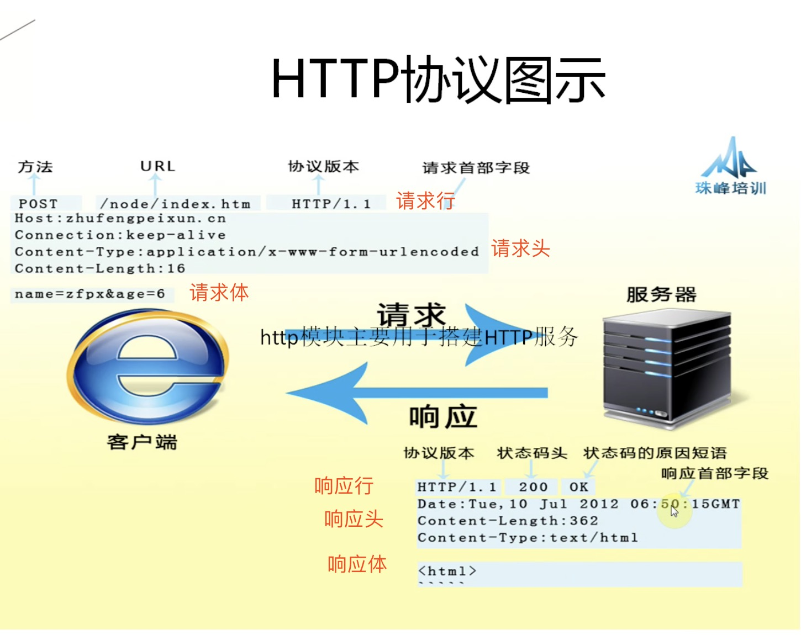

#### HTTP服务器

- 能在特定(`IP`)特定端口上监听客户端的请求，并根据请求的路径返回相应结果都叫服务器(一个服务器可以开很多个端口)
- 服务器可以是专业服务器也可以是个人电脑

#### HTTP客户端

- 只要能想特定(`IP`)特定端口发起请求并接受响应的都叫客户端
- 可以是浏览器、微信、qq等等

#### 数据在服务器和客户端之间传递

- 可以把服务器硬盘上已经有的静态文件发送给客户端
- 也可以由服务器把动态内容返回给客户端，比如当前时间

#### HTTP协议

- 人与人之间通信， 需要一种传输手段(声波)和一种彼此都懂的语言(比如普通话)
- 要让这些形形色色的机器能够通过网络进行交互，我们就需要指明一种协议(就是他们之间的语言)
- `HTTP`指的就是这种协议+数据格式的交流体系。

#### 请求方法

- 每条`HTTP`请求报文都包括一个方法表示本次将要进行何种类型的操作，如何读取一个页面，删除一个资源
- `GET`- 向服务器获取资源
- `POST`- 向服务器发送数据
- `DELETE`- 从服务器上删除资源
- `PUT`- 更新服务器上的一个资源

#### 请求头-MIME媒体类型

- `MIME`类型就是告诉浏览器用什么方式来处理这个数据
- `MIME`类型是一种文本标记，表示一种主要的对象类型和一个特定的子类型，中间由一条斜杠来分隔。如`text/html`(文本中html的形式)
- `MIME`类型在`HTTP`协议中的表现为请求头或者响应头中的`Content-Type`
- 常见媒体类型[http://tool.oschina.net/commons](http://tool.oschina.net/commons)