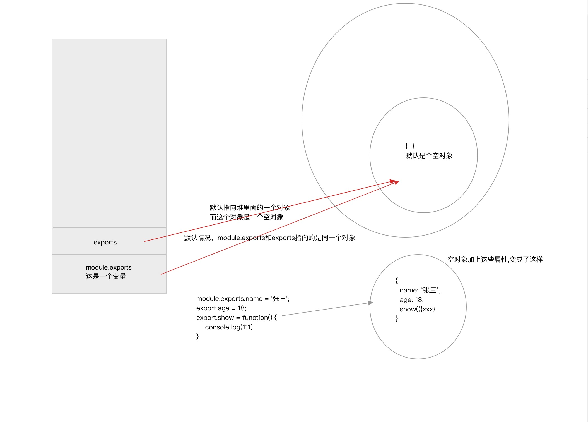
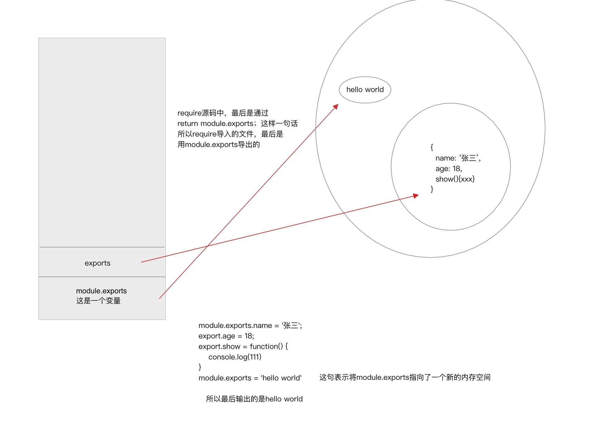

#### exports和module.exports的区别

##### 案例一
```js
//a.js
module.exports.name = '张三';
export.age = 18;
export.show = function() {
	console.log(111)
}
```

```js
let a = require('./a.js');
console.log(a);
/*
{
	name: '张三'，
	age: 18,
	show: function() {
		console.log(111)
	}
}
*/
```
得到`module.exports`和`export`是一样的，

记住`module.exports`和`export`指向的是同一个对象。

继续看下面案例

##### 案例二

```js
//a.js
module.exports.name = '张三';
export.age = 18;
export.show = function() {
	console.log(111)
}
module.exports = 'hello world'	//上面是指向一个对象，现在重新将module.exports指向一个字符串了
```

```js
let a = require('./a.js');
console.log(a);			//'hello world'
```




1. `exports`和`module.exports`指向的是同一个对象
2. 最终`require()`函数返回的是`module.exports`中的数据


```js
//改成这样
module.exports.name = '张三';
export.age = 18;
export.show = function() {
	console.log(111)
}
exports = 'hello world'

//此时exports指向了hello world这个内对空间，但是module.exports还是指向原来的对象，
//所以是 {name: '张三', age: 18, show: function(){console.log(111)}}
```

`exports`只是一个快捷方式