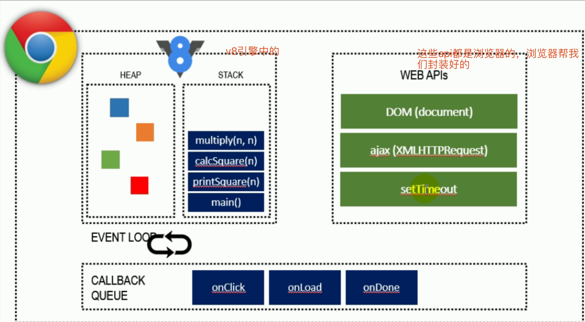
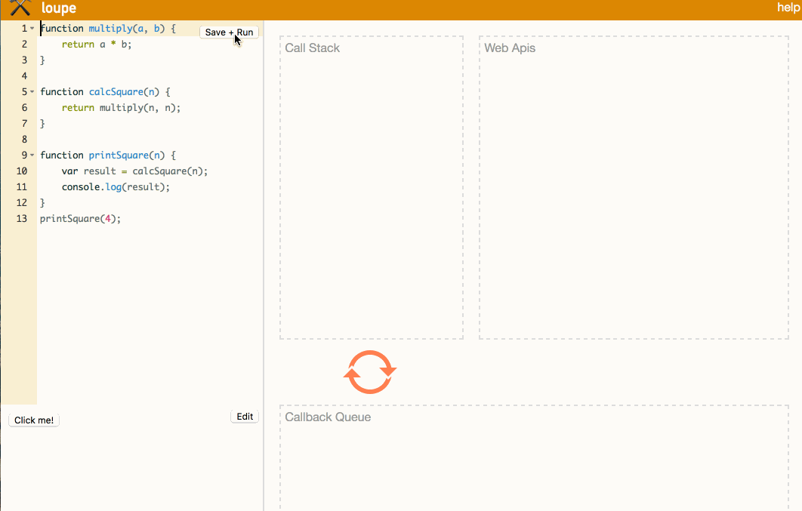
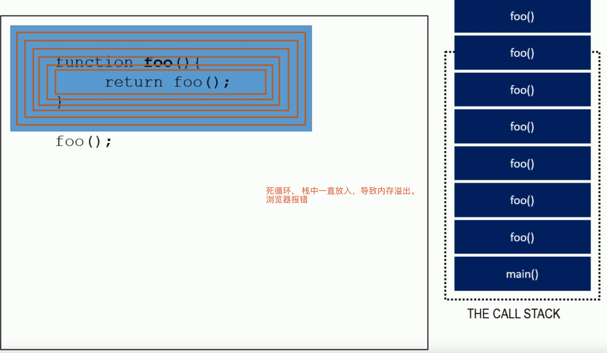
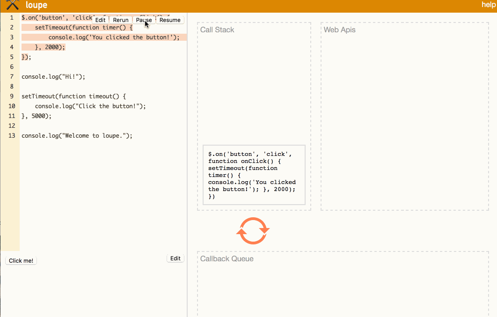

在浏览器中执行`Javascript`， `v8`引擎是一个`JavaScript`引擎实现、浏览器给我们提供封装好的`api`和`Javascript`语言本身。

##### 例子1
```js
function multiply(a, b) {
    return a * b;
}

function calcSquare(n) {
    return multiply(n, n);
}

function printSquare(n) {
    var result = calcSquare(n);
    console.log(result);
}
printSquare(4);
```
1. `printSquare(4)`先被推入栈中。
2. `calcSquare(n)`
3. `multiply(n, n)`
4. `a * b`
5. 当`return a * b`后，`a * b`销毁，推出栈
6. `multiply(n, n)`函数调用结束，销毁，推出栈
7. `calcSquare（n）`函数调用结束，销毁，推出栈
8. 执行`printSquare(n)`函数中的`console.log(result)`，`console.log(result)`被推入栈
9. `printSquare(n)`弹出栈


##### 例子2
```js
function foo() {
    return foo();
}
foo()
```
陷入死循环，一直被推入到栈中，超出栈的极限，导致内存溢出。浏览器报错


##### 例子3
```js
$.on('button', 'click', function onClick() {
    setTimeout(function timer() {
        console.log('You clicked the button!');    
    }, 2000);
});

console.log("Hi!");

setTimeout(function timeout() {
    console.log("Click the button!");
}, 5000);

console.log("Welcome to loupe.");
```
1. 首先推入绑定事件这一段，然后在浏览器底层帮我们监听这个点击事件，结束弹出绑定事件这一段
2. 推入`console.log("Hi!")`，结束弹出
3. 执行定时器，栈中推入，浏览器底层立即帮我们执行一个异步操作，开启一个等待，当等待结束将定时器中的函数放入肉队列，结束弹出下面函数
```
setTimeout(function timeout() {
    console.log("Click the button!");
}, 5000);
```
4. 推入`console.log("Welcome to loupe.")`，结束弹出
5. 在这个过程中我们触发一个点击事件，浏览器底层监听到了，在队列中放入这个事件函数
6. 当我们栈中的内容都执行完了，浏览器就会队列中查看是否还存在没有执行结束的任务。
7. 查看到队列中的任务，看哪个先可以被执行就先被推入到栈中执行，依次操作



**总结**： js是单线层的，非阻塞I/O。在执行过程中如果如要异步操作，可以先跳过等待，直接执行下面的内容。等到执行完栈中的任务，才会再去队列中寻找是否还存在任务，如果存在，则执行能被先执行的任务。

参考： [一个测试浏览器执行过程的工具](http://latentflip.com/loupe/?code=JC5vbignYnV0dG9uJywgJ2NsaWNrJywgZnVuY3Rpb24gb25DbGljaygpIHsKICAgIHNldFRpbWVvdXQoZnVuY3Rpb24gdGltZXIoKSB7CiAgICAgICAgY29uc29sZS5sb2coJ1lvdSBjbGlja2VkIHRoZSBidXR0b24hJyk7ICAgIAogICAgfSwgMjAwMCk7Cn0pOwoKY29uc29sZS5sb2coIkhpISIpOwoKc2V0VGltZW91dChmdW5jdGlvbiB0aW1lb3V0KCkgewogICAgY29uc29sZS5sb2coIkNsaWNrIHRoZSBidXR0b24hIik7Cn0sIDUwMDApOwoKY29uc29sZS5sb2coIldlbGNvbWUgdG8gbG91cGUuIik7!!!PGJ1dHRvbj5DbGljayBtZSE8L2J1dHRvbj4%3D)