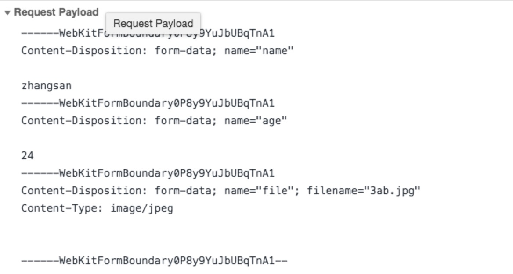
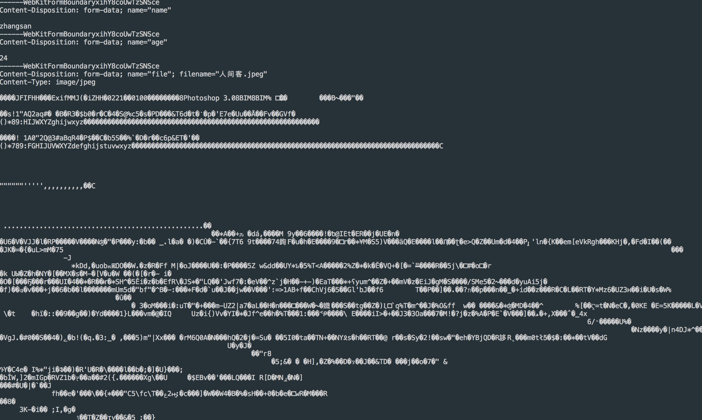

### GET/POST/文件上传请求

#### GET

```js
var http = require('http');
var url = require('url');
var util = require('util');
 
http.createServer(function(req, res){
	//get参数在请求头上，我们直接可以通过req.url得到
    res.writeHead(200, {'Content-Type': 'text/html; charset=utf-8'});
    res.end(util.inspect(url.parse(req.url, true)));
}).listen(3000);
```

#### POST(不含文件)

`POST`请求的内容全部的都在请求体中，`http.ServerRequest` 并没有一个属性内容为请求体，原因是等待请求体传输可能是一件耗时的工作。并不是一次性就发送完全了，他是一个持续发送的过程。而且有时候比如文件内容过大的话在持续请求中我们可以选择手动停止。

```js
var http = require('http');
var querystring = require('querystring');
 
http.createServer(function(req, res){
    // 定义了一个post变量，用于暂存请求体的信息
    var chunks = [];     
 
    // 通过req的data事件监听函数，每当接受到请求体的数据，就累加到chunks变量中
    req.on('data', function(chunk){    
        chunks.push(chunk);
    });
 
    // 在end事件触发后，通过querystring.parse将chunks解析为真正的POST请求格式，然后向客户端返回。
    req.on('end', function(){
    	 chunks = Buffer.concat(chunks).toString();
        let post = querystring.parse(chunks);
        res.end(util.inspect(post));
    });
}).listen(3000);
```

#### 文件上传

对于文件上传我们需要设置`Mime-type`的类型为`multipart/form-data`类型。我们可以使用以下两种方式文件上传：

1. 原生的表单`file`表单提交
2. `HTML5`的`FormData`

##### 完整代码

```html
<input type="file" id="file">
<button>click</button>
```

```js
//js
let file = document.getElementById("file");
let btn = document.querySelector('button');
btn.onclick = function () {
    let formdata = new FormData();
    formdata.append('name', 'zhangsan');
    formdata.append('age', 24);
    formdata.append('file', file.files[0]);
    let xhr = new XMLHttpRequest();
    xhr.open('post', 'http://127.0.0.1:9000/form', true);
    xhr.setRequestHeader('Content-Type', 'multipart/form-data;charset=utf-8')
    xhr.onload = function () {
        if (xhr.status === 200) {
            console.log(xhr.responseText);
        }
    }
    xhr.send(formdata);
}
```

或者

```html
<form action="/form" method="post" ectype="multipart/form-data;charset=utf-8">
	<input type="text" name="zhangsan" />
	<input type="text" age=24 />
	<input type="file" name="file" />
	<input type="submit">
</form>
```

```js
//nodejs

const http = require('http');
const path = require('path');
const fs = require('fs');

http.createServer((req, res) => {
    if (req.url === '/form') {
        let chunks = [];
        let size = 0;
        req.on('data', (chunk) => {
            chunks.push(chunk);
            size += chunk.length;
            // console.log(chunk.toString())
        })
        req.on('end', () => {
            let buffer = Buffer.concat(chunks, size);

            var rems = [];
            //根据\r\n分离数据和报头
            for (var i = 0; i < buffer.length; i++) {
                var v = buffer[i];
                var v2 = buffer[i + 1];
                if (v == 13 && v2 == 10) {   //  /n ascill码对应10  /r-->13
                    rems.push(i);
                }
            }
            // console.log(rems);     //对于/r/n的位置，即--webkit···结尾换行的位置节点 
            
            // console.log(buffer.slice(0, rems[0]).toString());
            // console.log(buffer.slice(rems[0]+2,rems[1]).toString());

            // console.log(buffer.slice(rems[2]+2,rems[3]).toString());
            // console.log(buffer.slice(rems[3]+2,rems[4]).toString());
            // console.log(buffer.slice(rems[4]+2,rems[5]).toString());

            // console.log(buffer.slice(rems[6]+2,rems[7]).toString());
            // console.log(buffer.slice(rems[7]+2,rems[8]).toString());
            // console.log(buffer.slice(rems[8]+2,rems[9]).toString());
            // console.log(buffer.slice(rems[9]+2,rems[10]).toString());
				
			  //文件内容
            // console.log(buffer.slice(rems[11]+2,rems[rems.length-2]));
            //最后一行
            // console.log(buffer.slice(rems[rems.length-2]+2,rems[rems.length-1]));

            //文件数据 
            let getbodyfile = buffer.slice(rems[8]+2,rems[9]).toString()
            let filename = getbodyfile.match(/filename=".*"/g)[0].split('"')[1];

            let nbuf = buffer.slice(rems[11]+2,rems[rems.length-2]);
            let savepath = path.join(__dirname, 'data', filename);
            
            fs.writeFileSync(savepath, nbuf);

            res.end('over')
        })
    }
}).listen(9000, () => console.log('服务器启动了'));
```

`post`传过来的数据都在请求体中，我们直接拿到的是体格`Buffer`二进制对象，如果不包含文件的话，我们直接使用`node`内置的模块就能解析，但是因为包含了文件，我们需要在`end`事件里对总`Buffer`对象进行切割，又因为涉及到文件上传，请求体重的形式是以这种`multipart/form-data`类型上传的


我们在服务端在`data`事件中打印`chunk.toString()`数据，对于文件内容的话得到是一片乱码


所以在`end`事件中的总的`Buffer`对象中包含了所有上传的数据，我们只要通过对字符串进行切割，得到文件的部分，然后将文件内容存到一个文件夹下就行了。

如果想获得里面的数据，就得先把非文件数据过滤掉，根据控制台输出的信息可知过滤的方法很简单，根据`\r\n`来分割就可以了。而结尾的话则是去掉`\r\n--WebKitFormblabla--\r\n`，也是根据`\r\n`来过滤。最后保存到一个文件下就行了。

参考文章[https://www.cnblogs.com/axes/p/4308430.html](https://www.cnblogs.com/axes/p/4308430.html)

#### 第三方模块formidable

```js
var http = require("http");
var formidable = require('formidable');
var fs = require("fs");
var util = require("util");
var sd = require("silly-datetime");
var path = require("path");


//创建服务器
var server = http.createServer(function(req,res){
    //如果你的访问地址是这个，并且请求类型是post
    if(req.url == "/uploads" && req.method.toLowerCase() == "post"){
        //Creates a new incoming form.
        var form = new formidable.IncomingForm();
        //设置文件上传存放地址
        form.uploadDir = "./uploads";
        //执行里面的回调函数的时候，表单已经全部接收完毕了。
        form.parse(req, function(err, fields, files) {
            //使用第三方模块silly-datetime
            var t = sd.format(new Date(),'YYYYMMDDHHmmss');
            //生成随机数
            var ran = parseInt(Math.random() * 8999 +10000);
            //拿到扩展名
            var extname = path.extname(files.tupian.name);
            //旧的路径
            var oldpath = __dirname + "/" + files.file.path;
            //新的路径
            var newpath = __dirname + '/uploads/'+t+ran+extname;
            //改名
            fs.rename(oldpath,newpath,function (err) {
                if(err){
                    throw  Error("改名失败");
                }
                res.writeHead(200, {'content-type': 'text/plain'});
                res.end("成功");
            });
			


            //所有的文本域、单选框，都在fields存放；
            //所有的文件域，files
            res.writeHead(200, {'content-type': 'text/plain'});

            res.end("success");
        });
    }
});

server.listen(3000,"127.0.0.1");
```

#### express中的multer第三方模块

```js
const express = require('express');
const path = require('path');
const multer = require('multer');

const app = express();

var upload = multer({ dest: path.join(__dirname, 'data') });       //文件保存路径

//这里的upload.array('file')  file名字要和html中 文件表单的name一致
app.post('/form', upload.array('file'), (req, res, next) => {
    console.log(req.body);      //除文件外表单信息的对象集合
    console.log(req.files);     //upload.array 以数组的形式， 以files方式去得到， 不同的形式也不一样，看官方文档
    res.send({a: 111});
})
app.listen(9000, () => {
    console.log('服务器启动了');
})
```