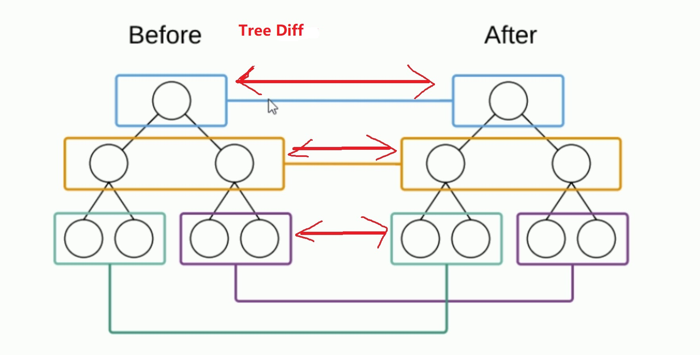
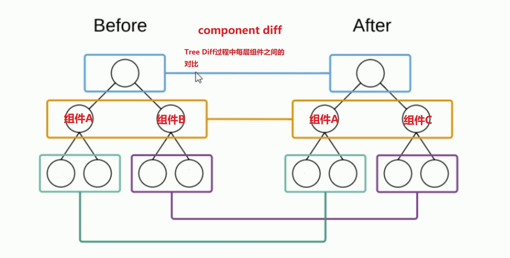
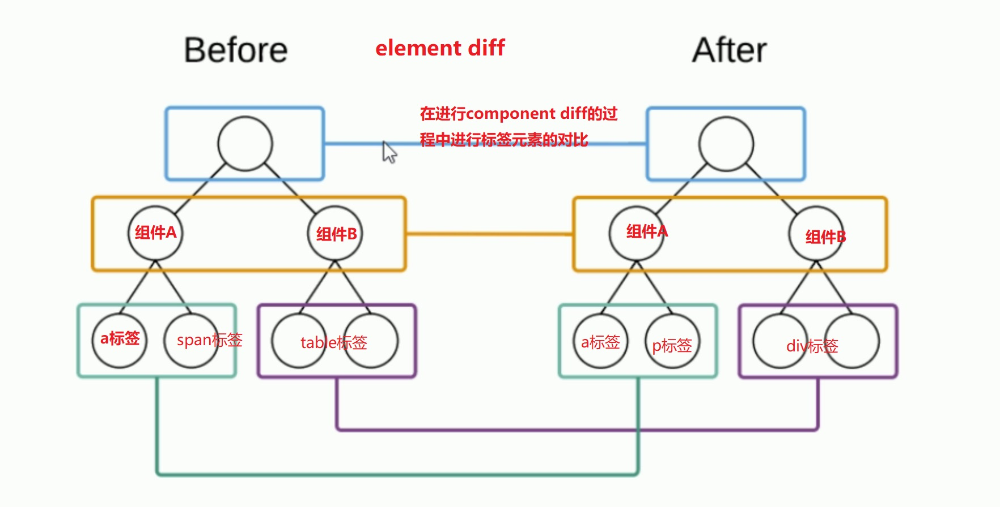

## 虚拟DOM

- **DOM的本质是什么**：浏览器中的概念，用JS对象来表示页面上的元素，并提供了操作DOM对象的API；
- **什么是React中的虚拟DOM**：是框架中的概念，是程序员用js对象来模拟页面上的DOM和DOM嵌套；
- **为什么要实现虚拟DOM**：为了实现页面中DOM元素的高效更新，减少不必要的重复；
- **DOM和虚拟DOM的区别**：
  - **DOM**：浏览器中，提供的概念；用js对象，表示页面上的元素，并提供了操作元素的API；
  - **虚拟DOM**：是框架中的概念；而是开发框架的程序员，手动用js对象来模拟DOM元素和嵌套关系；
    - 本质：用js对象，来模拟DOM元素和嵌套关系；
    - 目的：实现页面元素的高效更新；


#### DOM树的概念

一个网页呈现的过程：

1. 浏览器请求服务器获取页面HTML代码
2. 浏览器要在内存中解析DOM结构，并在浏览器内存中，渲染出一颗DOM树
3. 浏览器把DOM树，呈现在页面上


#### 案例

1. 比如现在有一个表格，有10行，突然我们对其的1， 2两行改变了数据，此时难道我们要对整个表格的数据进行for循环，重新渲染整个DOM树？这样就额外消耗了性能。

2. 如何才能把性能做到最优，按需渲染页面；（只重新渲染更新的数据所对应的页面元素）

3. 如何获取到新旧DOM树，从而实现DOM树的对比呢？ 浏览器中并没有直接提供获取DOM树的API；因此我们无法拿到浏览器内存中的DOM树。

4. 此时程序员可以手动模拟新旧两颗DOM树。

5. 比如模拟`<div id="mydiv" title="你好">123</div>`  做了修改

   ```js
   //旧
   var div = {
       tagName: 'div',
       attrs: {
           id: 'mydiv',
           title: '你好',
           'data-index': 0
       },
       children: [
           '123'
       ]
   }
   
   //新
   var div = {
       tagName: 'div',
       attrs: {
           id: 'mydiv',
           title: '不好啊',
           'data-index': 0
       },
       children: [
           'abc',
           {
               tagName: 'span',
               children: ['这是个子标签']
           }
       ]
   }
   ```

   通过js对对象的对比来得出变动的地方，从而来做出高效的更新。这种模拟的两颗新旧DOM树，就是React中虚拟DOM的概念；

**总结**：什么是虚拟DOM？用JS对象的形式，来模拟页面上DOM嵌套关系（虚拟DOM是以JS对象的形式存在的）。这就是React中的虚拟DOM的概念，本质：用JS对象来模拟DOM元素和嵌套关系； 目的：是为了实现页面的高效更新


## Diff算法

两个虚拟DOM（对象）要做对比，才能得出不同。那怎么样进行高效的对比呢？就要用到Diff算法。

- **tree diff**：新旧两颗DOM树，逐层对比的过程，就是Tree Diff；当整个Dom逐层对比完毕，则所有需要被按需更新的元素，必然能都找到。
- **component diff**：在进行Tree Diff的时候，每一层中，组件级别的对比，叫做Component Diff；
  - 如果对比前后，组件的类别相同，则暂时认为此组件不需要被更新。
  - 如果对比前后，组件类型不同，则需要移除旧组件，创建新组件，并追加到页面上；
- **element diff**：在进行组件对比的时候，如果两个组件类型相同，则需要进行元素级别的对比，这叫做Element Diff

一层一层递进**tree diff** -> **component diff** -> **element diff**





