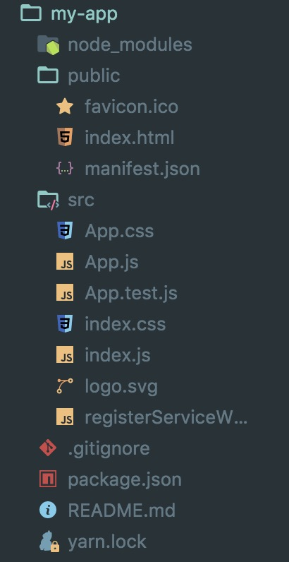
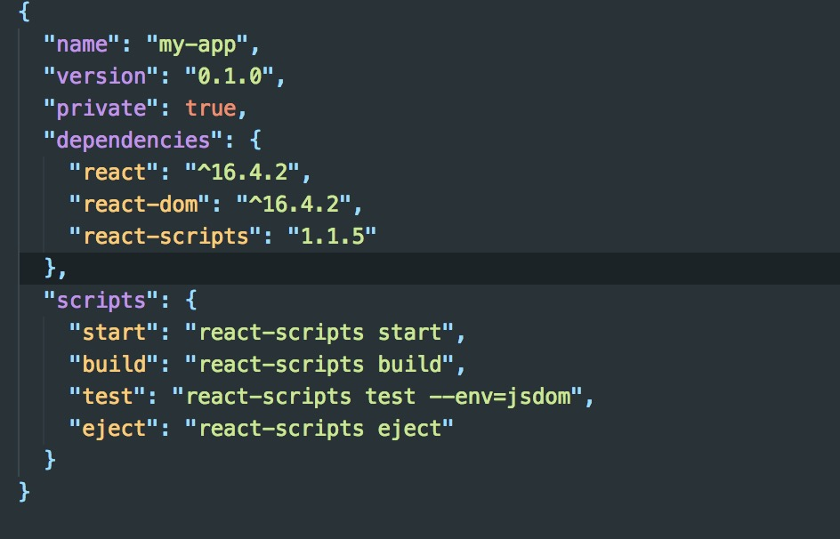
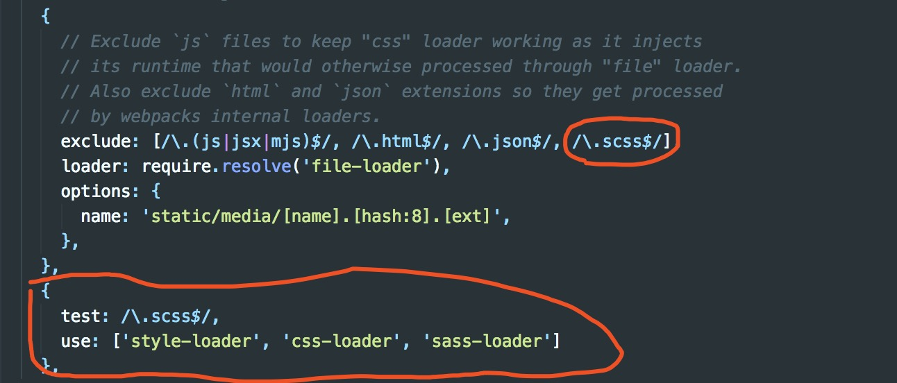
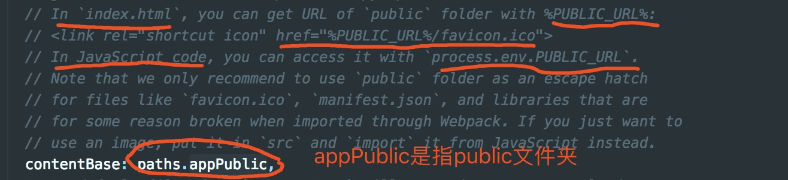

### 安装

```
npm install -g create-react-app
```


### 创建react应用

```
npx create-react-app my-app
```

或

```
npm init react-app my-app
```

或

```
yarn create react-app my-app
```

#### 1.项目结构



#### 2.package.json



主要依赖`react,react-dom,react-scripts`


### NPM命令

`package.json`中存在4个命令

1. `npm start`

   开启项目

2. `npm build`

   构建用于生产的应用程序

3. `npm test`

   运行测试观察程序。

4. `npm run eject`

   单向操作不可逆，`npm eun eject`命令暴露项目的配置，可以自由配置项目所需的依赖，不使用的版本零配置即可开发。

   我们可以看到隐藏的配置文件了。

#### react-scripts

`react-scripts`是`create-react-app`生成项目所有的依赖。

通常情况下，我们创建`spa`应用时是使用`npm`安装项目依赖，在通过配置`webpack.config.js`进行配置，搭建好环境后在`src`编写源代码。而`create-react-app`是自动构建，在`package.json`中只有`react-scripts`作为依赖，而在`reacr-scripts`中已经配置好了项目所有需要的。

从`react，es6，babel,webpack`编辑到打包，`react-scripts`都做了。


### 项目构建

#### 代码分割(即按需加载)

要实现这个功能就是使用`import`函数，注意这和导入组件的`import`是有差别的。

```js
const moduleA = 'hello';
export { moduleA };
```

```js
//在app.js中按需导入模块A
import('./moduleA').then( ({moduleA}) => {
    // 在这里面可以使用模块A
} ).catch( err => {
    // ...
} )
```


#### 使用scss文件

```
npm install sass-loader node-sass --save-dev
```

我们需要在`webpack.config.dev.js`、`webpack.config.prod.js`的`mode`中都要配置上。

**最新版本已经帮我们配置好**




#### 使用别名

在`webpack.config.dev.js`、`webpack.config.prod.js`都要添加

```js
alias: {
    '@': path.join(__dirname, '..', 'src')
},
```


#### 添加图片、字体和文件

添加这类的静态资源和添加css文件类似，使用`import`导入，得到的是一个路径。这和导入css不同。

```js
import logo from './logo.png';
function Header() {
    return ;
}
```

这也适用于CSS

```css
.Logo {
  	background-image: url(./logo.png);
}
```

> 注意：
>
> 对于引用在src文件中的图片资源，我们要使用import的方式引入再复制。上面例子中的方式。
>
>
>
> 对于引用在public静态文件中的图片资源，我们要使用相对路径或者按照下面章节的方式写。即
>
> 


#### public文件夹

可以用于添加其他的静态资源，你可以把不需要`webpack`编译的文件放在`public`文件夹里面，这里面的文件都不会被编译，(相当于静态资源文件夹)。

在`webpackDevServer.config.js`文件中设置了`contentBase`设置了根路径，所以当我们在`src`的文件要引入`public`静态文件夹中的资源时，我们可以直接以`public`文件夹开始写相对路径。



对于在index.html中我们可以使用`%PUBLIC_URL%`

```html
<link rel="shortcut icon" href="%PUBLIC_URL%/favicon.ico">
```

对于在js中我们要使用`process.env.PUBLIC_URL`

```js
return 
```


什么时候要注意`public`？

1. 你需要一些文件有特殊的文件名。

2. 当你有很多图片，并且这些图片的路径是动态添加的，懂不？？就比如你在页面上展示一个图片，这个图片要一直变，使用webpack编译后的文件不能做到这点，思考一下。

3. 如果你使用其他的很小的js库，并且这个库已经压缩和优化了，你可以直接用。

4. 还有一些js库和webpack是有冲突的，你必需通过script标签的形式导入。


#### 自定义设置proxy

在`package.json`文件中添加` "proxy": "http://..."`，为什么设置在这里？因为`path.js`文件中指向`package.json`。

例子：

```js
"proxy": {
    "/api": {
        "target": "http://www.example.org",	//所有以/api开始的指向这个ip
		"changeOrigin": true,				//
        //"ws"： true,		 				//proxy websockets
        "pathRewrite": {					//路由重写
        	"^/api/old-path" : "/api/new-path"		
        },
        "router": {
            "/api/abc": "http://194.214.43:8080"	//其中这个匹配，指向这个ip
        }
    }
}
```

但是当我们在`package.json`中设置`proxy`的时候，报错:提示只支持`string`类型,不支持`object`。只能写`"proxy":"http://xxx"`。

如果我们要代理多个，需要下面步骤：

1. 安装http-proxy-middleware管理包

```
$ npm install http-proxy-middleware --save
$ # or
$ yarn add http-proxy-middleware
```

2. 在项目目录`src/`下新建`setupProxy.js`文件，然后写入如下代码：

```js
const proxy = require(‘http-proxy-middleware‘);

module.exports = function(app) {
  app.use(proxy(‘/api‘, { 
       target: ‘http://xx‘ ,
       secure: false,
       changeOrigin: true,
       pathRewrite: {
        "^/api": "/"
       },
       router:{}
    }));
};
```

[官网文档](https://github.com/facebook/create-react-app/blob/master/docusaurus/docs/proxying-api-requests-in-development.md)

 [http-proxy-middleware](https://github.com/chimurai/http-proxy-middleware#options)


#### 在开发环境中使用HTTPS

可能你后台使用`https`的，所以你可以在cmd运行的时候输入

```
//Windows (cmd.exe)
set HTTPS=true&&npm start

//Windows (Powershell)
($env:HTTPS = $true) -and (npm start)

//Linux, macOS (Bash)
HTTPS=true npm start
```


#### 在项目中使用局部css

像Vue的`<style scoped>`一样局部使用css，不影响全局。

*我们一般可以将这个私有样式配置，放到对scss的配置上， 以scss结尾的文件为私有的文件(自己的样式表)，css结尾的文件用于第三方或公用的情况*。

在webpack.config.dev.js和webpack.config.prod.js文件的css中的css-loader中配置。

**最新版本已经帮我们配置好**

```js
{ test:/\.css$/, use: ['style-loader', 'css-loader?modules'] }
```

或

```js
{
	loader: require.resolve('css-loader'),
    options: {
    	modules: true		//加上这个属性
    },
}
```

```css
//base.css

.title {
    color: red;
}
```

```jsx
//A.jsx
import cssObj from './base.css'			//直接以模块的方式引进来

function A() {
    return (
        <div className={cssObj.title}>123</div>		//直接对象的方式调用
    )
}
```

也可以使用`localIdentName`自定义生成的类名格式，可选的参数有：

- [path]表示样式表`相对于项目根目录`所在路径
- [name]表示 样式表文件名称
- [local]表示样式的类名定义名称
- [hash:length]表示32位hash值
- 例子： `{test: /\.css$/, use: ['style-loader', 'css-loader?modules&localIdentName=[path][name]-[local]-[hash:5]']}`

详细可以查看[css-loader](https://www.npmjs.com/package/css-loader#localidentname)文档

可以从webpack的配置中看到，我们将局部样式写在`xx.module.scss`文件中。

##### 通过local和global设置类名是否被模块化

```css
//base
.title {
    
}
:global(.test) {	//这个类名就没被私有模块化，  直接引入base.css文件后，该类是会全局生效
    
}
:local(#a) { 		//被local包起来的是被模块化，默认类和id就是被包起来的
    
}
```

##### sass-resources-loader

使用`sass-resources-loader`可以让你全局调用scss变量等。

```scss
/* resources.scss */
 
$section-width: 700px;
 
@mixin section-mixin {
  margin: 0 auto;
  width: $section-width;
}
```

```js
//webpack的loader配置
{
  test: /\.scss$/,
    use: [
      'style-loader',
      'css-loader',
      'postcss-loader',
      'sass-loader',
      {
        loader: 'sass-resources-loader',
        options: {
          // Provide path to the file with resources
          resources: './path/to/resources.scss',

          // Or array of paths
          resources: ['./path/to/vars.scss', './path/to/mixins.scss']
        },
      },
    ],
},
```

然后在全局任何的样式文件中可以去调用这些变量

[sass-resources-loader](<https://www.npmjs.com/package/sass-resources-loader>)


#### 使用修饰器(Decorator)

我们需要安装 `@babel/plugin-proposal-decorators` 替换 旧版的`babel-plugin-transform-decorators-legacy`。[@babel/plugin-proposal-decorators](https://babeljs.io/docs/en/babel-plugin-proposal-decorators)

```node
npm install @babel/plugin-proposal-decorators --save
yarn add @babel/plugin-proposal-decorators --save
```

然后添加babel配置 ，可以在package.json文件或.babelr文件中配置。

```
{
  "plugins": [
    ["@babel/plugin-proposal-decorators", { "legacy": true }],
  ]
}
```

然后我们就可以在文件中使用修饰器了

```js
//LayoutFn
export default function(WrapredComponent) {
  return class Layout extends Component {
    render() {
      return (
        <div>
          <header>这是头部</header>
          <main>
            <WrapredComponent />
          </main>
        </div>
      )
    }
  }
}
```

```js
//A
import LayoutFn from './Layout';

@LayoutFn
class A extends Component {
  render() {
    return (
      <div>A</div>
    )
  }
}
export default A
```


参考文章：

[create-react-app](https://github.com/facebook/create-react-app)

[create-react-app 命令行工具系统讲解](https://www.cnblogs.com/ye-hcj/p/7191153.html)