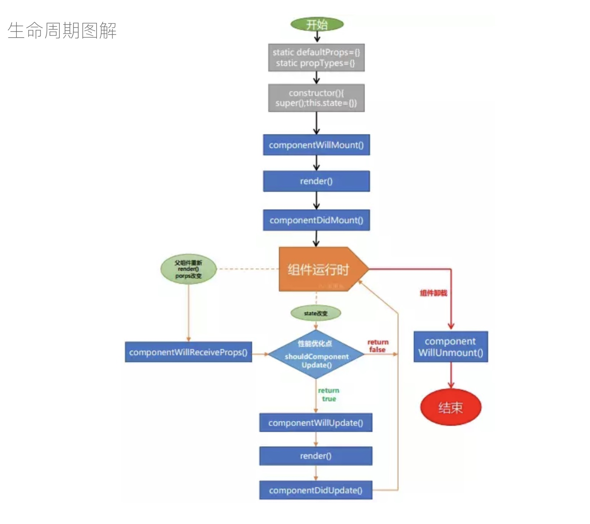
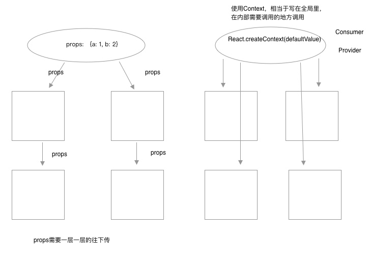

## 主要概念

### JSX简介

1. `jsx`可以js中写hmtl代码，比如：`const element = <h1>Hello, world!</h1>;`

2. `jsx`中在html标签里要使用js，则要使用`{}`大括号。在js中可以直接写标签，在标签中使用js要使用`{}`。

   ```js
   const element = (
       <h1>
         Hello, world!
         {1+1}
       </h1>;
   )
   ```

3. `{}`大括号内部写像`Vue`的`{{}}`里一样的表达式。

4. Vue中`</img>;`, React中`</img>;`

5. 使用 `camelCase` 小驼峰命名来定义属性的名称，而不是使用 HTML 的属性名称。其中Html的`class`属性变为`className` 

6. 在React中使用style修改样式，使用`{}`对象来表示

   ```jsx
   <div style={{ color: '#ccc', fontSize: '18px' }}></div>
   ```


### 元素渲染

- React 元素都是[immutable 不可变](https://en.wikipedia.org/wiki/Immutable_object)的。当元素被创建之后，你是无法改变其内容或属性的。

- 更新元素渲染， 可以创建一个新的元素，然后将它传入 `ReactDOM.render()` 方法，重新渲染。

  ```javascript
  function tick() {
    const element = (
      <div>
        <h1>Hello, world!</h1>
        <h2>It is {new Date().toLocaleTimeString()}.</h2>
      </div>
    );
    ReactDOM.render(element, document.getElementById('root'));
  }
  
  setInterval(tick, 1000);
  ```

- 16版本中ReactDOM 的 `render` 函数可以**数组**形式返回 React Component

  ```js
  class A extends React.Component {
      render(){
        return [
          <ComponentA key='A' />,
          <ComponentB key='B' />,
        ]
      }
  }
  ```

- 直接在标签的`{}`中以数组的形式渲染

  ```js
  const element = ['a', 'b', 'c'];
  const ul = <ul>{element}</ul>;
  ```


### 组件 & Props

- 函数和类两种方式来创建组件

  ```js
  //函数方式
  function Welcome(props) {
      return <h1>Hello, {props.name}</h1>;
  }
  
  //ES6 Class方式
  //使用类就允许我们使用其它特性，例如局部状态、生命周期钩子
  class Welcome extends React.Component {
      constructor(props) {
          super(props)
      }
      render() {
          return <h1>Hello, {this.props.name}</h1>
      }
  }
  ```

- 和Vue的`props`差不多，`<Welcome name="Sara" />` 或`<Welcome name={变量} />`。

- `props`的只读性，无论是函数或类声明一个组件，都不能修改它自己的`props`。

> 警告：组件名称必须是以大写字母开头。


### State & 生命周期

- 生命周期

  

- 将函数组件的写法改为类的写法，使用类就允许我们使用其它特性，例如局部状态、生命周期钩子。

- 状态是局部的，状态(state)与属性(props)十分相似，但是状态是私有的，完全受控于当前组件。

- 使用class的方式写组件`constructor`一定要调用`super()`，如果要在`class`组件任何地方直接调用`this.props`来获取属性值的话，我们需要通过如下传入`props`并用`super`调用：

  ```js
  //如果有constructor，要调用this.props的话要像下面这样传参和使用super
  class W extends React.Component {
      constructor(props) {
          super(props);
      }
  }
  //没写constructor的情况可以直接调用this.props
  class W extends React.Component {
      render(){
          //this.props
          return ()
      }
  }
  ```

- 要修改`state`，使用`setState()`方法。可以将`setState()`当成请求而不是立即就会更新组件，当我们对状态的更新中有异步操作的时候，`setState`参数使用回调函数的方式。`this.setState((prevState, props) => ({}))`， `setState(stateChange[, callback])`存在第二个参数，是一个可选的回调函数，当状态改变后执行该回调，保证同步。

  ```js
  this.setState(
      (prevState, props) => ({}))，
  	setState(stateChange[, callback]
  )
  
  this.setState({		//修改完后执行 回调函数
      name: 'lisi'
  }, function() {
      console.log(this.state.name)
  })
  //或
  this.setState((prevState, props) => ({}), function() {});
  ```

- 生命周期，只能用在class生成的组件中。

- **`state`(状态)和`props`(属性)的每次改变都会重新渲染dom，所以组件中的render函数每次都会重新执行**


### 事件处理

- React事件绑定属性的命名采用驼峰式写法，而不是像原生一样的小写。jsx语法也是传入一个函数作为事件处理函数，而不是一个字符串(DOM元素的写法)。

  ```jsx
  //传统html
  <button onclick="show()">btn</button>
  
  //React
  <button onClick={show}>btn</button>
  ```

- 你不能使用返回 `false` 的方式阻止默认行为。你必须在方法里明确的使用 `preventDefault`。

  ```jsx
  //传统
  <a href="#" onclick="console.log('Hello.'); return false">Click me</a>
  
  //React
  function show(e) {
      e.preventDefault();
  }
  return (
      <a href="#" onClick={show}>Click me</a>
  )
  ```

- 关于事件绑定时`this`的指向问题。**必须谨慎对待 JSX 回调函数中的 `this`，类的方法默认是不会绑定`this` 的，它默认指向类的实例。**(解决办法ES6的Class的基础语法中的this指向这节有讲)
  1. 可以在`constructor`中初始化修改`this`指向，  `this.fn = this.fn.bind(this)`，` xx.bind(xx)`是不会调用执行的， `call`和`apply`会调用执行。

  ```jsx
  class W extends React.Component {
      constructor(props) {
          super(props);
          this.handleClick = this.handleClick.bind(this);
      }
      handleClick(e) {}
  }
  
  //这样即使独立使用函数handleClick，它的this也是W实例
  let w = new W();
  let {handleClick} = w;  // 因为bind的原因，所以函数的this固定指向w实例
  ```

  2. 方法直接定义为  `fn = () => {}`

  ```jsx
  class W extends React.Component {
      constructor(props) {
          super(props);
      }
     //这个语法在Create React App中默认开启
      handleClick = (e) => {}		//实验性的属性初始化器语法    this就是指向W实例
  }
  ```

  3. 在标签中使用箭头函数

  ```jsx
  //注意这里的箭头函数，当点击按钮触发事件返回一个执行的函数。因为箭头函数的原因this是实例对象
  render() {
      return (
          <button onClick={(e) => this.handleClick(e)}>Click me</button>
      )
  }
  ```

  使用这个语法有个问题就是每次组件渲染的时候都会创建一个不同的回调函数，在大多数情况下可能没什么问题。然而如果这个回调函数作为一个属性值传入低阶组件，这些组件可能会进行额外的重新渲染。

  > 所以对于绑定this的问题，我们通常建议在构造函数中绑定或使用属性初始化语法来避免这类性能问题。

  4. 也可以在标签中使用`bind`来绑定`this`

  ```jsx
  render() {
      return (
          <button onClick={this.fn.bind(this)}>Click me</button>
      )
  }
  ```

- 关于事件中`event`， 如果没有别的参数，在标签上绑定时不用显示表示(即在标签上直接绑定函数就行，在函数定义上写上`event`参数)，如果还有别的参数，则需要显示写上`event`这个事件状态对象作为参数。 和Vue类似

```jsx
//没有别的参数
class W extends React.Component {
    constructor(props) {
        super(props);
        this.handleClick = this.handleClick.bind(this)
    }
    handleClick(e) {}
    render() {
        //不同传入e
        return (
            <button onClick={this.handleClick}>click</button>
        )
    }
}

//当存在别的参数
class W extends React.Component {
    constructor(props) {
        super(props);
    }
    handleClick(id, e) {}  //e参数必须写在后面
    render() {
        /*
        不同传入e的两种方式
        1.通过箭头函数的方式，事件对象必须显式的进行传递。
        2.通过bind的方式，事件对象以及更多的参数将会被隐式的进行传递。
        */
        return (
            <div>
                <button onClick={(e) => this.handleClick(id, e)}>click</button>
            	<button onClick={this.handleClick.bind(this, id)}>click</button>
            </div>
        )
    }
}
```


### 条件渲染

- React的条件渲染与JavaScript中的一致，使用JavaScript操作符`if`或条件运算符

```js
let isLoggedIn = true;
function W(props) {
    if(props.isLoggedIn) {
       return <UserGreeting /> 
    } else {
        return <GuestGreeting />
    }
}
```

- 元素变量，变量中写入标签等，通过`{变量}`来渲染标签

```jsx
render() {
    let a = <h1>Hello</h1>;
    return (
        <div>{a}</div>
    )
}
```

- 与运算符 `&&`，短路操作。

```jsx
function W(props) {
    let arr = [1, 2, 3];
    return (
        <div>
            { arr.length && <h2>Hello</h2> }
        </div>
    )
}
```

- 三目运算符

```jsx
render() {
  const isLoggedIn = true;
  return (
    <div>
     {isLoggedIn ? 'currently' : 'not'}
    </div>
  );
}
```

- 阻止组件渲染：在极少数情况下，你可能希望隐藏组件，即使它被其他组件渲染。让`render`方法返回`null`而不是它的渲染结果即可实现。并且并不会影响该组件生命周期方法的回调(即生命周期函数还是会执行)。

```jsx
function W(props) {
    if(!props.warn) {
        return null				//如果返回的是null，则组件不会渲染
    }
    return (<h1>Hello!</h1>);
}

class W extends React.Component {
    render() {
        return null
    }
}
```


### 列表 & Keys

1. 渲染多个组件：可以通过使用`{}`在JSX内构建一个元素集合。

```jsx
const numbers = [1, 2, 3, 4, 5];
const listItems = numbers.map((number) =>
 	<li key={number.toString()}>{number}</li>
)
//把整个listItems插入到ul元素中渲染
ReactDOM.render(
    <ul>{listItems}</ul>,
    document.getElementById('root')
);
```

2. Keys：Keys可以在DOM中的某些元素被增加或删除的时候帮助React识别哪些元素发生了变化。因此你应当给数组中的每一个元素赋予一个确定的标识。

   一个元素的key最好是这个元素在列表中拥有的一个独一无二的值，数字和字符串都可以。

   和Vue中的`key`一样。

```jsx
const todoItems = todos.map((todo, index) =>
  // Only do this if items have no stable IDs
  //也可以， key={todo.id}  只要代表唯一
  <li key={index}>	
    {todo.text}
  </li>
);
```

3. 元素`key`只有放在其环绕数组的上下文中才有意义。

   比如：你提取一个`ListItem`组件，应该把`key`保存在数组中的这个`<ListItem />`元素上，而不是`ListItem`组件中的`<li>`元素上。

```jsx
function ListItem(props) {
    const arr = props.list
    return (
        <li>{arr}</li>  //<li key={xx}>{arr}</li> 错误 
    )
}

function NumberList(props) {
  const numbers = [1, 2, 3, 4, 5];
  const listItems = numbers.map((number) =>
    <ListItem key={number.toString()} value={number} />
  );
  return (
    <ul>
      {listItems}
    </ul>
  );
}
```

4. Post组件可以读出`props.id`，但是不能读出`props.key`, **所以`keys`不能作为属性传入组件。**

```jsx
//组件Post的属性key是不在props中的，所以不能读出props.key
const content = posts.map((post, index) =>
  <Post
    key={index}
    id={post.id}
    title={post.title} />
);
```

5. 在jsx的大括号中嵌入map()

```jsx
{ numbers.map((number) => 
	<ListItem 
    	key={number.toString()} 
        value={number} 
    />) 
}
```


### 表单

即可读又可写。

#### 受控组件

```jsx
class NameForm extends React.Component {
  constructor(props) {
    super(props);
    this.state = {value: ''};

    this.handleChange = this.handleChange.bind(this);
    this.handleSubmit = this.handleSubmit.bind(this);
  }

  handleChange(event) {
    this.setState({value: event.target.value});
  }

  handleSubmit(event) {
    alert('A name was submitted: ' + this.state.value);
    event.preventDefault();
  }

  render() {
    return (
      <form onSubmit={this.handleSubmit}>
        <label>
          Name:
          <input type="text" value={this.state.value} onChange={this.handleChange} />
        </label>
        <input type="submit" value="Submit" />
      </form>
    );
  }
}
```

#### textarea标签

在html中`<textarea>`元素通过子节点文本来定义它的内容

```html
<textarea>Hello</textarea>
```

在React中，`<textarea>`也是用`value`属性来代替，和`<input>`很类似。

```jsx
render() {
  return (
  	<form onSubmit={this.handleSubmit}>
      <label>
        this.state.value是在构造函数中初始化
        <textarea value={this.state.value} onChange={this.handleChange} />
      </label>
      <input type="submit" value="Submit" />
    </form>
  );
}
```

#### select标签

在html中，`<select>`会创建一个下拉列表。

```html
<select>
  <option value="grapefruit">Grapefruit</option>
  <option value="lime">Lime</option>
  <option selected value="coconut">Coconut</option>
  <option value="mango">Mango</option>
</select>
```

html中`selected`属性表示默认被选中。在React中并不使用`selected`属性，而是在根`<select>`标签上用`value`属性来表示选中项。

```jsx
this.state = {value: 'coconut'};

handleChange(event) {
  this.setState({value: event.target.value});
}

render() {
    return (
      <select value={this.state.value} onChange={this.handleChange}>
      	<option value="grapefruit">Grapefruit</option>
        <option value="lime">Lime</option>
        <option value="coconut">Coconut</option>
        <option value="mango">Mango</option>
      </select>
    );
  }
```

#### 非受控标签

比如`<input type="file">`，因为该标签的`value`属性是只读的，所以他是React中的一个非受控组件。

#### 多个输入的解决方法

当你有处理多个受控的`input`元素时，可以通过给每个元素添加一个`name`属性，来让处理函数根据`event.target.name`的值来选择做什么。

对于`type="checkbox"`一般`value`属性不是很关键，主要是`checked`属性，该属性可以确定复选框是否`true/false`

```jsx
class Reservation extends React.Component {
    constructor(props) {
        super(props);
        this.state = {
            isGoing: true,
            numberOfGuests: 2
        };
        this.handleInputChange = this.handleInputChange.bind(this);
    }
    handleInputChange(event) {
        const target = event.target;
        //对于复选框，event.target.checked 表示true/false， event.target.value并不是很关键
        //而对于input、select、textarea等event.target.value是关键
        const value = target.type === 'checkbox' ? target.checked : target.value;
        const name = target.name;
        
        this.setState({
            [name]: value
        })
    }
    render() {
        return (
            <form>
            	<input
                  name="isGoing" 
                  type="checkbox" 
                  checked={this.state.isGoing}
                  onChange={this.handleInputChange} />
                <input 
                  name="numberOfGuests" 
                  type="number"
                  value={this.state.numberOfGuests}
                  onChange={this.handleInputChange} />
            </form>
        )
    }
}
```

#### 受控组件的替代方法

有时使用受控组件可能很繁琐，因为您要为数据可能发生变化的每一种方式都编写一个事件处理程序，并通过一个组件来管理全部的状态。也许有时使用[非受控组件](#非受控组件)也是一种表单的替代技术。


### 状态提升

遇到几个组件需要共用状态数据的情况。这种情况下，我们最好将这部分共享的状态提升至他们最近的父组件当中进行管理。

```jsx
class A extends React.Component {
    constructor(props) {
        super(props);
        this.changeInput = this.changeInput.bind(this);
    }
    changeInput(e) {
        this.props.doevent(e.target.value)		//子组件调用父组件的方法
    }
    render() {
		return (
        	<div>
            	<input value={this.props.v} onChange={this.changeInput} />
            </div>
        )
    }
}
class B extends React.Component {
    constructor(props) {
        super(props);
        this.changeInput = this.changeInput.bind(this);
    }
    changeInput(e) {
        this.props.doevent(e.target.value)
    }
    render() {
		return (
        	<div>
            	<input value={this.props.v} onChange={this.changeInput} />
            </div>
        )
    }
}

class All extends React.Component {
    constructor(props) {
        super(props);
        this.state = {
            a: 111
        }
        this.handleChange = this.handleChange.bind(this)
    }
    handleChange(value) {
        this.setState({
            a: value
        })
    }
    render() {
        return (
            //将父组件的公用状态传入子组件，父组件的方法传入子组件，在子组件中调用
        	<div>
            	<A v={this.state.a} doevent={this.handleChange} />
            	<B v={this.state.a} doevent={this.handleChange} />
            </div>
        )
    }
}
```

其实和Vue的组件中传参、调用方法差不多

Vue

```jsx
//父组件
data: {a: 11}
show(value) {}

<mycomponent :v="a" @todo="show"/>
//子组件
this.$emit('atodo', 111)
//也可以直接将方法传入进去
<mycomponent :v="a" :todo="show"/>
```

React

```jsx
//父组件
this.state = {a: 11}
this.show = this.show.bind(this)

show(value) {}
<mycomponent v={a} todo={this.show} />
//子组件	调用props属性传进来的方法
this.props.todo(111)		//就是执行父的show方法

//Vue也可以像React这样将事件当成属性传入子组件
<mycomponent :todo='show' />
```


### 组合和继承

#### 包含关系

1. 一些组件不能提前知道它们的子组件是什么。我们建议这些组件使用`children`属性将子元素直接传递到输出。就类似于Vue的`slot`作用域插槽。

```jsx
<Child color="blue">
    <h1>Hello Child</h1>
</Child>

//Child组件中
<div>
    { this.props.color }
	{ this.props.children }		//通过this.props.children来获取上面的<h1>Hello Child</h1>
</div>
```

和Vue的`slot`相对应

```jsx
<alert-box>
  Something bad happened.
</alert-box>

Vue.component('alert-box', {
  template: `
    <div class="demo-alert-box">
      <slot></slot>
    </div>
  `
})
```

2. 或者也可以直接`props`属性中，将组件传入进去，虽然不太常见。

```jsx
<Child color="blue" a={<A/>} b={<B/>} />

//Child组件直接渲染
{this.props.a}
{this.props.b}
```

在 Facebook 网站上，我们的 React 使用了数以千计的组件，然而却还未发现任何需要推荐你使用继承的情况。


## 高级指引

### 深入JSX

本质上来讲，JSX只是为`React.createElement(component, props, ...children)`方法提供的语法糖。

```jsx
<MyButton color="blue" shadowSize={2}>
  Click Me
</MyButton>

//编译为
React.createElement(
  MyButton,
  {color: 'blue', shadowSize: 2},
  'Click Me'
)
```

#### 指定React元素类型

##### 点表示法

有一个名为`MyComponents.DatePicker`的组件，可以直接在JSX中使用：

```jsx
const MyComponents = {
    DatePicker(props) {
        return (<div>{props.color}</div>)
    }
}
function BlueDatePicker() {
  return <MyComponents.DatePicker color="blue" />;
}

//点表示法取值 正确
<MyComponents.DatePicker color="blue" />;
//使用[]方式取值 错误
<MyComponents['DatePicker'] color="blue" />;  	//不可以
```

##### 用户定义组件必须首字母大写

```jsx
function Mycomponent() {}
```

##### 在运行时选择类型

你不能使用一个通用的表达式来作为React元素的标签。

```jsx
const components = {
  photo: PhotoStory,
  video: VideoStory
};

function Story(props) {
  // 错误！JSX 标签名不能为一个表达式。
  return <components[props.storyType] story={props.story} />;
}

//改为，先将值赋给一个大写开头的变量
function Story(props) {
  // 正确！JSX 标签名可以为大写开头的变量。
  const SpecificStory = components[props.storyType];
  return <SpecificStory story={props.story} />;
}
```

我测试过，这种变量取值的组件名方式只能使用点表示法。

#### JSX的属性(Props)

1. 使用JavaScript表达式作为属性

```jsx
<MyComponent foo={1 + 2 + 3 + 4} />
```

2. 字符串常量

```jsx
<MyComponent message="hello world" />

<MyComponent message={'hello world'} />
```

3. 默认属性为True

```jsx
<MyTextBox autocomplete />

<MyTextBox autocomplete={true} />
```

4. 展开属性

```jsx
const props = {firstName: 'Ben', lastName: 'Hector'}; 
<Greeting {...props} />
//等价于
<Greeting firstName="Ben" lastName="Hector" />;
```

#### JSX中的子代

1. 字符串字面量

```jsx
//直接将Hello world!通过props.children传递子代
<MyComponent>Hello world!</MyComponent>
```

2. JSX子代

```jsx
<MyContainer>
  <MyFirstComponent />
  <MySecondComponent />
</MyContainer>
```

3. JavaScript表达式作为子代

```jsx
<MyComponent>{'foo'}</MyComponent>
```

4. 函数作为子代

```jsx
//props.children传入一个函数进去，在子组件中可以调用
<Repeat numTimes={10}>
    {(index) => <div key={index}>This is item {index} in the list</div>}
</Repeat>

props.children(index) 	//调用
```

5. 布尔值、Null和Undefined被忽略

`false`、`null`、`undefined` 和 `true` 都是有效的子代，只是它们不会被渲染。

```jsx
//下面的都等价
<div />

<div></div>

<div>{false}</div>

<div>{null}</div>

<div>{undefined}</div>

<div>{true}</div>
```


### 使用PropTypes进行类型检查

从React v15.5起使用`prop-types`库代替。

```jsx
import PropTypes from 'prop-types';

class Greeting extends React.Component {
  render() {
    return (
      <h1>Hello, {this.props.name}</h1>
    );
  }
}

Greeting.propTypes = {
  name: PropTypes.string
};
```

##### 限制单个子代

使用 `PropTypes.element` 你可以指定只传递一个子代。

```jsx
import PropTypes from 'prop-types';

class MyComponent extends React.Component {
  render() {
    const children = this.props.children;
    return (
      <div>
        {children}
      </div>
    );
  }
}

MyComponent.propTypes = {
  children: PropTypes.element.isRequired
};
```

##### 属性默认值

你可以通过配置 `defaultProps` 为 `props`定义默认值。

```jsx
class Greeting extends React.Component {
  render() {
    return (
      <h1>Hello, {this.props.name}</h1>
    );
  }
}

// 为属性指定默认值:
Greeting.defaultProps = {
  name: 'Stranger'
};
```

如果你在使用像 [transform-class-properties](https://babeljs.io/docs/plugins/transform-class-properties/) 的 Babel 转换器，你也可以在React 组件类中声明 `defaultProps` 作为静态属性。

```jsx
class Greeting extends React.Component {
  static defaultProps = {
    name: 'stranger'
  }

  render() {
    return (
      <div>Hello, {this.props.name}</div>
    )
  }
}
```


### Refs & DOM

在典型的React数据流中，属性(`props`)是父组件与子组件交互的唯一方式。要修改子组件，你需要使用新的`props`重新渲染它。但是某些情况下你需要在典型数据流外强制修改子组件。要修改的子组件可以是React组件的实例，也可以是DOM元素。对于这两种情况，React提供了解决办法。

##### 使用Refs

`Refs` 提供了一种方式，用于访问在 `render` 方法中创建的 DOM 节点或 React 元素。

下面是几个适合使用`refs`的情况：

- 处理焦点、文本选择或媒体控制。
- 触发强制动画
- 集成第三方DOM库

`ref`的值取决于节点的类型：

- 当`ref`属性被用于一个普通的HTML元素时，则`React.createRef()`的`current`属性对应元素的底层DOM。React 会在组件加载时将 DOM 元素传入 `current` 属性，在卸载时则会改回 `null`。`ref` 的更新会发生在`componentDidMount` 或 `componentDidUpdate` 生命周期钩子之前。
- 当`ref`属性被用于一个自定义类组件时，`ref`对象将接受该组件已挂载的实例作为它的`current`。
- 不能在函数式组件上使用`ref`属性，因为它们没有实例。但是可以在函数式组件内部使用`ref`，只要它指向一个DOM元素或者class组件。

```jsx
//为 DOM 元素添加 Ref
class MyComponent extends React.Component {
    constructor(props) {
        super(props);
        this.myRef = React.createRef();			//1. 创建一个ref实例
    }
    componentDidMount() {
		this.myRef.current.style.color = 'blue';	//3. ref中的current属性对节点的引用进行访问
    }
    render() {
        return <div ref={this.myRef} />;		//2. 绑定节点
    }
}

//为类组件添加 Ref
class AutoFocusTextInput extends React.Component {
  constructor(props) {
    super(props);
    this.textInput = React.createRef();
  }
  componentDidMount() {
    //this.textInput.current就是CustomTextInput组件这个实例
    this.textInput.current.focusTextInput();
  }
  render() {
    return (
      <CustomTextInput ref={this.textInput} />
    );
  }
}

//不能在函数式组件上使用ref属性，因为它们没有实例
function MyFunctionalComponent() {
  return <input />;
}
class Parent extends React.Component {
  constructor(props) {
    super(props);
    this.textInput = React.createRef();
  }
  render() {
    // 这将 不会 工作！
    return (
      <MyFunctionalComponent ref={this.textInput} />
    );
  }
}

//ref使用函数回调的方式
function CustomTextInput(props) {
  // 这里必须声明 textInput，这样 ref 回调才可以引用它
  let textInput = null;
  function handleClick() {
    textInput.focus();
  }
  return (
    <div>
      <input
        type="text"
        ref={(input) => { textInput = input; }} />
      <input
        type="button"
        value="Focus the text input"
        onClick={handleClick}
      />
    </div>
  );  
}
```

##### 对父组件暴露DOM节点

该新特性就是 `Ref` 的转发, 它的目的是让父组件可以访问到子组件的 `Ref`，从而操作子组件的 DOM。 主要使用`React.forwardRef` 这个方法，该方法接收一个函数，函数参数有 `props` 和 `ref`。

如果你对子组件的实现还是没有控制权的话，你剩下的选择是使用 [`findDOMNode()`](https://react.docschina.org/docs/react-dom.html#finddomnode)，但是不推荐。

查看下面[React.forwardRef](#React.forwardRef)章节的内容。

##### 回调Refs

在ref中使用回调函数，回调函数会直接执行，其中该函数有一个参数，参数就是当前写有ref的节点对象。

在父组件中可以直接获取到子组件中的dom节点。

例子1：

```jsx
 class Parent extends React.Component {
     constructor(props) {
         super(props);
         this.textInput = null;
         this.test = element => {		//使用箭头函数
             console.log(element);		//为<div>111</div>
             this.textInput = element;
         }
     }
     render() {
         return (
             <div ref={this.test}>111</div>		//这里ref={函数}，  函数会被调用
         );
     }
 }
```

```jsx
class Parent extends React.Component {
    test(element) {
        console.log(element)	//这里的element为MyComponent组件实例
    }
    render() {
        return (
        	<MyComponent ref={this.test.bind(this)} />
        )
    }
}
```

例子2：

```jsx
class Child extends React.Component {
    constructor(props) {
        super(props);
    }
    render() {
        return (
            <div ref={this.props.test}>child</div>	//ref中的函数会自动执行
        );
    }
}
class Parent extends React.Component {
    constructor(props) {
        super(props);
        this.inputElement = null;
    }
    render() {
        return (
            //箭头函数的this是当函数生成的时候就决定了，不像一般函数的this是在执行的时候决定的。所以下面的箭头函数中在定义的时候就确定了，指向Parent
            <Child
            	test={(el) => {
                    console.log(el, this)	//el: <div>child</div>  this: Parent
                    this.inputElement = el;
            	}
    		} />
		);
	}
}
```

ref用函数来表示，可以很灵活

```js
//这么做就将input标签的节点，赋值给了一个变量，可以很灵活的使用变量。
var inputElement = null;
<input ref={dom => {
	inputElement = dom            
}}>
```

相对于Vue中的ref

```jsx
<!-- `vm.$refs.p` will be the DOM node -->
<p ref="p">hello</p>

<!-- `vm.$refs.child` will be the child component instance -->
<child-component ref="child"></child-component>
```


### React.forwardRef

另外一个新特性是 `Ref` 的转发, 它的目的是让父组件可以访问到子组件的 `Ref`，从而操作子组件的 DOM。 `React.forwardRef` 接收一个函数，函数参数有 `props` 和 `ref`。

```js
//TextInput就是一个组件
const TextInput = React.forwardRef((props, ref) => {
    return (<input type="text" placeholder="Hello forwardRef" ref={ref} />)
    //return <Aa ref={ref} />         函数也可以返回一个class的组件                              
})

class App extends Component {
  constructor(props) {
    super(props)
    this.myRef = React.createRef()
  }
  handleSubmit = event => {
    event.preventDefault()
    alert('input value is:' + this.myRef.current.value)
  }
  render() {
    return (
      <form onSubmit={this.handleSubmit}>
        <TextInput ref={this.myRef} />
        <button type="submit">Submit</button>
      </form>
    )
  }
}
```


### 非受控组件

对于表单中我们使用非受控的方法去操作数据(即直接操作dom，使用ref，不用状态)。

##### 默认值

如果我们要给表单的`value`设定一个初始值，我们可以指定一个 `defaultValue` 属性而不是 `value`。

```js
<input defaultValue="Bob" type="text" ref={(input) => this.input = input} />
```

同样，`<input type="checkbox">` 和 `<input type="radio">` 支持 `defaultChecked`，`<select>` 和 `<textarea>` 支持 `defaultValue`.

##### 文件输入标签

```html
<input type="file" />
```

在React中，`<input type="file" />` 始终是一个不受控制的组件，因为它的值只能由用户设置，而不是以编程方式设置。

我们可以使用File API与文件进行交互。


### 性能优化

##### shouldComponentUpdate

更新`state`和`props`会触发该生命周期，即使执行`setState`修改的值相同没有变化，还是会触发该生命周期，**只是不会重新渲染dom节点而已**。

```jsx
shouldComponentUpdate(nextProps, nextState) {
  return true;		//如果为false，则不渲染。 true为渲染
}
```

如果想让组件只在`props.color`或者`state.count`的值变化时重新渲染

```jsx
shouldComponentUpdate(nextProps, nextState) {		//nextProps, nextState为更新好后的
    if (this.props.color !== nextProps.color) {		//this.props和this.state为当前还没更新的
        return true;								
    }
    if (this.state.count !== nextState.count) {
        return true;
    }
    return false;
}
```

>  注意，如果使用`ref`去修改`state`或`props`并不会触发`shouldComponentUpdate`生命周期，并没有监听到。

##### 不会突变的数据

尽量不引起数据突变。

```jsx
//使用push等变异方法会改变原值(突变)
handleClick() {
    const words = this.state.words;
    words.push('marklar');
    this.setState({words: words});
}

//修改

//使用不会修改原值的方法，拷贝一个备份，然后重新赋值
handleClick() {
  this.setState(prevState => ({
    words: prevState.words.concat(['marklar'])
  }));
}
handleClick() {
  this.setState(prevState => ({
    words: [...prevState.words, 'marklar'],
  }));
};
```

```js
//这里会突变原始对象
function updateColorMap(colormap) {
  colormap.right = 'blue';
}

//不突变原始对象
function updateColorMap(colormap) {
  return Object.assign({}, colormap, {right: 'blue'});
}
function updateColorMap(colormap) {
  return {...colormap, right: 'blue'};
}
```


### 不使用ES6

通常我们会使用JavaScript的`class`关键字来创建React组件，如果不打算使用ES6，可以使用`create-react-class`模块来创建：

```jsx
var createReactClass = require('create-react-class');
var Greeting = createReactClass({
  //声明默认属性
  getDefaultProps() {
  	return {
  		name: 'Mary'
    };
  },
  //设置初始状态---对应this.state
  getInitialState() {
  	return {count: this.props.initialCount};
  },
  //方法自动绑定this， 不用像之前要this.fn = this.fn.bind(this)
  handleClick() {
    alert(this.state.message);
  },
  render() {
  	return <h1>Hello, {this.props.name}</h1>;
  }    
});
```

使用`create-react-class`创建的组件可以使用`Mixin`(混入)，而使用class创建的是不能够使用混入的。

```jsx
var SetIntervalMixin = {
  componentWillMount: function() {
    this.intervals = [];
  },
  setInterval: function() {
    this.intervals.push(setInterval.apply(null, arguments));
  },
  componentWillUnmount: function() {
    this.intervals.forEach(clearInterval);
  }
};

var createReactClass = require('create-react-class');

var TickTock = createReactClass({
  mixins: [SetIntervalMixin], // 使用混入
  render() {
    return (/*……*/);
  }
});
```


### 不使用JSX

每一个JSX元素都只是`React.createElement(component, props, ...children)`的语法糖。

```jsx
class Hello extends React.Component {
  render() {
    return <div>Hello {this.props.toWhat}</div>;
  }
}
ReactDOM.render(
  <Hello toWhat="World" />,
  document.getElementById('root')
);
```

可以被编译成下面这段不使用JSX的代码

```jsx
class Hello extends React.Component {
  render() {
    return React.createElement(
        'div', 
        null, 
        `Hello ${this.props.toWhat}`
    );
  }
}
ReactDOM.render(
  React.createElement(Hello, {toWhat: 'World'}, null),
  document.getElementById('root')
);
```

如果你对于每次都要输入 `React.createElement` 感到非常厌倦，这是一种常用的简写形式：

```jsx
const e = React.createElement;
ReactDOM.render(
  e('div', null, 'Hello World'),
  document.getElementById('root')
);
```


### Reconciliation

`diffing`算法用来找出两棵树的所有不同点。

当你使用React，你可以认为`render()`函数是在创建React元素树。

React基于两点假设，实现了一个启发的O(n)算法：

1. 两个不同类型的元素将产生不同的树。
2. 开发者可以使用`key`属性来提示哪些子元素贯穿不同渲染是稳定的。

#### 差分算法

当差分两棵树时，React首先比较两个根元素。依赖于根元素的类型不同，其行为也不同。

##### 不同类型的元素

每当根元素有不同类型，React将拆除旧树并且从零开始重新构建新树。

当拆除一棵树时，旧的DOM节点被销毁。组件实例收到`componentWillUnmount()`。当构建一棵新树时，新的DOM节点被插入到DOM中。组件实例先收到`componentWillMount()`，然后收到`componentDidMount()`。任何与旧树有关的状态都被丢弃。

##### 相同类型的DOM元素

当比较两个相同类型的React DOM元素时，React则会观察二者的属性(attributes)，保持相同的底层DOM节点，并仅更新变化的属性。

当更新`style`时，React同样知道仅更新改变的属性(properties)。

##### 相同类型的组件元素

当组件更新时，实例保持相同，这样状态跨渲染被维护。React通过更新底层组件实例的属性(props)来匹配新元素，并在底层实例上调用`componentWillReceiveProps()` 和 `componentWillUpdate()`。

下一步，`render()`方法被调用，差分算法递归处理前一次的结果和新的结果。

##### 子代们上的递归

默认时，当递归DOM节点的子节点时，React就是迭代在同一时间点的两个子节点列表，并在不同时产生一个变更。

例如，当在子节点末尾增加一个元素，两棵树的转换效果很好：

```html
<ul>
  <li>first</li>
  <li>second</li>
</ul>
<ul>
  <li>first</li>
  <li>second</li>
  <li>third</li>
</ul>
```

React将会匹配两棵树的`<li>first</li>`，并匹配两棵树的`<li>second</li>` 节点，并插入`<li>third</li>`节点树。

如果你的实现方法过于天真，插入元素到列表的开头会使得性能变坏。

```html
<ul>
  <li>Duke</li>
  <li>Villanova</li>
</ul>
<ul>
  <li>Connecticut</li>
  <li>Duke</li>
  <li>Villanova</li>
</ul>
```

React将修改每个子节点，而非意识到可以完整保留`<li>Duke</li>` 和 `<li>Villanova</li>`子树。低效成了一个问题。

##### Keys

为解决该问题，React支持了一个`key`属性。当子节点有key时，React使用key来匹配原始树的子节点和随后树的子节点。

```html
<ul>
  <li key="2015">Duke</li>
  <li key="2016">Villanova</li>
</ul>

<ul>
  <li key="2014">Connecticut</li>
  <li key="2015">Duke</li>
  <li key="2016">Villanova</li>
</ul>
```

现在React知道带有`'2014'`的key的元素是新的，带有`'2015'`和`'2016'`的key的元素仅需要移动。

建议`key`值不要使用索引，若元素顺序永远不会改变，该方法效果不错，但重新排序就会很慢。如果key是索引，则移动一个项目改变索引，结果，诸如非受控输入这类的组件状态可能会以意想不到的方式混淆和更新。


### Context

`Context` 通过组件树提供了一个传递数据的方法，从而避免了在每一个层级手动的传递 `props` 属性。

`Context` 提供了一种在组件之间共享此类值的方式，而不必通过组件树的每个层级显式地传递 `props` 。

`Context` 设计目的是为共享那些被认为对于一个组件树而言是“全局”的数据，例如当前认证的用户、主题或首选语言。

```jsx
//也可以传入一个对象等
const {Provider, Consumer} = React.createContext('默认值：如果没有定义Provider，则Consumer中的值就是这里定义的默认值');

class Child extends Component {
    render() {
        //以函数调用的方式
        //这里的v是Provider中的value
        return (
            <Consumer>
            	{ v => <div>{v}</div> }
            </Consumer>	
        )
    }
}
class Parent extends Component {
    render() {
        return (
            <Provider value="value中的值传入Consumer可以被得到">
            	<Child />
            </Provider>
            //<Child />   没有<Provider>则渲染上面定义的默认值
        )
    }
}
```



#### API

##### React.createContext

```jsx
const {Provider, Consumer} = React.createContext(defaultValue);
```

当 React 渲染 Context 组件 Consumer 时，它将从组件树的上层中最接近的匹配的 Provider 读取当前的 context 值。

如果上层的组件树没有一个匹配的 Provider，而此时你需要渲染一个 Consumer 组件，那么你用到的值是`defaultValue` 。

`defaultValue`或`<Provider>`的`value`传入的参数可以是任何类型。

```jsx
const {Provider, Consumer} = React.createContext(defaultValue);

//如果要创建多个React.createContext 就不要用解构直接获取
const A = React.createContext(defaultValue);
const B = React.createContext(defaultValue);

<A.Provider value="a">
    <B.Provider value="b">
    	xx
    </B.Provider>
</A.Provider>

<A.Consumer>
	{a => (
     	<B.Consumer>
        	{b => ···}
    	</B.Consumer>
     )}
</A.Consumer>
```

Provider是提供者，Consumer是消费者。在Provider上可以通过value属性绑定值，然后在Consumer中可以得到Provider上绑定的值。

上面`defaultValue`参数，仅在Consumer消费者找不到Provider这个提供者时，取得值才是这个默认值`defaultValue`

```jsx
const {Provider, Consumer} = React.createContext('我是默认值');

class Child extends Component {
    render() {
        //因为<Child /> 不在<Provider />中，所以<Consumer>找不到<Provider>这个提供者，所以只能去React.createContext上找默认值，结果显示'我是默认值'
        return (
            <Consumer>
            	{ v => <div>{v}</div> }
            </Consumer>	
        )
    }
}
class Parent extends Component {
    render() {
        return (
            <div>
            	<Provider value="aaaa"><Child /></Provider>
            	<Child />
            </div>
        )
    }
}
```

##### Provider

```jsx
<Provider value={/* some value */}>
    xx
</Provider>
```

将value的值传递下去，可以在Consumer中获取。

##### Consumer

以函数调用的方式获得 `Context` 对象的值。

```jsx
<Consumer>
  {value => /* render something based on the context value */}
</Consumer>
```

在Consumer 中，以函数的方式执行，函数的参数来接受上下文传递下来的数据。value值为上下文中最近的Provider的value值，如果没有此上下文Provider，则`value`参数将等于`React.createContext()`中的`defaultValue`值。

##### 整体过程

- 通过 `const ThemeContext = React.createContext(defaultValue)` 创建 `Context` 对象。
- 在父组件上，使用`<ThemeContext.Provider/>` 来提供 `Provider`。
- 在需要消费的地方，使用`<ThemeContext.Consumer/>` 以函数调用的方式`{theme => <Button {...props} theme={theme} />}`获得 `Context` 对象的值。

##### 注意事项

> 注意：从`Provider`到其后代使用者的传播不受`shouldComponentUpdate`方法的约束，因此即使祖先组件退出更新，如果`Provider`上的`value`值变化了，`Consumer`也会更新。

[官方api](https://reactjs.org/docs/context.html#legacy-api)

```jsx
class App extends React.Component {
  render() {
    return (
        //传入一个对象
      <Provider value={{something: 'something'}}>
        <Toolbar />
      </Provider>
    );
  }
}
```


### Portal

由 `ReactDOM` 提供的 `createPortal` 方法，允许将组件渲染到其他 DOM 节点上。其函数签名为 `ReactDOM.createPortal(child, container)`, `child` 参数为任意的可渲染的 React Component，如 element、sting、fragment 等，`container` 则为要挂载的 DOM 节点。

```html
<div id="app"></div>
```

```js
import React from 'react'
import ReactDOM from 'react-dom'

let app = document.getElementById('app');

class Aaa extends React.Component {
    constructor(props) {
        super(props);
        this.el = document.createElement('div');
    }
    componentDidMount() {
        app.appendChild(this.el);
    }
    render() {
        return ReactDOM.createPortal(
            <div>123</div>,
            this.el
        )
    }
}
function App(props) {
    return (
    	<Aaa />
    )
}
```


### Fragment

在向 DOM 树批量添加元素时，一个好的实践是创建一个`document.createDocumentFragment`，先将元素批量添加到 `DocumentFragment` 上，再把 `DocumentFragment` 添加到 DOM 树，减少了 DOM 操作次数的同时也不会创建一个新元素。

和 DocumentFragment 类似，React 也存在 Fragment 的概念，用途很类似。

React 16 中则通过 `<React.Fragment></React.Fragment>` 直接创建 `Fragment`:

```js
render() {
    //可以带上keys
  return (
    <React.Fragment>
      <ChildA />
      <ChildB />
      <ChildC />
    </React.Fragment>
  )
}
```

如此，我们不需要单独包裹一层无用的元素(如使用`<div></div>`包裹)，减少层级嵌套。 此外，还一种精简的写法：

```js
render() {
  return (
    <>
      <ChildA />
      <ChildB />
      <ChildC />
    </>
  )
}
```


### 高阶组件

#### 高阶函数基本概念

- 函数可以作为参数被传递

```js
setTimeout(() => {
    console.log(1)
}, 1000)
```

- 函数可以作为返回值输出

```js
function show() {
    return function(){}
}
```

#### 高阶组件

高阶组件基本概念：

- 高阶组件就是接受一个组件作为参数并返回一个新组件的函数
- 高阶组件是一个函数，并不是组件。

1. 方法一：创建一个函数，将组件作为参数传入

```js
//Layout/.js
//WrapredComponent参数是一个组件
export default function LayoutFn(WrapredComponent) {
  return class Layout extends Component {
    render() {
      return (
        <div>
          <header>这是头部</header>
          <main>
            <WrapredComponent />
          </main>
        </div>
      )
    }
  }
}
```

```js
//A组件
import LayoutFn from './Layout';
class A extends Component {
  render() {
    return (
      <div>A</div>
    )
  }
}
export default LayoutFn(A)
```

```js
//B组件
import LayoutFn from './Layout';
class B extends Component {
  render() {
    return (
      <div>B</div>
    )
  }
}
export default LayoutFn(B)
```

2. 方法二：使用修饰器(Decorator)方式

[@babel/plugin-proposal-decorators](https://babeljs.io/docs/en/babel-plugin-proposal-decorators)

```
npm install @babel/core @babel/plugin-proposal-decorators --save
```

然后添加babel配置 ，可以在package.json文件或.babelr文件中配置。

```
{
  "plugins": [
    ["@babel/plugin-proposal-decorators", { "legacy": true }],
  ]
}
```

```js
//LayoutFn
export default function(WrapredComponent) {
  return class Layout extends Component {
    render() {
      return (
        <div>
          <header>这是头部</header>
          <main>
            <WrapredComponent />
          </main>
        </div>
      )
    }
  }
}

```

```js
//A
import LayoutFn from './Layout';

@LayoutFn
class A extends Component {
  render() {
    return (
      <div>A</div>
    )
  }
}
export default A
```

```js
//B
import LayoutFn from './Layout';

@LayoutFn
class B extends Component {
  render() {
    return (
      <div>B</div>
    )
  }
}
export default B
```

#### 高级组件应用

- 操纵prop
- 访问ref
- 抽取状态
- 包装组件

1.操纵prop

```jsx
//App.js
class App extends Component {
    return (
    	<>
        	<A a={'a'}/>
    	</>
    )
}

//Base
export default (WrapredComponent) => class Base extends Component {
    render() {
        //this.props中传入a属性
        return (
        	<>
                <WrapredComponent {...this.props} b={'b'}/>
            </>
        )
    }
}

//A.js
import base from 'Base.js'
@base    //使用修饰器
class A extends Component {
    render() {
        //此时props中存在a和b属性
        const {a, b} = this.props;
        return (
        	<>
            	{a}{b}
            </>
        )
    }
}
export default A
```

2.访问ref

```jsx
//App.js
class App extends Component {
    return (<A/>)
}
//Base.js
export default function(WrapredComponent) {
  return class Base extends Component {
    constructor(props) {
      super(props);
      this.refc = this.refc.bind(this);
    }
    //此时的instance就是WrapredComponent组件的实例对象，如果ref是个标签元素，则instance是该标签元素
    refc(instance) {
      instance.show();
    }
    render() {
        //ref如果是个函数的话，则自动执行。 绑定this
      return (
        <>
          <WrapredComponent ref={this.refc} />
        </>
      )
    }
  }
}
//A.js
import base from 'Base.js'
@base
class A extends Component {
  show() {
    alert(1)
  }
  render() {
    return (
      <>
        <input type="text" />
      </>
    )
  }
}
export default A
```

3.抽取状态

```jsx
//App.js
class App extends Component {
    return (
    	<>
        	<A/>
    	</>
    )
}

//Base
export default (WrapredComponent) => class Base extends Component {
    constructor(props) {
      super(props);
      this.state = {
        a: 111
      }
    }
    onInputChange = (e) => {
      this.setState({
        a: e.target.value
      })
    }
    render() {
        //传给子组件value和onChange，用于绑定到<input/>标签
        let newProps = {   
            value: this.state.a,
            onChange: this.onInputChange
        }
        return (
        	<>
                <WrapredComponent {...newProps} />
            </>
        )
    }
}

//A
import base from 'Base.js'
@base
class A extends Component {
  render() {
      //input上通过props添加属性value和onChange
    return (
      <div>
        <input type="text" {...this.props} />
      </div>
    )
  }
}

export default A
```

4.包装组件

```jsx
//代理方式的高阶组件
export default WrappedComponent => class A extends Component {
    render() {
        const {...otherProps} = this.props;
        return <WrappedComponent {...otherProps} />
    }
}
//继承方式的高阶组件
export default WrappedComponent => class A extends WrappedComponent {
    render() {
        const {user, ...otherProps} = this.props;
        this.props = otherProps
        return super.render()	//super作为对象是父类的原型对象
    }
}
```

继承例子：

```jsx
//App.js
class App extends Component {
  render() {
    return (
      <div className="App">
        <C/>
      </div>
    );
  }
}
export default App;

//style.js
import { cloneElement } from 'react';
export default (WrapredComponent) => class NewComponent extends WrapredComponent {
  render() {
    let element = super.render();
    let style = {
      color: element.type === 'div' ? 'orange' : 'green'
    }
    let newProps = {...this.props, style }
    return cloneElement(element, newProps, element.props.children)
  }
}

//C.js
import styleFn from './style.js'
@styleFn
class C extends Component {
  render() {
    return (
      <div>这是C</div>
    )
  }
}
export default C
```

不建议使用继承


### 生命周期

生命周期的概念：每个组件的实例，从创建、到运行、直到销毁，在这个过程中，会出发一系列事件，这些事件就叫做组件的生命周期函数；

React组件生命周期分为三部分：

- 组件创建阶段：特点：一辈子只执行一次

  - `componentWillMount`：经量使用`constructor`或`componentDidMount`去代替
  - `render`
  - `componentDidMount`

- 组件运行阶段：按需，根据props属性或state状态的改变，有选择性的执行0到多次

  - `componentWillReceiveProps`	使用`getSnapshotBeforeUpdate(prevProps, prevState)`代替

  - `shouldComponentUpdate`

    ```js
    shouldComponentUpdate(nextProps, nextState) {
        return true		//默认返回的是true， 表示当props或state变化的时候允许Dom重新渲染更新，但如果是false，虽然state或props更新了，却不允许DOM重新渲染更新
    }
    ```

  - `componentWillUpdate`        使用`getSnapshotBeforeUpdate(prevProps, prevState)`代替

  - `render`

  - `componentDidUpdate`

- 组件销毁阶段：一辈子只执行一次

  - `componentWillUnmount` 


React16.5版本中，每个组件都有几个“声明周期方法”，在下面列表中，常用的生命周期方法标记为**粗体**。其余的存在用于相对罕见的用例。

以下是最新版本的生命周期图：


### 16版本

#### 安装 

在创建组件的实例并将其插入DOM时，将按以下顺序调用这些方法：

- `constructor(props)`

  用于初始化，在构造函数中只用于两个目的。1.初始化状态`this.state`。2.绑定事件处理器方法到一个实例。

- `Static getDerivedStateFromProps(nextProps, prevState)`

- `render()`

- `componentDidMount()`         

  这是实例化网络请求的好地方，若需要和浏览器交互，将任务放在`componentDidMount()`中或其他的生命周期方法中。保持`render()` 方法纯净使得组件更容易理解。

  这个方法是建立任何订阅的一个好地方。别忘了在`componentWillUnmount()`取消订阅。

**官方的建议是将首屏放在 `constructor` 或 `componentDidMount`中**。

> 这些方法被认为是遗留的，您应该在新代码中避免他们：
>
> - UNSAFE_componentWillMount()     现在官网建议使用constructor()来替代初始化状态

#### 更新

`state`和`props`的更改可能导致更新。重新渲染组件时，将按以下顺序调用这些方法：

- `static getDerivedStateFromProps(props, state)`

  **其作用是根据传递的 props 来更新 state。**

  它的一大特点是无副作用 : 因为该生命周期处在 Render Phase 阶段，所以在每次的更新都要触发， 故在设计 API 时采用了静态方法，其好处是单纯 —— 无法访问实例**(即访问不到this)**、无法通过 ref 访问到 DOM 对象等，保证了单纯且高效。

  1. `getDerivedStateFromProps`在调用`render`方法之前调用，无论是在初始安装还是后续更新。它应该返回一个更新状态的对象(即需要更新的`state`对象)，或者返回`null`以不更新任何状态。
  2. 初始化的时候就会执行一次。
  3. `state`或`props`变化就会执行该生命周期，因为`state`和`props`变化都会使组件重新渲染。

  ```js
  state = {
     a: 1 
  }
  static getDerivedStateFromProps(props, state) {
      if(xx) {
          return {			//返回state對象，现在state变为了该生命周期返回的新对象了，如果为null则不变, 有的key则覆盖新值，没有的则添加
              b: 2
          }
          //state = {a: 1， b: 2}
      } els
          return null
      }
  }
  ```

  不过官方有几点建议：

  - 如果改变 `props` 的同时，有副作用的产生(如异步请求数据，动画效果)，这时应该使用 `componentDidUpdate`。 `props`和`state`的更新都会重新执行`render`渲染
  - 如果想要根据 `props` 计算属性，应该考虑将结果 memoization 化，参见 memoization
  - 如果想要根据 `props` 变化来重置某些状态，应该考虑使用受控组件

- `shouldComponentUpdate(nextProps, nextState)`

  默认为`true`。该方法在初始化渲染或当使用`forceUpdate()`时并不会被调用。

- `render()`

- `getSnapshotBeforeUpdate(prevProps, prevState)`    

  更新之前，此生命周期返回的任何值都将作为参数传递给`componentDidUpdate()`的第三个参数，常常用于 scroll 位置的定位。初始化的时候不会触达，只有更新的时候才会触发。

- `componentDidUpdate(prevProps, prevState, snapshot)`  

  将当前的状态或属性和之前的比较，这也是进行网络请求的好地方。对于初次的渲染，该方法并不会调用。

对于 `componentWillReceiveProps` 的升级方案是使用 `getDerivedStateFromProps` 和 `componentDidUpdate` 来代替。 对于 `componentWillUpdate` 的升级方案是使用 `componentDidUpdate` 代替。如涉及大量的计算，可在 `getSnapshotBeforeUpdate` 完成计算，再在 `componentDidUpdate` 一次完成更新。

> 这些方法被认为是遗留的，您应该在新代码中避免他们：
>
> - UNSAFE_componentWillUpdate(nextProps, nextState)
> - UNSAFE_componentWillReceiveProps()     官网推荐使用getDerivedStateFromProps来代替

#### 卸载

从DOM中删除组件时调用此方法，可以在该方法里处理任何必要的清理工作，例如解绑定时器，取消网络请求，清理任何在`componentDidMount`环节创建的订阅。

- `componentWillUnmount(error, info)`

#### 错误处理

在渲染期间，生命周期方法或任何子组件的构造函数中发生错误时，将调用此方法。

- `componentDidCatch()`

> 注意： 不要在componentDidMount、render、shouldComponentUpdate、componentDidUpdate等已经在render渲染好后还去修改state状态，这样会导致一直重复渲染报错。


参考文章： 

[盘点 React 16.0 ~ 16.5 主要更新及其应用](https://mp.weixin.qq.com/s/JPQvhLMpqQIl-GhWIxNtsA)