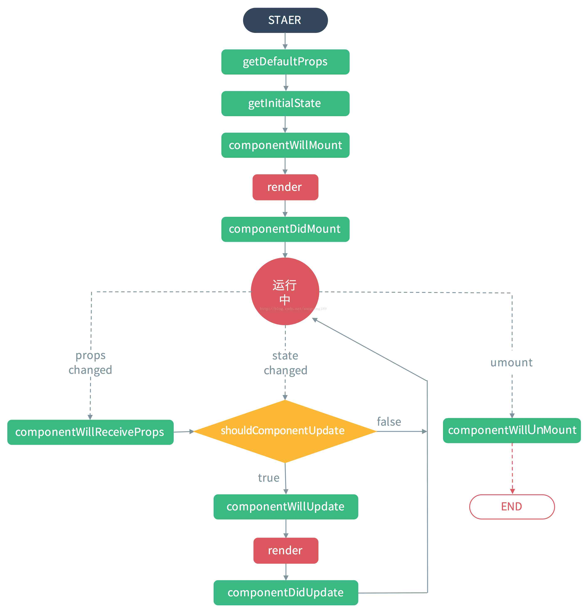
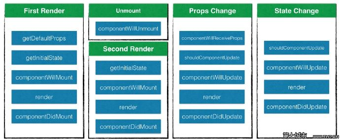

#### setState(updater, [callback])
* 将setState()认为是一次请求而不是一次立即执行更新组件的命令。为了更为客观的性能，React可能会推迟它，稍后会一次性更新这些组件。React不会保证在setState之后，能够立刻拿到改变的结果。
* setState()不是立刻更新组件。其可能是批处理或推迟更新。这使得在调用setState()后立刻读取this.state的一个潜在陷阱。
* 解决的办法使用componentDidUpdate或一个setState回调（setState(updater, callback)）都会保证在更新被应用之后触发。
* setState()改变，就会重新渲染，除非shouldComponentUpdate() 返回false，否则setState()永远都会导致重渲。
* 修改setState，若之后的状态依赖于之前的状态，我们推荐使用updater函数形式：

在组件的整个生命周期中，随着该组件的props或者state发生改变，其DOM表现也会有相应的变化。

一个React组件的生命周期分为三个部分：实例化、存在期和销毁时。

组件的生命周期可分成三个状态：
* Mounting：已插入真实 DOM
* Updating：正在被重新渲染
* Unmounting：已移出真实 DOM

### React 组件生命周期
- getDefaultProps
- getInitialState
- componentWillMount
- render
- componentDidMount
- componentWillReceiveProps
- shouldComponentUpdate //默认内置有一个，自己也额外可以设定
- componentWillUpdate
- componentDidUpdate
- componentWillUnmount


<br>



<br>

### 实例化
#### componentWillMount
该方法在首次渲染之前调用，在render()之前被调用, 也是再 render 方法调用之前修改 state 的最后一次机会。
这是唯一的会在服务端渲染调起的生命周期钩子函数。通常地，我们推荐使用constructor()来替代。

#### render

**在一般情况下，如果Component的props或state发生改变，组件的render方法会被执行，React根据render返回结果与之前的结果比较，最后更新DOM**。

该方法会创建一个虚拟DOM，用来表示组件的输出。对于一个组件来讲，render方法是唯一一个必需的方法。render方法需要满足下面几点：
* 只能通过 this.props 和 this.state 访问数据（不能修改）
* 可以返回 null,false来声明你并不想渲染任何东西 或者任何React组件,返回null 或 false时，ReactDOM.findDOMNode(this) 将返回 null。
* 只能出现一个顶级组件，不能返回一组元素
* 不能改变组件的状态
* 不能修改DOM的输出

render()函数应该纯净，意味着其不应该改变组件的状态，其每次调用都应返回相同的结果，同时不直接和浏览器交互。若需要和浏览器交互，将任务放在componentDidMount()阶段或其他的生命周期方法。保持render() 方法纯净使得组件更容易思考。

#### componentDidMount

```js
componentDidMount()
```

* 该方法不会在服务端被渲染的过程中调用。componentDidMount()在组件被装配后立即调用。该方法被调用时，已经渲染出真实的 DOM。
* 若你需要从远端加载数据，这是一个适合实现网络请求的地方。在该方法里设置状态将会触发重渲。
* 可以再该方法中通过 this.getDOMNode()没找到这个api， 访问到真实的 DOM(推荐使用ReactDOM.findDOMNode())。

由于组件并不是真实的 DOM 节点，而是存在于内存之中的一种数据结构，叫做虚拟 DOM （virtual DOM）。只有当它插入文档以后，才会变成真实的 DOM 。有时需要从组件获取真实 DOM 的节点，这时就要用到 ref 属性：

```js
var Area = React.createClass({
    render: function(){
        this.getDOMNode(); //render调用时，组件未挂载，这里将报错
        return <canvas ref='mainCanvas'>
    },
    componentDidMount: function(){
        var canvas = this.refs.mainCanvas.getDOMNode();
        //这是有效的，可以访问到 Canvas 节点
    }
})
```

需要注意的是，由于`this.refs.[refName]`属性获取的是真实 DOM ，所以必须等到虚拟 DOM 插入文档以后，才能使用这个属性，否则会报错。

<br>

### 存在期
#### componentWillReceiveProps

```js
componentWillReceiveProps(nextProps)
```

在组件接收到一个新的prop时被调用。这个方法在初始化render时不会被调用。若你需要更新状态响应属性改变（例如，重置它）,你可能需对比`this.props`和`nextProps`并在该方法中使用`this.setState()`处理状态改变。在这个方法里更新 state,以触发 render 方法重新渲染组件。

```js
componentWillReceiveProps(nextProps) {
    //前一个就是我改变后的props，  后一个为没改变时的props
    console.log(nextProps, this.props)	
}
```


调用`this.setState`通常不会触发`componentWillReceiveProps`。

#### shouldComponentUpdate

```js
shouldComponentUpdate(nextProps, nextState)
```

* 返回一个布尔值。在组件接收到新的props或者state时被调用。在初始化时或者使用forceUpdate时不被调用。 可以在你确认不需要更新组件时使用。

* 如果你确定组件的 props 或者 state 的改变不需要重新渲染，可以通过在这个方法里通过返回 false 来阻止组件的重新渲染，返回 `false 则不会执行render 以及后面的 componentWillUpdate，componentDidUpdate 方法。
* 该方法是非必须的，并且大多数情况下不建议在开发中使用。因为react其实默认行为是在每一次状态的改变重渲，在大部分情况下你应该依赖于默认行为。 即默认其实就是存在一个shouldComponentUpdate，每次的状态更新在重新着渲染。
* 即数据属性变了,但因为而后componentWillUpdate(), render(), componentDidUpdate() 不会被调用，所以dom没更新，还是之前的，但其实props，state已经变了。

```js
shouldComponentUpdate: function(nextProps, nextState){
    return this.state.checked === nextState.checked;
    //return false 则不更新组件
}
```

#### componentWillUpdate

```js
componentWillUpdate(nextProps, nextState)
```

* 这个方法和 componentWillMount 类似，在组件接收到了新的 props 或者 state 即将进行重新渲染前，componentWillUpdate(object nextProps, object nextState) 会被调用。
* 注意！！不要在此方面里再去更新 props 或者 state。若你需要更新状态响应属性的调整，使用componentWillReceiveProps()代替。
* 该方法不会在初始化渲染时调用。
* 注意若shouldComponentUpdate()返回false，componentWillUpdate()将不会被调用。

#### componentDidUpdate

```js
componentDidUpdate(prevProps, prevState)
```

* componentDidUpdate()会在更新发生后立即被调用。该方法并不会在初始化渲染时调用。
* 当组件被更新时，使用该方法是操作DOM的一次机会。这也是一个适合发送请求的地方，要是你对比了当前属性和之前属性（例如，如果属性没有改变那么请求也就没必要了）。可以在这里访问并修改 DOM。
* 注意!若shouldComponentUpdate()返回false，componentDidUpdate()将不会被调用。

<br>

### 销毁时

#### componentWillUnmount

```js
componentWillUnmount()
```

componentWillUnmount()在组件被卸载和销毁之前立刻调用。可以在该方法里处理任何必要的清理工作，例如解绑定时器，取消网络请求，清理任何在componentDidMount环节创建的DOM元素。

当再次装载组件时，以下方法会被依次调用：
1、getInitialState
2、componentWillMount
3、render
4、componentDidMount

<br>
参考文章[https://segmentfault.com/a/1190000004168886](https://segmentfault.com/a/1190000004168886)
react [https://doc.react-china.org/docs/react-component.html?#componentwillreceiveprops](https://doc.react-china.org/docs/react-component.html?#componentwillreceiveprops)
[什么时候要在React组件中写shouldComponentUpdate？](http://www.infoq.com/cn/news/2016/07/react-shouldComponentUpdate)