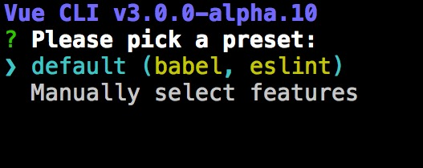
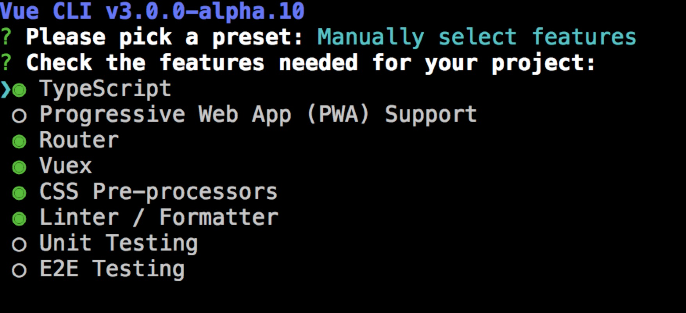
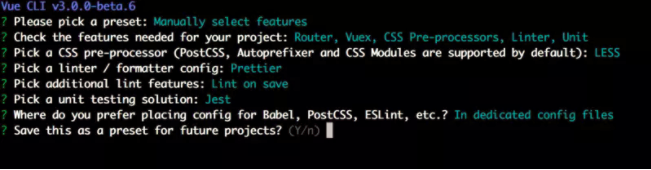

#### 环境安装

```
//npm
npm install -g @vue/cli

//yarn
yarn add global @vue/cli
```

<br/>

#### 创建项目

这里对比下以前2.X之前的版本 ，新版本把插件以及模板等 移植到命令行界面了.

| **版本** | **创建命令** |
| :--- | :--- |
| 2.× | vue init &lt;template-name&gt; &lt;project-name&gt; |
| 3.× | vue create &lt;project-name&gt; |

选择模板， 第一个为默认， 第二个为手动配置的




<br/>

#### 配置项目插件和功能

可以选择的
* TypeScript
* PWA
* Vue-router
* Vuex
* CSS预处理
* eslint prettier
* 自动化测试单元测试 、e2e



最后就是选择 是否记录一下？ 下次继续使用这套配置 ， 我选择no


<br/>

#### 启动项目


```
yarn serve
// OR
npm run serve
```

<br/>

#### 项目分析

* 去掉了2.x build和config等目录 ,大部分配置 都集成到[vue.config.js](https://github.com/vuejs/vue-cli/tree/dev/docs)这里了
* 移除了 static 文件夹，新增 public 文件夹，并且 index.html 移动到 public 中。
* 在 src 文件夹中新增了 views 文件夹，用于分类 视图组件 和 公共组件。

这里的vue.config.js要自己创建， 关于配置在尤大github上有,具体自己看

<br/>

#### ESLint、Babel、browserslist 相关配置

* Babel 可以通过 .babelrc 或 package.json 中的 babel 字段进行配置。
* ESLint 可以通过 .eslintrc 或 package.json 文件中的 eslintConfig 字段进行配置。
* 你可能注意到了 package.json 中的 browserslist 字段指定了该项目的目标浏览器支持范围。

<br/>

#### 关于 public 目录的调整

vue 约定 public/index.html 作为入口模板会通过 html-webpack-plugin 插件处理。在构建过程中，资源链接将会自动注入其中。
在 JavaScript 或者 SCSS 中通过相对路径引用的资源会经过 webpack 处理。放置在 public 文件的资源可以通过绝对路径引用，这些资源将会被复制，而不经过 webpack 处理。


```
小提示：图片最好使用相对路径经过 webpack 处理，这样可以避免很多因为修改网站根目录导致的图片404问题。
```

<br/>

参考文章：
[https://www.uis.cc/2018/02/27/New-features-of-vue-cli-3-speed/](https://www.uis.cc/2018/02/27/New-features-of-vue-cli-3-speed/)

[https://www.imooc.com/article/23379?block_id=tuijian_wz](https://www.imooc.com/article/23379?block_id=tuijian_wz)

[https://juejin.im/entry/5ac1c540f265da237c690faf?utm_source=gold_browser_extension](https://juejin.im/entry/5ac1c540f265da237c690faf?utm_source=gold_browser_extension)