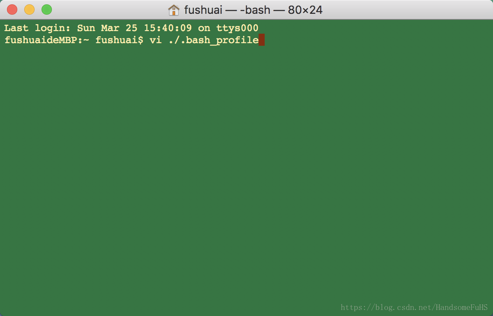

### mac 添加环境变量

1. Mac系统的环境变量，加载顺序为：

   a.  /etc/profile  

   b.  /etc/paths  

   c.  ~/.bash_profile  

   d.  ~/.bash_login  

   e.   ~/.profile  f. ~/.bashrc

其中a和b是系统级别的，系统启动就会加载，其余是用户接别的。c,d,e按照从前往后的顺序读取，如果c文件存在，则后面的几个文件就会被忽略不读了，以此类推。`~/.bashrc`没有上述规则，它是bash shell打开的时候载入的。这里建议在c中添加环境变量，以下也是以在c中添加环境变量来演示的。


2. 打开Terminal，输入`vi ./.bash_profile`,回车，打开./.bash_profile文件：




回车：


3. 现在已经打开了./.bash_profile文件，但是还处于查看模式，不能编辑。输入“`i`”，进入insert模式


4. 这时就可以添加环境变量了，例如：

```
export MONGO_PATH=/usr/local/Cellar/mongodb
export PATH=$PATH:$MONGO_PATH/bin
```


5. 编辑完成，点击`esc`键，退出insert模式”, 然后输入`:wq!`,回车，保存成功。


6. 输入`source ./.bash_profile`，让环境变量生效。
7. 输入`echo $PATH`,查看环境变量，发现添加成功。


8. 重新打开终端，环境变量就会生效了。


参考文章:

[https://blog.csdn.net/handsomefuhs/article/details/79687381](https://blog.csdn.net/handsomefuhs/article/details/79687381)