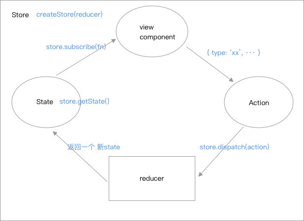

## Redux

安装

```node
npm install --save redux
```

附加包

```node
npm install --save react-redux
npm install --save-dev redux-devtools
```

开始

```js
import { createStore } from 'redux';

/**
 * 这是一个 reducer，形式为 (state, action) => state 的纯函数。
 * 描述了 action 如何把 state 转变成下一个 state。
 *
 * state 的形式取决于你，可以是基本类型、数组、对象、
 * 甚至是 Immutable.js 生成的数据结构。惟一的要点是
 * 当 state 变化时需要返回全新的对象，而不是修改传入的参数。
 *
 * 下面例子使用 switch 语句和字符串来做判断，但你可以写帮助类(helper)
 * 根据不同的约定（如方法映射）来判断，只要适用你的项目即可。
 */
const reducer = function(state = 0, action) {	//返回一个新state
  switch (action.type) {
    case 'INCREMENT':
      return state + 1;
    case 'DECREMENT':
      return state - 1;
    default:
      return state;
    }
}

// 创建 Redux store 来存放应用的状态。
// API 是 { subscribe, dispatch, getState }。
let store = createStore(reducer);

// 可以手动订阅更新，也可以事件绑定到视图层。   当数据发生变化时触发
store.subscribe(() =>
  console.log(store.getState())		//可以应用新的 state 来更新 UI
);

// 改变内部 state 惟一方法是 dispatch 一个 action。
// action 可以被序列化，用日记记录和储存下来，后期还可以以回放的方式执行
store.dispatch({ type: 'INCREMENT' });
// 1
store.dispatch({ type: 'INCREMENT' });
// 2
store.dispatch({ type: 'DECREMENT' });
// 1

// 停止监听 state 更新
unsubscribe();
```

redux应用只有一个单一的`store`，当需要拆分数据处理逻辑时，应使用`reducer`


### Store

是一个对象，存储着我们的公有数据。`store`是redux库中的`createStore`方法。

```js
import { createStore } from  'redux';
const store = createStore(reducer);
```


### State

`store`是一个对象，但是要获取这个对象中的所有储存的数据，需要调用它的方法：`store.getState()`,而`state`就是`store.getState()`得到的数据。

```js
import { createStore } from 'redux';
const store = createStore(fn);
const state = store.getState();
```


### Action

redux认为，一个`state`对应着一个`view`，`state`改变，`view`跟着改变。对于用户而言，接触到的可能就只有`view`，所以redux需要提供一种用户通过`view`，来更改`state`，从而让`view`发生变化的东西。而这个东西就是`Action`。

`action`用来描述的是用户行为，它是一个对象，`redux`通过`dispatch`发送`action`来更改`state`。

```js
var action = {
    type: 'ADD',	//type是Action定义的类型，是一个必须属性。
    text: 'value'
}
```

用户的行为那么多，仅仅用对象的方式来表示，显得太麻烦！可以使用一个函数的方式来描述`action`

```js
function add(text){
    return {
        type: "ADD",
        text: text
    }
}

store.dispatch(add(123));
```


### store.dispatch(action)

我们定义好了用户的行为，可是这个行为我们要怎么才算触发呢？

在redux中，触发用户行为的方式只有一个`store.dispatch(action)`,这也是唯一一种更改数据的方式。

```js
store.dispatch({
  type: 'ADD_TODO',
  payload: 'Learn Redux'
});
```

这里的`dispatch`接受一个`action`，进行触发更改`state`的命令。


### reducer

用户进行`dispatch`了，数据要进行变化，可是这个变化的过程我们没有描述，比如`dispatch`一个`action`，我们还是不知道一个数字是加一还是减一，又或者有其他的什么操作，而`reducer`就是用来定义这种操作的过程的！！

第一个参数为初始化`state`，第二个参数为`action`，是用户通过`dispatch`发送的`action`。内部我们根据`action`的类型来返回一个新的`state`，此时仓库中的`state`就更新为新的`state`了。

```js
const defaultState = 0;
const reducer = (state = defaultState, action) => {   //默认一开始设定一个初始的state
  switch (action.type) {
    case 'ADD':
      return state + action.payload;
    default: 
      return state;
  }
};
```

#### combineReducers

其中随着应用的变大，可以拆分成多个`reducers`，然后将他们合并。

```js
import { combineReducers } from 'redux'
```

```js
//这是一个reducer
const A = (state={}, action) => {	
    return '一个新state'
}
//这是一个reducer
const B = (state={}, action) => {
    return '一个新state'
}
//合并多个reducer
let reducer = combineReducers({ A, B });
let store = createStore(reducer);
```


### store.subscribe()

这个`subscribe`函数，是用来注册一个监听函数的，每当`state`发生改变的时候，`subscribe`注册的函数就会被触发。

```js
store.subscribe(function() {
    console.log('更新了')
})
```


### unsubscribe()

停止监听 `state` 更新

```js
unsubscribe()
```


思维图




## 在React中使用Redux

```
npm install --save react-redux;
```


### Provider

在react项目中，只有把`store`给每一个组件通过`props`注入进去，才能让每个组件获取共享的`state`。为了保证每一个容器都能接收到`store`，react-redux提供了`Provider`组件。

```jsx
import { createStore } from 'redux';
import { Provider } from 'react-redux';
let store = createStore(reducer);

<Provider store={store}>
  <App/>
</Provider>
```


### connect

`Provider`提供了一种`store`注入的方式，可是一个组件如何接收这个`store`？这个就是由react-redux中的`connect`函数决定的。

可以查看[connect](https://github.com/reduxjs/react-redux/blob/master/docs/api.md#connectmapstatetoprops-mapdispatchtoprops-mergeprops-options)的api

```js
//mapStateToProps、mapDispatchToProps函数的参数中可以得到store的state和dispatch
connect([mapStateToProps], [mapDispatchToProps], [mergeProps], [options])
```

```js
import { connect } from 'react-redux';
//如果我connect中不传参数，直接连接
export default connect()(App);		//这种情况时，在App组件的props中我们dispatch属性

const AAA = connect(
    (state, ownProps) => {  //state为store中的state
        return {
            'other': '可以随便写， 对象里的属性传给connect了连接的组件',
            'a': 111
        }
    }, 
    (dispatch, ownProps) => {  //dispatch为store中的dispatch方法
        return {
            show: (text) => {
               dispatch(action) 
            }
        }
    }
)(MyComponent)

//此时MyComponent组件的props中存在 other、a、show能属性
<MyComponent />
```

例子

```jsx
import { connect } from 'react-redux';

const mapStateToProps = (state, ownProps) => {
    console.log(ownProps)		//这里存在属性 title
    return {
        a: 1,
        b: 2
    }
}
const mapDispatchToProps = (dispatch, ownProps) => {
    return {
        run(action) {
            dispatch(action)
        }
    }
}
//就是将上面mapStateToProps和mapDispatchToProps返回的对象作为props的属性了， children插在组件中的文本
const App = ({a, b, run, children}) => {	
    return <div>App</div>
}
const myComponent = connect(mapStateToProps, mapDispatchToProps)(App)

<myComponent title="你好">abc</myComponent>		//传入ownProps
```


## 异步的actions, 增强dispatch


### applyMiddleware(...middlewares)

使用包含自定义功能的 middleware 来扩展 Redux 是一种推荐的方式。它可以使你在触发`dispatch`方法的时候进行增加，你可以在此改变你`dispatch`时的`action`。

```js
import { createStore, applyMiddleware } from 'redux';
import todos from './reducers'

function logger({ getState }) {
  return (next) => (action) => {
    //现在执行的dispatch(action)中 action为{type: 'ADD_TODO', text: 'Understand the middleware'}  
    console.log('will dispatch', action)
      
    /*
    调用 middleware 链中下一个 middleware 的 dispatch。
    执行了next(action)， 即下一个dispatch(action)。
    这里的下一个dispatch为我下面的设置,
    **就是将当前执行的dispatch(action)拦截，重新改为你想要的dispatch(action),就是下面的next(action)。  如果不想修改则还是next(action) **
    */
    let returnValue = next({type: 'DOSOMETHING', text: '增强dispatch, 再次执行修改'}) 
	
    //此时getState()为新的state，即上面被next(action)执行后的新state
    console.log('state after dispatch', getState())

    // 一般会是 action 本身,即next(action)，除非
    // 后面的 middleware 修改了它。
    return returnValue
  }
}

let store = createStore(
  todos,
  [ 'Use Redux' ],		//第二个参数为初始化给state的值
  applyMiddleware(logger)	//增强dispatch
)

store.dispatch({
  type: 'ADD_TODO',
  text: 'Understand the middleware'
})
// (将打印如下信息:)
// will dispatch: { type: 'ADD_TODO', text: 'Understand the middleware' }
// state after dispatch: [ 'Use Redux', '增强dispatch, 再次执行修改' ]    

//一开始['Use Redux']， 后来因为执行了初始的dispatch(action)， 但是又被next(action)修改。所以最终的state值为上面的值
```

这种方式是全局的，每次发生`dispatch`的时候就会有拦截器进行判断，是否修改还是原来的形式执行。最后的返回值是一个`action`

而下面的方式就是对每个`dispatch`可以做特有的增强，在函数内部可以直接执行`dispatch`，可以不在乎返回值，想要执行就在内部直接进行逻辑操作。


### 使用 Thunk Middleware 来做异步 Action

```js
import { createStore,applyMiddleware,combineReducers } from 'redux';
import thunkMiddleWare from 'redux-thunk'	//这个需要npm安装， 不是redux中的模块
const store = createStore(reducerss, applyMiddleware(thunkMiddleWare));

var url = 'http://datainfo.duapp.com/shopdata/getclass.php';

store.dispatch(function(dispatch) {
    //开始的时候进行dispatch
    dispatch({type: 'AA', text: 'aa'});		//执行了这个就直接触发dispatch了，会改变state
    fetch(url).then(res => {
        console.log(res);
        return res.json();
    }).then(data=>{
        console.log(data)
        //成功的情况下的dispatch。
        dispatch({type: 'BB', text: 'bb'})
    })
});
/*
即使用了redux-thunk， 其实就是可以在dispatch中参数写成一个函数， 函数带有dispatch参数，可以在这个函数中做一些操作，比如异步。 最后在该函数中执行dispatch(action)操作
store.dispatch(function(dispatch) {
	//do something
	//异步操作 比如
    fetch(url).then(res => {
        if(success) {
            dispatch({
                type: 'XX',
                text
            })
        }
    })
})
*/
```


参考文章：

[理解redux](https://blog.csdn.net/mapbar_front/article/details/79683161)

[todoList例子](http://www.redux.org.cn/docs/basics/ExampleTodoList.html)


目录结构：

```
action
	···
	···
	index.js
components
	···
	···
containers
	···
	···
reducers
	···
	···
	index.js
App.js
index.js
```

