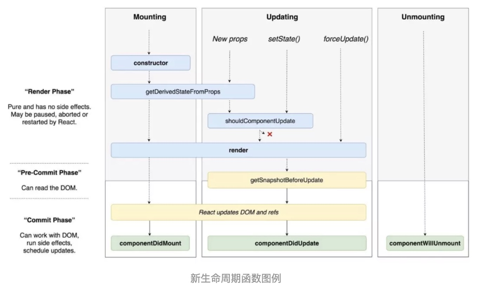

[toc]

### 虚拟DOM(Vitural DOM)

React将DOM抽象为虚拟DOM，虚拟DOM其实就是用一个对象来描述DOM，通过对比前后两个对象的差异，最终只把变化的部分重新渲染，提高渲染的效率。

为什么使用虚拟DOM，当DOM发生更改时常需要遍历，而在遍历的过程中，可能一些无关的属性、dom会重新渲染，导致页面的更新代价变大。

那么我们怎么去处理这个问题呢？

1. 用JavaScript对象结构表示DOM树的结构，然后用这个树构建一个真正的DOM树，插入到文档当中。
2. 当状态变更的时候，重新构造一棵新的对象树。然后用新的树和旧的树进行比较，记录两棵树差异。
3. 将对比后的差异应用到步骤1所构建的真正DOM树上，视图就更新了。

[理解 Virtual DOM](https://www.zhihu.com/question/31809713)

[如何实现一个 Virtual DOM 算法](https://github.com/livoras/blog/issues/13)


### Diff算法

当你使用React的时候，在某个时间点`render()`函数创建了一棵React元素树，在下一个`state`或者`props`更新的时候，`render()`函数将创建一棵新的React元素树，React将对比这两棵树的不同之处，计算出如何高效的更新UI(只更新变化的地方)

React中有两种假定：

1. 两个不同类型的元素会产生不同的树(根元素不同结构树一定不同)
2. 开发者可以通过key属性指定不同树中没有发生改变的子元素

##### Diff算法的说明-1

如果两棵树的根元素类型不同，React会销毁旧树，创建新树

```jsx
//旧树
<div>
    <Counter />
</div>
//新树
<span>
	<Counter />
</span>
```

##### Diff算法的说明-2

- 对于类型相同的React DOM元素，React会对比两者的属性是否相同，只更新不同的属性。
- 当处理完这个DOM节点，React就会递归处理子节点。

```jsx
//只更新：className 属性
//旧
<div className="before" title="stuff" />
//新
<div className="after" title="stuff" />

//只更新：color属性
// 旧
<div style={{color: 'red', fontWeight: 'bold'}} />
// 新
<div style={{color: 'green', fontWeight: 'bold'}} />
```

##### Diff算法的说明-3

1. 当在子节点的后面添加一个节点，这时候两棵树的转化工作执行的很好

```jsx
// 旧
<ul>
  <li>first</li>
  <li>second</li>
</ul>

// 新
<ul>
  <li>first</li>
  <li>second</li>
  <li>third</li>
</ul>
```

执行过程：React会匹配新旧两个`<li>first</li>`和两个`<li>second</li>`，然后添加`<li>third</li> `。

2. 但是如果你在开始位置插入一个元素，那么问题就来了：

```jsx
// 旧
<ul>
  <li>Duke</li>
  <li>Villanova</li>
</ul>

// 新
<ul>
  <li>Connecticut</li>
  <li>Duke</li>
  <li>Villanova</li>
</ul>
```

在没有`key`属性时的执行过程：React将改变每一个子节点，删除重新创建，而非保持`<li>Duke</li>`和 `<li>Villanova</li>`不变。

##### key属性

为了解决以上问题，React提供了一个key属性。当子节点带有`key`属性，React会通过`key`来匹配原始树和后来的树。

```jsx
// 旧
<ul>
  <li key="2015">Duke</li>
  <li key="2016">Villanova</li>
</ul>

// 新
<ul>
  <li key="2014">Connecticut</li>
  <li key="2015">Duke</li>
  <li key="2016">Villanova</li>
</ul>
```

执行过程：现在React知道带有`key =“2014”`的元素是新的，对于2015和2016仅仅移动位置即可

- 说明：`key`属性在React内部使用，但不会传递给你的组件
- 推荐：在遍历数据时，推荐在组件中使用`key`属性
- 注意：`key`需要保持与他的兄弟节点唯一
- 注意：尽可能减少数组`index`作为`key`，数组插入元素等操作时，会使得效率低下


### React的基本使用

```
npm i -S react react-dom

react：是React库的入口点
react-dom：提供了针对DOM的方法
```

```jsx
import React from 'react'
import ReactDOM from 'react-dom'

/*
 *参数1：元素名称
 *参数2：元素属性对象(null表示无)
 *参数3：子元素string||createElement() 的返回值
 */
const div = React.createElement(
    'div', 
    {
      title: 'hello'
    },
    'Hello React'
)
/*
 *参数1：虚拟dom对象
 *参数2：dom对象渲染到哪个元素内
 *参数3：回调函数
 */
ReactDOM.render(div, document.getElementById('app'))
```

##### JSX的基本使用

```
npm i -D babel-preset-react
```

JSX的语法需要通过`babel-preset-react`编译后，才能被解析执行，JSX语法，最终会被编译为`createElement()`方法。

```jsx
/* 1 在 .babelrc 开启babel对 JSX 的转换 */
{
  "presets": [
    "env", "react"
  ]
}

/* 2 webpack.config.js */
module: [
  rules: [
    { test: /\.js$/, use: 'babel-loader', exclude: /node_modules/ },
  ]
]

/* 3 在 js 文件中 使用 JSX */
const dv = (
  <div title="标题" className="cls container">Hello JSX!</div>
)

/* 4 渲染 JSX 到页面中 */
ReactDOM.render(dv, document.getElementById('app'))
```

- 注意1：如果在JSX中给元素加类，需使用`className`代替`class`，类似：`label`的`for`属性，使用`htmlFor`代替
- 注意2：在JSX中直接使用JS代码需要通过`{}`，而在JS中可以直接使用JSX。
- 注意3：在JSX中只能使用表达式，不能出现语句。
- 注意3：JSX的注释语法`{/*中间是注释的内容*/}`

##### style样式

React中行内的样式是以对象的形式表示

```jsx
<li style={{border:'1px solid red', fontSize:'12px'}}></li>
```

##### 条件渲染

- 使用JavaScript操作符`if`或条件运算符
- 元素变量，表达式等通过`{}`来渲染
- `&&`、`||`短路操作
- 三目运算符

##### 列表&keys

- 在`{}`中可以是一个充满JSX的数组集合。

- `keys`：`keys`可以在DOM中的某些元素被增加或删除的时候帮助React识别哪些元素发生了变化，你应当给每一个元素赋予一个唯一的标识。

- 注意：如果有一组组件的话，应该把`key放在其环绕数组的上下文中才有意义

  ```jsx
  <ListItem key={id} />
  ```

- 组件内部不能读出`props.key`，所以`key`不能作为属性传入组件。
- 在JSX的`{}`中使用`map`等数组操作等简化代码。


### 深入JSX

本质上来讲，JSX只是`React.createElement()`方法提供的语法糖。

```jsx
<Mybutton color="blue" shadowSize={2}>
	Click me
</Mybutton>

//编译为
React.createElement(
	MyButton,
    {clolr: 'blue', shadowSize: 2},
    'Click me'
)
```

##### 指定React元素类型

- 点表示法

有一个名为`MyComponents.DatePicker`的组件，可以直接在JSX中使用：

```jsx
const MyComponents = {
    DatePicker(props) {
        return (<div>{props.color}</div>)
    }
}
function BlueDatePicker() {
  return <MyComponents.DatePicker color="blue" />;
}

//点表示法取值 正确
<MyComponents.DatePicker color="blue" />;
//使用[]方式取值 错误
<MyComponents['DatePicker'] color="blue" />; 
```

- 用户定义组件必须首字母大写
- 在运行时选择类型

你不能使用一个通用的表达式来作为React元素的标签

```jsx
const components = {
  photo: PhotoStory,
  video: VideoStory
};

function Story(props) {
  // 错误！JSX 标签名不能为一个表达式。
  return <components[props.storyType] story={props.story} />;
}

//改为，先将值赋给一个大写开头的变量
function Story(props) {
  // 正确！JSX 标签名可以为大写开头的变量。
  const SpecificStory = components[props.storyType];
  return <SpecificStory story={props.story} />;
}
```

##### JSX的属性(props)

1. 使用JavaScript表达式作为属性

```jsx
<MyComponent foo={1 + 2 + 3 + 4} />
```

2. 字符串常量

```jsx
<MyComponent message="hello world" />
<MyComponent message={'hello world'} />
```

3. 默认属性为`True`

```jsx
<MyTextBox autocomplete />

```

4. 展开属性

```jsx
const props = {firstName: 'Ben', lastName: 'Hector'}; 
<Greeting {...props} />
//等价于
<Greeting firstName="Ben" lastName="Hector" />;
```

##### JSX中的子代

1. 字符串字面量

```jsx
//直接将Hello world!通过props.children传递子代
<MyComponent>Hello world!</MyComponent>
```

2. JSX子代

```jsx
<MyContainer>
  <MyFirstComponent />
  <MySecondComponent />
</MyContainer>
```

3. JavaScript表达式作为子代

```jsx
<MyComponent>{'foo'}</MyComponent>
```

4. 函数作为子代

```jsx
//props.children在子组件中可以调用
<Repeat numTimes={10}>
    {(index) => <div key={index}>This is item {index} in the list</div>}
</Repeat>

props.children(index) 	//调用
```

5. 布尔值、`Null`和`Undefined`被忽略

`false`、`null`、`undefined` 和 `true` 都是有效的子代，只是它们不会被渲染。

```jsx
//下面的都等价
<div />
<div></div>
<div>{false}</div>
<div>{null}</div>
<div>{undefined}</div>
<div>{true}</div>
```


### React组件

React创建组件的两种方式：

1. 通过函数创建(无状态组件)
2. 通过class创建(有状态组件)

注意事项：

- 函数名必须为大写字母开头，React通过这个特点来判断是不是组件
- 函数必须有返回值，返回值可以是JSX对象或`null`
- 返回的JSX，必须有一个根元素

##### 函数创建

```js
//函数
function MyComponent(props) {
    return (<div>Hello</div>)
}
```

##### class创建

> 在es6中class仅仅是一个语法糖，不是真正的类，本质上还是构造函数+原型实现继承

```js
//class
class MyComponent extends React.Component {
    constructor(props) {
        super(props);
        this.state = {
            a: 1
        }
        this.handleClick = this.handleClick.bind(this);
    }
    static getDerivedStateFromProps(nextProps, prevState) {}
    handleClick() {},
    render() {
		return (<div>{this.state.a}</div>)
    }
}
```


### 父子组件传递数据

- 组件中有一个只读的对`props`，无法给`props`添加属性
- 获取方式：1.函数的参数`props`。2.类的构造函数中的`props`参数

```jsx
class Parent extends React.Component {
    constructor(props) {
        super(props)
    }
    render() {
        return (
        	<>
            	<Child a="1" b={'2'} />
            </>
        )
    }
}
function Child(props) {
    return (
    	<>{props.a} {props.b}</>
    )
}
```


### props和state

##### props

- 作用：给组件传递数据，一般用在父子组件之间

- 说明：React把传递给组件的属性转化为一个对象并交给`props`

- 特点：`props`只读，不能修改

- `props.children`：获取组件标签中间的内容，对应Vue中的`slot`插槽

  ```jsx
  <MyComponent name="a">Hello World</MyComponent>
  //在MyComponent组件中可以通过props.children获取Hello World文本内容
  ```

- 也可以直接`props`属性中将组件传入进去

  ```jsx
  <Child color="blue" a={<A/>} b={<B/>} />
  
  //Child组件直接渲染
  {this.props.a}
  {this.props.b}
  ```

```jsx
function MyComponent(props) {
    return <div>{props.name}, {props.children}</div>
}

class MyComponent extends React.Component {
    constructor(props) {
        super(props);
    }
    render() {
        return <div>{this.props.name}, {this.props.children}</div>
    }
}
```

##### state

- 作用：用来给组件提供组件内部使用的数据
- 注意：只有class创建的组件才具有状态
- 注意：**状态是私有的，完全由组件来控制**
- 注意：不要在`state`中添加`render()`方法中不需要的数据，会影响渲染性能
- 注意：不要在`render()`方法中调用`setState()`方法来修改`state`的值

```jsx
class MyComponent extends React.Component {
    constructor(props) {
        super(props);
        this.state = {
            name: 'a'
        }
    }
    render() {
        return <div>{this.state.name}</div>
    }
}
```


### setState

- 注意：不要直接修改`state`，这样不会重新渲染组件，要使用`setState()`方法修改状态`state`，状态改变后，React会重新渲染组件。
- 该方法存在两个参数，第一个必填项：对象或函数，第二个参数可选：回调函数
- 注意：将`setState()`当成请求而不是立即就会更新组件，即**当成一个异步方法**，当对状态的更新中有异步操作的时候，可以使用该方法的第二个参数，是一个回调函数(表示状态改变后执行改函数)。

```js
//写法1
this.setState({
    a: 1
}, function() {
    //状态修改后的回调
})

//写法2  return一个对象
this.setState(function(prevState, props) {
    return {a: 1}
}, function() {
    /*···*/
})
```


### 绑定事件

React事件名称采用驼峰命名法，例如`onClick`用来绑定单击事件。

```jsx
//传统html
<button onclick="show()">btn</button>

//React
<button onClick={show}>btn</button>
```

使用原生的js方式

```jsx
<input ref={input => this.txtInput = input} type="button" value="Hello React" />

componentDidMount() {
    //通过this.txtInput属性获取元素绑定事件
    this.txtInput.addEventListener('click', () => {
        this.setState({
            count: this.state.count + 1
        })
    })
}
```

不能使用返回`false`的方式阻止默认行为。必须在方法里明确的使用`preventDefault`

```jsx
//传统
<a href="#" onclick="console.log('Hello.'); return false">Click me</a>

//React
function show(e) {
    e.preventDefault();
}
return (
    <a href="#" onClick={show}>Click me</a>
)
```

##### 事件绑定this

必须谨慎对待JSX回调函数中的`this`，类的方法默认是不会绑定`this`的，它默认指向类的实例。

1. 使用`bind`方法

```jsx
//在constructor中绑定
class MyComponent extend React.Component {
    constructor(props) {
        super(props);
        this.handleChilk = this.handleChilk.bind(this);
    }
    handleChilk(e) {}
    render() {return null}
}
```

```jsx
//在标签中使用bind绑定
<button onClick={this.fn.bind(this)}>Click me</button>
```

2. 直接使用`fn = () => {}`的形式

```jsx
class MyComponent extend React.Component {
    constructor(props) {
        super(props);
    }
    //这个语法在Create React App中默认开启
    handleChilk = (e) => {}
    ···
}
```

3. 在标签上使用箭头函数

```jsx
<button onClick={(e) => this.handleClick(e)}>Click me</button>
```

使用这个语法有个问题就是每次组件渲染的时候都会创建一个不同的回调函数，在大多数情况下可能没什么问题。然而如果这个回调函数作为一个属性值传入低阶组件，这些组件可能会进行额外的重新渲染。

##### event参数

关于事件`event`对象，如果没有别的参数，在标签上绑定的函数中不用显示，如果还存在别的函数，则需要写上`event`事件对象作为参数。

```jsx
//没有别的参数时,不传入e
handleClick(e) {}
<button onClick={this.handleClick}>click</button>

//存在别的参数时
/*
 * 1.通过箭头函数的方式，事件对象必须显式的进行传递
 * 2.通过bind的方式，事件对象以及更多的参数将会被隐式的进行传递
 */
handleClick(id, e) {}
<button onClick={(e) => this.handleClick(id, e)}>click</button>
<button onClick={this.handleClick.bind(this, id)}>click</button>
```


### 受控组件

- [表单和受控组件](https://doc.react-china.org/docs/forms.html)
- [非受控组件](https://doc.react-china.org/docs/uncontrolled-components.html)

在HTML当中，像`input`，`textarea`和`select`这类表单元素会维持自身状态，并根据用户输入进行更新。在React中，可变的状态通常保存在组件的`state`中，并且只能用`setState()`方法进行更新。

React根据初始状态渲染表单组件，接受用户后续输入，改变表单组件内部的状态，这类表单元素称为受控组件。如：`<input type="text"/>`、`textarea`、`select`。

注意：只能通过`setState`来设置受控组件的值。

```jsx
this.state = {
    msg: ''
}

handleTextChange = (event) => {
    this.setState({
        msg: event.target.value
    })
}

<input type="text" value={this.state.msg} onChange={this.handleTextChange}/>
```

##### textarea

在HTML中`<textarea>`元素通过子节点文本来定义它的内容。

```html
<textarea>Hello</textarea>
```

在React中，`<textarea>`用`vlaue`属性来代替。

```jsx
<textarea value={this.state.value} onChange={this.handleChange} />
```

##### select

在HTML中`<select>`会创建一个下拉列表，`selected`属性表示默认被选中。

```html
<select>
  <option value="grapefruit">Grapefruit</option>
  <option value="lime">Lime</option>
  <option selected value="coconut">Coconut</option>
  <option value="mango">Mango</option>
</select>
```

而在React中是根据`<select>`的`value`属性来表示选中

```jsx
<select value={this.state.value} onChange={this.handleChange}>
    <option value="grapefruit">Grapefruit</option>
    <option value="lime">Lime</option>
    <option value="coconut">Coconut</option>
    <option value="mango">Mango</option>
</select>
```

#### 非受控组件

比如`<input type="file" />`，因为该标签的`vlaue`属性是只读的，所以是一个非受控组件。

对于复选框`<input type='checkbox' />`一般`value`属性并不是很重要，反而`checked`属性可以确定复选框是否`true/false`。（`element.checked`）

```jsx
this.state = {
    isGoing: false
}

handleInputChange = (e) => {}

<input
    name="isGoing" 
    type="checkbox" 
    checked={this.state.isGoing}
    onChange={this.handleInputChange} />
```


### props校验

```
npm i -S prop-types
```

[类型校验文档](https://doc.react-china.org/docs/typechecking-with-proptypes.html)

```jsx
import PropTypes from 'prop-types';

class Greeting extends React.Component {
  render() {
    return (
      <h1>Hello, {this.props.name} {children}</h1>
    );
  }
}

Greeting.propTypes = {
  name: PropTypes.string,
  children: PropTypes.element.isRequired
};
```


### React单向数据流

- React中采用单向数据流

- 数据流动方向：自上而下，也就是只能由父组件传递到子组件

- 如果多个组件都要使用某个数据，最好将这部分共享的状态提升至他们最近的父组件当中进行管理

- Refs

  [单向数据流](https://discountry.github.io/react/docs/state-and-lifecycle.html)

  [状态提升](https://discountry.github.io/react/docs/lifting-state-up.html)

#### 组件通讯

- 父 -> 子：`props`
- 子 -> 父：父组件通过`props`传递回调函数给子组件，子组件调用函数将数据作为参数传递给父组件
- 兄弟组件：因为React是单向数据流，因此需要借助父组件进行传递，通过父组件回调函数改变兄弟组件的`props`
- React中的状态管理：flux -> Redux -> mobx
- 简单来说，就是统一管理了项目中所有数据，让数据变的可控

  [组件通讯](https://segmentfault.com/a/1190000006831820)

#### Context

跨级传递数据(爷爷给孙子传递数据)，避免向下每层手动传递`props`。最好配合`PropTypes`类型限制来使用。

API：

- `React.createContext()`
- `Provider`
- `Consumer`

```jsx
const {Provider, Consumer} = React.createContext('我是一个默认值'); //此处的默认值也可以是对象等类型

class Child extends React.Component {
    render() {
        //这里{}中需为一个函数，该函数会自动执行。
        //v的值为上下文中最近的Provider的value值，如果没有此上下文Provider，则v的值为React.createContext()中的默认值。
        return (
            <Consumer>{ v => <div>{v}</div> }</Consumer>
        )
    }
}
class Parent extends React.Component {
    render() {
        return (
        	<>
            	<Provider value='Consumer中v的值'>
                    <Child />  
                </Provider>
            	//<Child /> 如果该组件外面没有<Provider>标签，则传入Consumer中v的值为createContext方法中的默认值
            	//传递对象
                <Provider value={{a: 1}}>
                	<Child />
                </Provider>
            </>
        )
    }
}
```

整体过程：

1. 通过`const ThemeContext = React.createContext(defaultValue)`创建`Context`对象。
2. 在父组件上使用`<ThemeContext.Consumer />`来提供`Provider`
3. 在需要消费的地方，使用`<ThemeContext.Consumer/>`以函数调用的方式获取`Context`对象的值。

注意事项：

> 从Provider到其后代使用者的传播不受shouldComponentUpdate方法的约束，因此即使祖先组件退出更新，如果Provider上的value值变化了，Consumer也会更新。


### Refs

##### 使用Refs

在典型的React数据流中，属性`props`是父组件与子组件交互的唯一方式。要修改子组件，你需要使用新的`props`重新渲染它。但是某些情况下你需要在典型数据流外强制修改子组件。要修改的子组件可以是React组件的实例，也可以是DOM元素。此时可以使用Refs来解决这个问题。

`Refs`提供了一种方式，用于访问在`render`方法中创建的DOM或React元素。

`ref`的值取决于节点的类型：

- 当`ref`属性被用于一个普通的HTML元素时，则`React.createRef()`的`current`属性对应元素的底层DOM。React 会在组件加载时将 DOM 元素传入 `current` 属性，在卸载时则会改回 `null`。`ref` 的更新会发生在`componentDidMount` 或 `componentDidUpdate` 生命周期钩子之前。
- 当`ref`属性被用于一个自定义类组件时，`ref`对象将接受该组件已挂载的实例作为它的`current`。
- 不能在函数式组件上使用`ref`属性，因为它们没有实例。但是可以在函数式组件内部使用`ref`，只要它指向一个DOM元素或者class组件。
- 在`ref`中使用回调函数，回调函数会直接执行，其中该函数有一个参数，参数就是当前写有ref的节点对象或组件实例。

```jsx
//为 DOM 元素添加 Ref
class MyComponent extends React.Component {
    constructor(props) {
        super(props);
        this.myRef = React.createRef();			//1. 创建一个ref实例
    }
    componentDidMount() {
		this.myRef.current.style.color = 'blue';	//3. ref中的current属性对节点的引用进行访问
    }
    render() {
        return <div ref={this.myRef} />;		//2. 绑定节点
    }
}
```

```jsx
//为类组件添加 Ref
class AutoFocusTextInput extends React.Component {
  constructor(props) {
    super(props);
    this.textInput = React.createRef();
  }
  componentDidMount() {
    //this.textInput.current就是CustomTextInput组件这个实例
    this.textInput.current.focusTextInput();
  }
  render() {
    return (
      <CustomTextInput ref={this.textInput} />
    );
  }
}
```

```jsx
//不能在函数式组件上使用ref属性，因为它们没有实例
function MyFunctionalComponent() {
  return <input />;
}
// 这将 不会 工作！
<MyFunctionalComponent ref={this.textInput} />
```

```jsx
//ref使用函数回调的方式，ref中的函数会自动直接执行
function CustomTextInput(props) {
  let textInput = null;
  function handleClick() {
    textInput.focus();
  }
  return (
    <div>
      <input
        type="text"
        ref={(input) => { textInput = input; }} />
      <input
        type="button"
        value="Focus the text input"
        onClick={handleClick}
      />
    </div>
  );  
}
```

##### 对父组件暴露DOM节点(React.forwardRef)

该新特性就是`Ref`的转发，它的目的是让父组件可以访问到子组件的`Ref`，从而操作子组件的DOM。主要使用`React.forwardRef`这个方法，该方法接收一个函数，函数参数有`props`和`ref`。

```jsx
/TextInput就是一个组件
const TextInput = React.forwardRef((props, ref) => {
    return (<input type="text" placeholder="Hello forwardRef" ref={ref} />)
    //return <Aa ref={ref} />         函数也可以返回一个class的组件                              
})

class App extends Component {
  constructor(props) {
    super(props)
    this.myRef = React.createRef()
  }
  handleSubmit = event => {
    event.preventDefault()
    alert(this.myRef.current.value) //<input />
  }
  render() {
    return (
      <form onSubmit={this.handleSubmit}>
        <TextInput ref={this.myRef} />
      </form>
    )
  }
}
```

##### 回调Refs

在`ref`中使用回调函数，回调函数会直接执行，其中该函数有一个参数，参数就是当前写有`ref`的节点或组件的实例对象。

例子1：

```jsx
//这里的ref为dom节点
class Parent extends React.Component {
     constructor(props) {
         super(props);
         this.textInput = null;
         this.test = element => {		//使用箭头函数
             console.log(element);		//为<div>111</div>
             this.textInput = element;
         }
     }
     render() {
         return (
             <div ref={this.test}>111</div>		//这里ref={函数}，  函数会被调用
         );
     }
 }

//这里的ref为组件的实例对象
class Parent extends React.Component {
    test(element) {
        console.log(element)	//这里的element为MyComponent组件实例
    }
    render() {
        return (
        	<MyComponent ref={this.test.bind(this)} />
        )
    }
}
```

例子2：

```jsx
class Child extends React.Component {
    constructor(props) {
        super(props);
    }
    render() {
        return (
            <div ref={this.props.test}>child</div>		//ref中的函数会自动执行
        );
    }
}
class Parent extends React.Component {
    constructor(props) {
        super(props);
        this.inputElement = null;
    }
    render() {
        return (
            //箭头函数的this是当函数生成的时候就决定了，不像一般函数的this是在执行的时候决定的。
            <Child
            	test={(el) => {
                    console.log(el, this)	//el: <div>child</div>  this: Parent
                    this.inputElement = el;
            	}
    		} />
		);
	}
}
```

- 相对于Vue中的ref

```vue
<!-- `vm.$refs.p` will be the DOM node -->
<p ref="p">hello</p>

<!-- `vm.$refs.child` will be the child component instance -->
<child-component ref="child"></child-component>
```


### 生命周期

生命周期的概念：每个组件的实例，从创建、到运行、知道销毁，在这个过程中，会出发一些列事件，这些事件就叫做组件的生命周期。

组件的生命周期包含三个阶段：创建阶段(Mount)、运行和交互阶段(Update)、卸载阶段(Unmount)。



React16.5版本：

- 创建阶段

>constructor()
>
>componentWillMount()     //已不建议使用
>
>Static getDerivedStateFromProps(nextProps, prevState)
>
>render()
>
>componentDidMount()

1. `constructor()`：用于初始化，在构造函数中有两个目的。1.初始化状态`this.state`。2.绑定事件处理器方法到一个实例。
2. `getDerivedStateFromProps`：其作用是根据传递的`props`来更新`state`。
   1. 在调用`render`之前执行，返回一个更新状态的对象(即需要更新的`state`对象)或者返回`null`表示不更新。
   2. 初始化的时候就会执行一次。
   3. `state`或`props`变化就会执行该生命周期，因为状态和属性的变化都会使组件重新渲染，所以**每次组件更新都会触发**。
   4. 注意：该API设计时采用了静态方法，因此无法访问实例(即**访问不到this**)、无法通过`ref`访问到DOM对象等，保证了单纯且高效。
   5. 如果改变`props`的同时又副作用的产生(如异步请求，动画效果等)，这时应该使用`componentDidUpdate`。
3. `componentDidMount()`：这是实例化网络请求的好地方。若需要和浏览器交互，将任务放在`componentDidMount()`中或其他的生命周期方法中。保持`render()`方法纯净。这个方法也是建立订阅的一个好地方。但别忘了在`componentWillUnmount()`取消订阅。

**官方的建议是将首屏放在`constructor`或`componentDidMount`中**。

- 运行或更新阶段

> componentWillReceiveProps()		//已不建议使用
>
> Static getDerivedStateFromProps(nextProps, prevState)
>
> shouldComponentUpdate(nextProps, nextState)
>
> componentWillUpdate()			//已不建议使用
>
> render()
>
> getSnapshotBeforeUpdate(prevProps, prevState)
>
> componentDidUpdate(prevProps, prevState, snapshot)

1. `shouldComponentUpdate`：默认为`true`，该方法在初始化渲染或使用`forceUpdate()`时不会被调用。
2. `getSnapshotBeforeUpdate`：更新之前，此生命周期返回的任何值都将作为`componentDidUpdate()`的第三个参数传入。常常用于scroll位置的定位。初始化的时候不会触发，只有更新的时候才会触发。
3. `componentDidUpdate`：已经更新完成，这也是进行网络请求的好地方。对于初始化时，该方法并不会被调用。

对于`componentWillReceiveProps`的升级方案是使用`getDerivedStateFromProps`来代替。对于`componentWillUpdate`的升级方案是使用`componentDidUpdate`代替。

- 卸载阶段

> componentWillUnmount(error, info)

从DOM中删除组件时调用此方法，可以在该方法里处理任何必要的清理工作，例如解除定时器，取消网络请求，清理任何在`componentDidMount`环境创建的订阅等。


> 注意：不要在componentDidMount、render、shouldComponentUpdate、componentDidUpdate等已经在render渲染好后还去修改state状态，这样会导致一直重复渲染报错


参考文章：

[React入门看这篇就够了](https://segmentfault.com/a/1190000012921279)

[React](#https://segmentfault.com/a/1190000012921279)