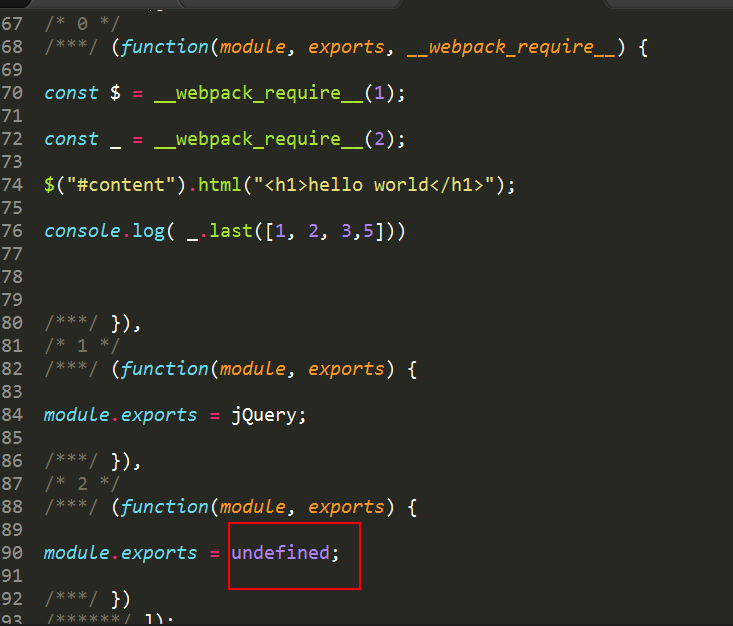

## 外部扩展[externals]
按照官方文档的解释，如果我们想引用一个库，但是又不想让webpack打包，并且又不影响我们在程序中以CMD、AMD或者window/global全局等方式进行使用，那就可以通过配置externals。

#### externals

例如，从 CDN 引入 jQuery，而不是把它打包：

index.html
```html
<script
  src="https://code.jquery.com/jquery-3.1.0.js"
  integrity="sha256-slogkvB1K3VOkzAI8QITxV3VzpOnkeNVsKvtkYLMjfk="
  crossorigin="anonymous">
</script>
```

webpack.config.js

```js
externals: {
    jquery: 'jQuery',
    react:  {
        commonjs: "React",
        commonjs2: "React",
        amd: "React",
        root: "React" // 指向全局变量
    }
}
```
externals对象的key是给require时用的，比如require('react')，对象的value表示的是如何在global（即window）中访问到该对象，这里是window.React。

同理jquery的话就可以这样写：'jquery': 'jQuery'，那么require('jquery')即可。
因为jquery， react对外展现的全局变量构造函数为jQuery, React

这样就剥离了那些不需要改动的依赖模块，换句话，下面展示的代码还可以正常运行, 不需要npm install jquery
```
import $ from 'jquery';	//如果直接是cdn引入， 对外暴露是jQuery， 我们也可以直接jQuery(xxx)直接运行

$('.my-element').animate(...);
```

下面我们通过bundle的源码来分析下原理。


这里的/* 0 */和__webpack_require__分别指打包前js对应的模块函数，这里就不细说了。这里可以看到module.exports = jQuery，就是说我们externals中的key指的是require的东西，value指的就是它，就是说“当require的参数是jquery的时候，使用jQuery这个全局变量引用它”。这种最简洁的externals配置方式为默认的global模式，就是在window上挂一个全局变量，然后直接可以使用这个变量。

打包文件我想运行到node环境下，我得使用commonjs规范，所以你要这么写。
```js
externals: {
 jquery: "commonjs2 jQuery",
}
```
源码


<br/>

然后我的项目中还用到了lodash，也想把它从bundle中移除，之前我的代码是这样子，引的是npm包。


现在我们的externals配置如下
```js
externals: {
  jquery: "jQuery",
  _: "lodash"
}
```


我们必须要去掉这个const ，否则的话会报一个错误 lodash is not defined。为什么会这样呢？因为我们的lodash输出是global格式的， 我们这里在做些修改，我们先统一一下输出格式，加一个libraryTarget字段。


这个东西是干嘛用的呢？

他是我们输出文件的模块化规范，想想我们上面配置的commonjs jquery是运行在node下，总之记住一句话——我们最长使用的模块化方案是commonjs2和umd，前者是为node环境，后者是为浏览器环境。一共有这几种规范：

- "var" - Export by setting a variable: var Library = xxx (default)
- "this" - Export by setting a property of this: this["Library"] = xxx
- "commonjs" - Export by setting a property of exports: exports["Library" = xxx
- "commonjs2" - Export by setting module.exports: module.exports = xxx
- "amd" - Export to AMD (optionally named - set the name via the library option)
- "umd" - Export to AMD, CommonJS2 or as property in root


然后报这个错误，也就是说我们的模块没有正确的输出，回到我们的externals，它更多的是指定当你引用一个包的时候，这个包(lodash)应该遵循哪种模块化方式(common,root,amd等等)引入，这意思就是说，打包的时候不需要关心他到底怎么输出。

```js
externals: {
  jquery: "jQuery",
  lodash: {
   commonjs: 'lodash',
   commonjs2: 'lodash',
   amd: 'lodash',
   root: '_'
  }
 },
```

ok，记得要将之前的覆盖掉，替换成下面的require，因为在externals中我们规范的commmonjs规范为lodash。


也就是说，这就是我们最初的代码，即没有用过externals时候的代码，看，也就是说我们只需要配置externals和libraryTarget就可以，其他的业务逻辑代码不需要改变。包括我们的项目中还用了echarts，这个通通不用改变！！！！！


也就是说最终的代码是externals配合libraryTarget一起使用，如果去掉umd的话，会报这个错误。


相应的源码是这样子



就是说我不知道通过那种方式输出，所以我应该告诉webpack，我通过umd方式输出,即将你的 lodash 暴露为所有的模块定义下都可运行的方式。它将在 CommonJS, AMD 环境下运行，或将模块导出到 global 下的变量.加上umd的源码如下。


具有外部依赖(external dependency)的 bundle 可以在各种模块上下文(module context)中使用，例如 CommonJS, AMD, 全局变量和 ES2015 模块。外部 library 可能是以下任何一种形式：
- root：可以通过一个全局变量访问 library（例如，通过 script 标签）。
- commonjs：可以将 library 作为一个 CommonJS 模块访问。
- commonjs2：和上面的类似，但导出的是 module.exports.default.
- amd：类似于 commonjs，但使用 AMD 模块系统。

或者我们可以自己写一个全局的tools.js文件

tools.js
```js
window.MyTools = {
  name: 'zhangsan',
  age: 24
}
```

index.html中引入
```js
<script src='./tools.js'></script>
```

webpack.config.js
```js
externals: {
  tools: 'MyTools'
}
```

文件引入
```
import t from 'tools'

t就是MyTools  
t.name  //zhangsan
t.age   //24
```

（具体看webpack官方网站，还有externals的可以为各种格式）
[https://doc.webpack-china.org/configuration/externals/]
[https://segmentfault.com/a/1190000012113011]
[https://www.tangshuang.net/3343.html]

