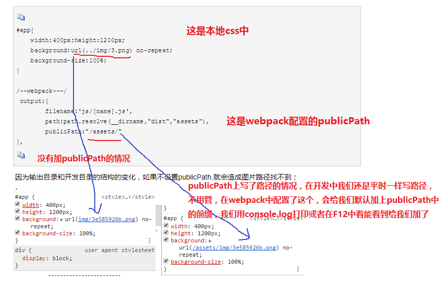
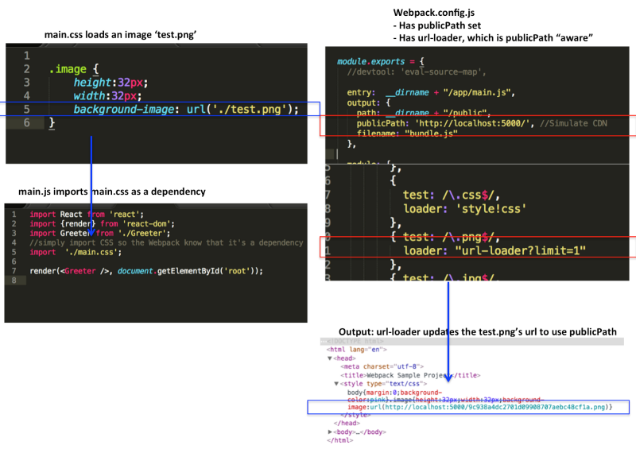

很久前初略学习过webpack当时还是1.0，很久没看有些忘了配置
当前版本3.6,一个简单的问题忘了 弄了我一晚上和一个早上


```
目录结构

text
node_modules
.babelrc
11.jpg
index.html
main.js
package.json
util.js
webpack.config.js
```

```js
const path = require('path');

module.exports = {
    entry: './main.js',
    output: {
        filename: 'bundle.js',
        // publicPath: '/dist/',
        path: path.resolve(__dirname, 'dist')
    },
    devtool: 'inline-source-map',
    devServer: {
        port: 7500
    },
    module: {
        rules: [
            {
                test: /\.js$/,
                loader: "babel-loader",
                exclude: /node_modules/
            }
        ]
    }
};
```

昨天我以为在index.html中引入的js文件可以是main.js 然后在main.js中引入各种模块，es6等，以为经过webpack-dev-server开启服务，然后去引入这个main.js文件就能使用各种依赖了，其实根本是自己进入了一个误区。
webpack引入的js文件一直是在配置文件的output中写的文件，，，，，不管开发阶段server还是生产阶段build,我们都是关注出口文件output。
在webpack-dev-server 动态更新时会实时去构建输出文件，实时更新

* <font size='2'>当filename: 'bundle.js'时，我们直接在index.html中引入`<script src="bundle.js"></script>`就行。当还存在publicPath: '/dist/'时,我们需要加上/dist/为前缀`<script src="/dist/bundle.js"></script>`。
* <font size='2'>output 位于对象最顶级键(key)，包括了一组选项，指示 webpack 如何去输出、以及在哪里输出你的bundle、asset 和其他你所打包或使用 webpack 载入的任何内容。对于在output中的path是对应一个绝对路径。当我们在index.html中引入的是打包后的路径，可以基于path， 当是server时可要关注publicPath和filename了
* <font size='2'>webpack-dev-server 也会默认从 publicPath 为基准，使用它来决定在哪个目录下启用服务，来访问 webpack 输出的文件。

<br>

webpack-dev-server环境下，path、publicPath、区别与联系。

- <font size='2'>path：指定编译目录而已（/build/js/），不能用于index.html中的js引用。
- <font size='2'>publicPath：虚拟目录，自动指向path编译目录（/dist/ => /build/js/）。index.html中引用js文件时，必须引用此虚拟路径（但实际上引用的是内存中的文件，既不是/build/js/也不是/dist/）。

<br>

#### 关于output中path和publicPath

* <font size='2'>path指定了本地构建地址，publicPath指定的是构建后在html里的路径，一般也是用这个来指定上线后的cdn域名。

path:所有输出文件的目标路径;
publicPath:输出解析文件的目录，url 相对于 HTML 页面
区别：

* <font size='2'>path是webpack所有文件的输出的路径，必须是绝对路径，比如：output输出的js,url-loader解析的图片，HtmlWebpackPlugin生成的html文件，都会存放在以path为基础的目录下。
* <font size='2'>publicPath 并不会对生成文件的路径造成影响，主要是对你的页面里面引入的资源的路径做对应的补全，常见的就是css文件里面引入的图片。引用到的js文件,图片等资源的路径,都会受到publicPath的影响。


套用了别人的图····

另一篇文章

#### output
output项告诉webpack怎样存储输出结果以及存储到哪里。output的两个配置项“path”和“publicPath”可能会造成困惑。

* <font size='2'>“path”仅仅告诉Webpack结果存储在哪里，然而“publicPath”项则被许多Webpack的插件用于在生产模式下更新内嵌到css、html文件里的url值。
* <font size='2'>例如，在localhost（译者注：即本地开发模式）里的css文件中边你可能用“./test.png”这样的url来加载图片，但是在生产模式下“test.png”文件可能会定位到CDN上并且你的Node.js服务器可能是运行在HeroKu上边的。这就意味着在生产环境你必须手动更新所有文件里的url为CDN的路径。-----然而你也可以使用Webpack的“publicPath”选项和一些插件来在生产模式下编译输出文件时自动更新这些url。


```css
// 开发环境：Server和图片都是在localhost（域名）下
.image {
    background-image: url('./test.png');
}
// 生产环境：Server部署下HeroKu但是图片在CDN上
.image {
    background-image: url('https://someCDN/test.png');
}
```


